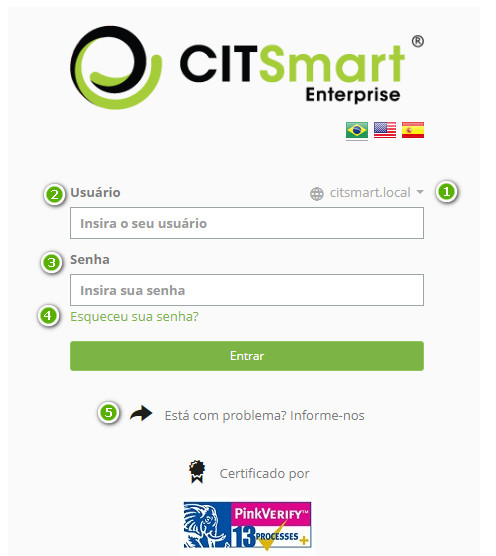
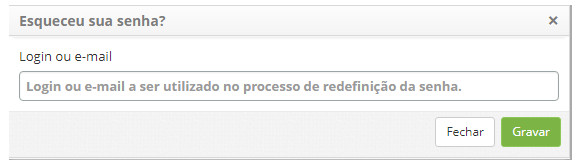
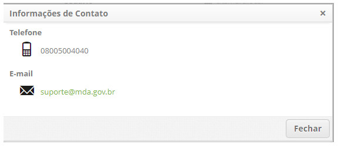

title: Autenticação (login)
Description: Esta funcionalidade tem por objetivo explicar a autenticação (login) de usuários em diversos ambientes.
# Autenticação (login)

Esta funcionalidade tem por objetivo explicar a autenticação (login) de usuários em diversos ambientes.

Como acessar
---------------

1. Digitar URL da instância que deseja acessar, exemplo: https://itsm.citsmartcloud.com\citsmart

Pré-condições
---------------

1. Ter pelo menos um usuário ativo no sistema (ver conhecimento [Cadastro e pesquisa de usuário](/pt-br/citsmart-platform-7/plataform-administration/region-and-language/register-unit.html)).

Logando no ambiente
----------------------

**Figura 1 - Tela de autenticação**

 permite o usuário escolher de uma lista em qual ambiente será feita a autenticação:

- citsmart.local: ambiente default onde os usuários são cadastrados no banco de dados da aplicação;
- <domínio1>
- <domínio2>
- ...
- <domínioN>
    
    !!! warning "ATENÇÃO"
    
        Esta lista de domínios personalizados conterá itens se e somente se: (i) o Administrador criar personalizar ao menos um 
        domínio de autenticação LDAP (ver conhecimento Cadastro e pesquisa de conexões LDAP); e (ii) o parâmetro 383 - Habilitar 
        listagem de domínios no login estiver configurado para mostrar a lista.
        
 login previamente cadastrado por um administrador.

 previamente cadastrada por um administrador.

    
**Figura 2- Tela para recuperação de senha**
    

    
**Figura 3 - Tela de informações de contato**
    
Esqueci minha senha
--------------------

Esta é uma opção importante porque não é incomum esquecermos nossa senha, afinal são muitas em muitos aplicativos.

Pré-condições
---------------

1. Deve existir ao menos um modelo de e-mail (ver conhecimento [Cadastro e pesquisa de configuração de modelo de e-mail](/pt-br/citsmart-platform-7/plataform-administration/email-settings/configure-email-template.html))

2. As palavras-chave indicadas para serem inseridas no modelo de e-mail são:

    - ${NOMEEMPREGADO} : retorna o nome do usuário que solicitou o reset de senha;
    - ${LOGIN} : login do usuário que solicitou o rset de senha;
    - ${NOVASENHA} : nova senha gerada pelo sistema.
    
3. Dever ser configurado o parâmetro: 116 - ID do modelo de e-mail para alteração da senha de acesso ao CITSmart

Como restaurar a senha
-----------------------

1. Acessar a tela de login do CITSmart;

2. Clicar no link **Esqueci minha senha**;

3. Informar o e-mail para onde será enviada a nova senha;

4. Após estes passos, o sistema atribui novo conteúdo provisório à senha do usuário e a envia por e-mail conforme modelo de e-mail
cadastrado.

!!! warning "ATENÇÃO"

    Caso a integração do CITSmart seja com LDAP, não será possível atribuir conteúdos à senha do usuário, Neste caso deve-se 
    enviar ao usuário os meios de solicitar a restauração (reset) da senha.
    
!!! tip "About"

    <b>Product/Version:</b> CITSmart | 7.00 &nbsp;&nbsp;
    <b>Updated:</b>07/26/2019 - Larissa Lourenço
