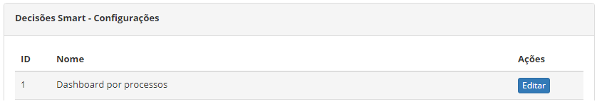
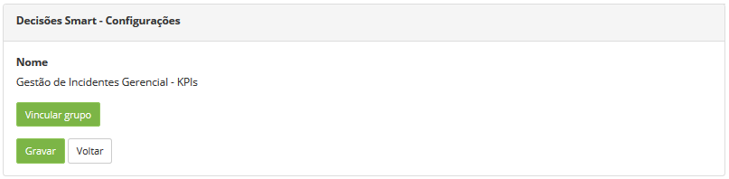

title: Permissão de acesso do Smart Decisions

Description: A funcionalidade de Permissão de Acesso do Smart Decisions permite definir quem terá acesso aos widgets para inserção no dashboard o qual é exibido na tela principal do sistema.

# Permissão de acesso do Smart Decisions

A funcionalidade de Permissão de Acesso do Smart Decisions permite definir quem
terá acesso aos widgets para inserção no dashboard o qual é exibido na tela
principal do sistema.

Como acessar
------------

1.  Acesse a funcionalidade de Permissão de Acesso do Smart Decisions através da
    navegação no menu principal **Acesso e Permissão > SmartDecisions**.

Pré-condições
------------

1.  Não se aplica.

Filtros
------

1.  Não se aplica.

Listagem de itens
---------------

1.  Os seguintes campos cadastrais estão disponíveis ao usuário para facilitar a
    identificação dos itens desejados na listagem padrão da
    funcionalidade: ID e Nome.

2.  Existe um botão de ação disponível ao usuário em relação a cada item da
    listagem, é ele: *Editar*.

**Figura 1 - Tela de permissão de acesso - Smart decisions**

Preenchimento dos campos cadastrais
--------------------------------

1.  Não se aplica.

Definindo permissão de acesso
----------------------------

1.  Será apresentada a tela para **Definição da Permissão de Acesso aos
    Widgets**;

2.  Clique no botão *Editar* do widget para o qual irá definir quem terá acesso
    ao mesmo. Feito isso, será exibida a tela para vínculo do grupo, conforme
    ilustrado na figura abaixo:

    
    
    **Figura 2 - Definição do tipo de acesso**

    -   Clique no botão *Vincular grupo*. Feito isso, será apresentada a tela de
    pesquisa do grupo, busque pelo grupo desejado, seleciono-o e clique
    em *Enviar* para efetuar o vínculo.

3.  Após definição da permissão de acesso, clique no botão *Gravar* para efetuar
    o registro, onde a data, hora e usuário serão gravados automaticamente para
    uma futura auditoria.

!!! tip "About"

    <b>Product/Version:</b> CITSmart | 8.00 &nbsp;&nbsp;
    <b>Updated:</b>07/17/2019 – Anna Martins
