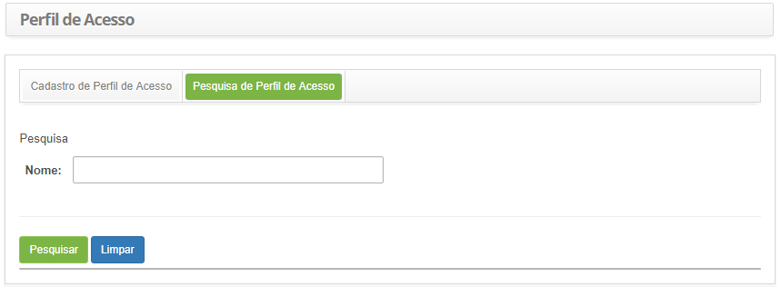
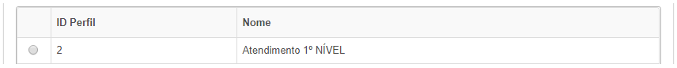
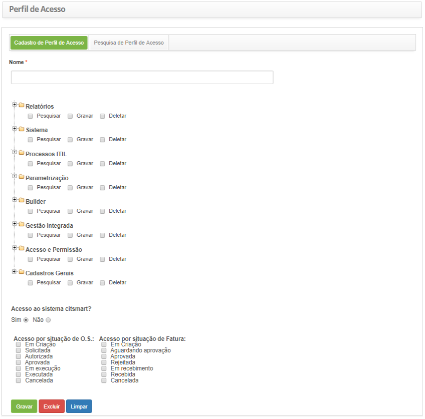

title: Cadastro e pesquisa de perfil de acesso

Description: O perfil de acesso define quais direitos e permissões tem o usuário
do sistema.

# Cadastro e pesquisa de perfil de acesso

O perfil de acesso define quais direitos e permissões tem o usuário do sistema.

Após o usuário ser autenticado o processo de definição de acesso determina o que
ele pode fazer no sistema.

Como acessar
------------

1.  Acesse a funcionalidade de Perfil de Acesso através da navegação no menu
    principal **Acesso e Permissão   Perfil de Acesso.**

Pré-condições
------------

1.  Não se aplica.

Filtros
-------

1.  O seguinte filtro possibilita ao usuário restringir a participação de itens
    na listagem padrão da funcionalidade, facilitando a localização dos itens
    desejados, conforme ilustrado na figura abaixo:

    -   Nome

1.  Na tela de Cadastro de Perfil de Acesso, clique na aba **Pesquisa de Perfil
    de Acesso**. Será apresentada a tela de pesquisa conforme ilustrada na
    figura abaixo:

    
    
    **Figura 1 - Tela de pesquisa de perfil de acesso**

1.  Realize a pesquisa do perfil de acesso:

-   Informe o nome do perfil de acesso que deseja pesquisar e clique no
    botão *Pesquisar*. Após isso, será exibido o registro de perfil de acesso
    conforme o nome informado;

-   Caso deseje listar todos os registros de perfil de acesso, basta clicar
    diretamente no botão *Pesquisar*.

Listagem de itens
----------------

1.  Os seguintes campos cadastrais estão disponíveis ao usuário para facilitar a
    identificação dos itens desejados na listagem padrão da funcionalidade: **ID
    Perfil** e **Nome**.

    
    
    **Figura 2 - Tela de listagem de perfil de acesso**

1.  Após a pesquisa, selecione o registro desejado. Feito isso, será direcionado
    para a tela de cadastro exibindo o conteúdo referente ao registro
    selecionado;

2.  Para alterar os dados do registro de perfil de acesso, basta modificar as
    informações dos campos desejados e clicar no botão *Gravar*para que seja
    gravada a alteração realizada no registro, onde a data, hora e usuário serão
    gravados automaticamente para uma futura auditoria;

3.  Para excluir o registro de perfil de acesso, basta clicar no
    botão *Excluir* e confirmar a exclusão.

Preenchimento dos campos cadastrais
----------------------------------

1.  Será apresentada a tela de **Cadastro de Perfil de Acesso**, conforme
    ilustrada na figura abaixo:

    
    
    **Figura 3 - Tela de cadastro de perfil de acesso**

1.  Preencha os campos conforme orientações abaixo:

    -   **Nome**: informe o nome do perfil de acesso;

    -   Selecione os itens de menu que o perfil terá acesso, marcando o que o
        perfil pode realizar em cada item:

        -   **Pesquisar**: o usuário com este perfil poderá fazer consultas e
            visualizar os dados;

        -   **Gravar**: o usuário com este perfil poderá fazer o “Pesquisar” e
            ainda incluir e alterar os dados;

        -   **Delete**: o usuário com este perfil poderá fazer o “Gravar” e
            ainda excluir os dados do sistema.

       !!! info "IMPORTANTE"

           As exclusões executadas no produto são exclusões lógicas (e não físicas),
           portanto em casos extremos há como recuperar algo excluído, porém isso
           exigirá apoio técnico de um analista/consultor.

       !!! note "NOTA"

           Ao determinar o tipo de perfil de acesso, marcando/desmarcando um
           checkbox, todos os checkboxs subordinados a este na estrutura são igualmente
           marcados/desmarcados em cascata.

       !!! note "NOTA"

           Os perfis de acesso ficarão desabilitados (os checkboxs de todos os perfis
           de acessos pré-existentes ficarão desmarcados), por default, quando for
           criadas novas funcionalidades, exigindo, portanto, que o administrador
           explicitamente habilite esta para os perfis que desejar, tornando-a
           disponível para os perfis pretendidos.

    -   **Acesso ao sistema CITSmart**: defina se o perfil terá acesso ao sistema a
    partir do portal;

    -   **Acesso por situação de OS**: selecione as situações de OS que o perfil
    terá acesso;

    -   **Acesso por situação de Fatura**: selecione as situações da fatura que o
    perfil terá acesso.

1.  Após informar os dados, clique no botão *Gravar* para efetuar o registro,
    onde a data, hora e usuário serão gravados automaticamente para uma futura
    auditoria.

!!! tip "About"

    <b>Product/Version:</b> CITSmart | 8.00 &nbsp;&nbsp;
    <b>Updated:</b>07/23/2019 – Anna Martins
