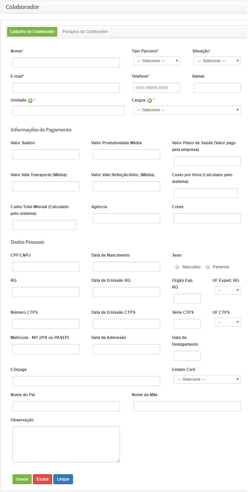

title: Cadastro e pesquisa de colaborador

Description: Esta funcionalidade permite cadastrar cada pessoa que possuir algum tipo de vínculo com a organização, tais como: um funcionário, um parceiro, etc.

# Cadastro e pesquisa de colaborador

Esta funcionalidade permite cadastrar cada pessoa que possuir algum tipo de
vínculo com a organização, tais como: um funcionário, um parceiro, etc.

Como acessar
-----------

1.  Acesse a funcionalidade de colaborador através da navegação no menu
    principal **Cadastro Gerais > Gerência de Pessoal > Colaborador**.

Pré-condições
------------

1.  Cadastrar unidade (ver conhecimento [Cadastro e pesquisa de
    unidade];

2.  Cadastrar cargo (ver conhecimento [Cadastro e pesquisa de
    cargo].

Filtros
-------

1.  Os seguintes filtros possibilitam ao usuário restringir a participação de
    itens na listagem padrão da funcionalidade, facilitando a localização dos
    itens desejados:

    -   Nome;

    -   CPF;

    -   Situação.

2.  Clique na aba **Pesquisa de Colaborador**, será apresentada a tela
    de **Pesquisa de Colaborador**, conforme ilustrado na figura abaixo:

    
    
    **Figura 1 - Tela de pesquisa de colaborador**

3.  Realize a pesquisa de colaborador:

    -   Informe o nome, CPF e/ou situação do colaborador e clique no
    botão *Pesquisar*. Após isso, será exibido o registro de colaborador
    conforme os dados informados;

    -   Caso deseje listar todos os registros de colaborador, basta clicar
    diretamente no botão *Pesquisar*.

Listagem de itens
----------------

1.  O seguinte campo cadastral está disponível ao usuário para facilitar a
    identificação dos itens desejados na listagem padrão da
    funcionalidade: **Nome**.

     
     
     **Figura 2 - Tela de listagem de colaborador**

2.  Após a pesquisa, selecione o registro desejado. Feito isso, será direcionado
    para a tela de cadastro exibindo o conteúdo referente ao registro
    selecionado;

3.  Para alterar os dados do registro do colaborador, basta modificar as
    informações dos campos desejados e clicar no botão *Gravar*para que seja
    gravada a alteração realizada no registro, onde a data, hora e usuário serão
    gravados automaticamente para uma futura auditoria.

Preenchimento dos campos cadastrais
----------------------------------

1.  Clique na aba **Cadastro de Colaborador**, será apresentada a tela
    de **Cadastro de Colaborador**, conforme ilustrada na figura abaixo:

    
    
    **Figura 3 - Tela de cadastro de colaborador**

2.  Preencha os campos conforme orientações abaixo:

3.  **Nome**: informe o nome do novo colaborador;

    -   **Tipo de Parceiro**: informe o tipo de vínculo que o colaborador possui
        com a empresa;

    -   **Situação**: informe se o colaborador está atuando ou não na empresa,
        em caso positivo informar “*Ativo*” ou se estiver afastado por algum
        motivo, informar “*Inativo*”;

    -   **E-mail**: informe o e-mail do colaborador para estabelecer um canal de
        comunicação;

    -   **Telefone**: informe o código de área (DDD) e o número do telefone do
        colaborador;

    -   **Ramal**: informe o número do ramal (divisão interna de um sistema
        telefônico) do colaborador

    -   **Unidade**: informe a unidade na qual o colaborador está alocado. Caso
        não encontre a unidade, é possível realizar um cadastro rápido a partir
        desta tela, basta clicar no ícone   ;

    -   **Cargos**: selecione o cargo que o colaborador ocupará. Caso não
        encontre o cargo, é possível realizar um cadastro rápido a partir desta
        tela, basta clicar no ícone   ;

    -   Preencha as informações a respeito do pagamento do colaborador:

        -   **Valor Salário(R\$)**: informe o valor do salário do colaborador;

        -   **Valor Produtividade Média(R\$)**: informe o valor da
                produtividade média do colaborador;

        -   **Valor Plano de Saúde (Valor pago pela empresa) (R\$)**:
                informe o valor do plano de saúde pago pela empresa;

        -   **Valor Vale Transporte (Média)(R\$)**: informe o valor do vale
                transporte pago pela empresa para o colaborador;

        -   **Valor Vale Refeição/Alim. (Média) (R\$)**: informe o valor do
                vale refeição/alimentação pago pela empresa para o colaborador;

        -   **Custo por Hora (Calculado pelo sistema) (R\$) e Custo
                Total Mensal (Calculado pelo sistema)**: estes campos serão
                preenchidos após a realização dos cálculos feitos pelo sistema;

        -   **Agência**: informe a agência bancária do colaborador;

        -   **Conta**: informe o número da conta bancária do colaborador.

    -   Informe os dados pessoais do colaborador:

        -   **CPF/CNPJ**: informar o número do CPF/CNPJ do colaborador;

        -   **Data de Nascimento**: informe a data de nascimento do colaborador;

        -   **Sexo**: marque uma das opções referentes ao sexo do colaborador:
        Masculino ou Feminino;

        -   **RG**: informe o número do RG do colaborador;

        -   **Data Emissão RG**: informe a data de emissão do RG do colaborador;

        -   **Órgão Exp. RG**: informe o órgão expedidor do RG;

        -   **UF Exped. RG**: informe o estado, onde foi emitido o RG;

        -   **Número CTPS**: informe o número da CTPS (Carteira de Trabalho e
             Previdência Social) do colaborador;

        -   **Data Emissão CTPS**: informe a data de emissão da CTPS do colaborador;

        -   **Série CTPS**: informe a série da CTPS;

        -   **UF CTPS**: selecione o estado, onde foi emitida a CTPS;

        -   **Matrícula - NIT (PIS ou PASEP)**: informe o número de identificação do
            trabalhador (PIS ou PASEP);

        -   **Data de Admissão**: informe a data de admissão do colaborador;

        -   **Data Desligamento**: informe a data de desligamento do colaborador,
            quando o mesmo for desligado;

        -   **Cônjuge**: informe o nome do cônjuge do colaborador, ou seja, o nome
             da pessoa que em que se tem uma união estável;

        -   **Estado Civil**: selecione o estado civil do colaborador;

        -   **Nome do Pai**: informe o nome do pai do colaborador;

        -   **Nome da Mãe**: informe o nome da mãe do colaborador;

        -   **Observação**: informe alguma observação que achar conveniente sobre o
             colaborador.

4.  Após informar os dados, clique no botão *Gravar* para efetuar o registro,
    onde a data, hora e usuário serão gravados automaticamente para uma futura
    auditoria.

!!! tip "About"

    <b>Product/Version:</b> CITSmart | 8.00 &nbsp;&nbsp;
    <b>Updated:</b>07/23/2019 – Anna Martins
