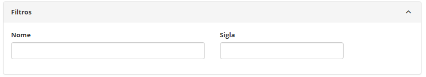
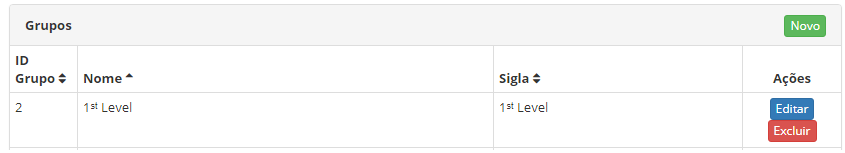
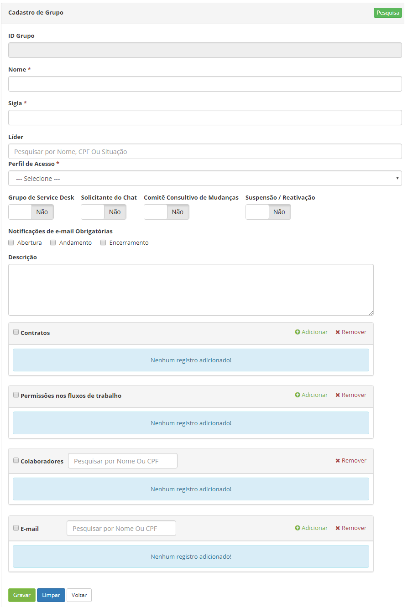
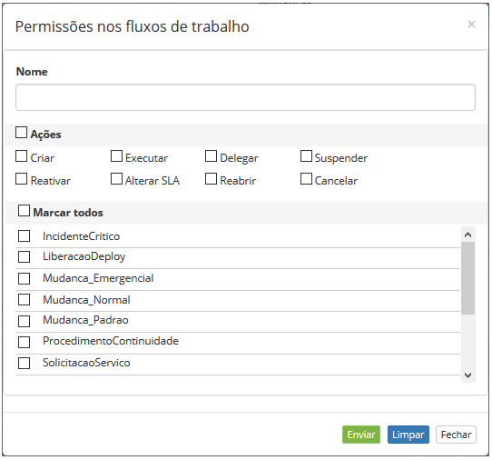
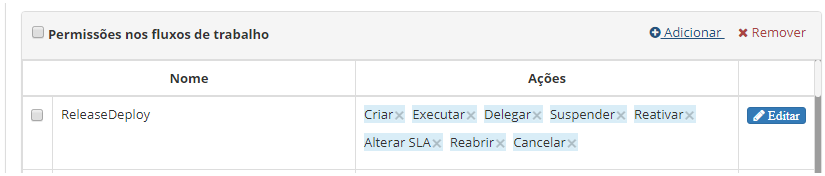

title: Cadastro e pesquisa de grupo
Description: Esta funcionalidade permite o cadastro de grupos e o vínculo deles
com usuários, um perfil, contratos e e-mails para notificação.

# Cadastro e pesquisa de grupo

Um grupo é um conjunto de um ou mais colaboradores que têm os mesmos objetivos
relacionados as suas funções.

Os dois usos mais comuns para os grupos criados são:

1.  Programação de notificação automática com base em alguma situação/evento
    específico;

2.  Gestão da segurança/sigilo de acessos a vários tipos de cadastros (ex.:
    pastas da base de conhecimento, portfólios de serviços, etc.).

Esta funcionalidade permite o cadastro de grupos e o vínculo deles com usuários,
um perfil, contratos e e-mails para notificação.

Como acessar
------------

1.  Acesse a funcionalidade de Grupo através da navegação no menu
    principal **Acesso e Permissão > Grupo**.

Pré-condições
------------

1.  Cadastrar perfil de acesso (ver conhecimento [Cadastro e pesquisa de perfil
    de
    acesso]( );

2.  Cadastrar colaborador (ver conhecimento [Cadastro e pesquisa de
    colaborador]( ).

Filtros
-------

1.  Os seguintes filtros possibilitam ao usuário restringir a participação de
    itens na listagem padrão da funcionalidade, facilitando a localização dos
    itens desejados:

    -   Nome;

    -   Sigla.

1.  Na tela de Cadastro de Grupo, são exibidos os grupos já registrados e os
    filtros que permitem realizar uma busca específica de acordo com sua
    necessidade:

    
    
   **Figura 1 - Tela de pesquisa de grupo**

1.  Para realizar a busca de um grupo específico, informe o nome e/ou sigla do
    grupo que deseja. Após isso, será exibido o registro conforme os dados
    informados.

Listagem de itens
----------------

1.  Os seguintes campos cadastrais estão disponíveis ao usuário para facilitar a
    identificação dos itens desejados na listagem padrão da funcionalidade: **ID
    Grupo, Nome e Sigla**.

    
    
    **Figura 2 - Tela de listagem de grupo**

1.  Existem botões de ação disponíveis ao usuário em relação a cada item da
    listagem, são eles: *Editar* e *Excluir;*

    !!! info "IMPORTANTE"

        A exclusão de grupo depende de não existir portfólios, colaboradores e
        contratos vinculados ao mesmo.

1.  Para alterar os dados do registro de grupo, clique no botão *Editar*. Feito
    isso, será direcionado para a tela de cadastro exibindo o conteúdo referente
    ao registro selecionado.

Preenchimento dos campos cadastrais
----------------------------------

1.  Clique no botão *Novo*. Feito isso, é apresentada a tela de **Cadastro de
    Grupo**, conforme ilustrada na figura a seguir:

    
    
    **Figura 3 - Tela de cadastro de grupo**

1.  Preencha os campos conforme orientações abaixo:

     -   **Nome**: informe o nome do grupo;

    -   **Sigla**: informe uma sigla para identificação do grupo;

    -   **Líder**: informe o líder do grupo, ou seja, o responsável pelo grupo;

    -   **Perfil de Acesso**: selecione o perfil de acesso, que servirá para definir
    quais funcionalidades ficarão disponíveis ao grupo e colaboradores
    pertencentes a ele;

    -   **Grupo de Service Desk**: defina se é um grupo de Service Desk* *(Central
    de Serviços de Atendimento), se sim, ele poderá ser visualizado para o
    direcionamento do grupo executor durante o registro de solicitação de
    serviço;

    -   **Solicitante do Chat**: permite que o grupo a ser cadastrado seja
    solicitante do chat ou não;

    -   **Comitê Consultivo de Mudanças**: defina se é um grupo de Comitê Consultivo
    de Mudanças, ou seja, um grupo de pessoas que se reúnem para autorizar a
    mudança no serviço de TI;

    -   **Suspensão/Reativação**: defina se o grupo terá permissão para suspender e
    reativar múltiplas solicitações de serviço;

    -   **Notificações de e-mail Obrigatórias**: selecione as opções (abertura,
    andamento e/ou encerramento), caso queira que as notificações de e-mail
    referentes às solicitações de serviço sejam de envio obrigatório;

    !!! note "NOTA"

        Ao registrar uma solicitação de serviço, as opções de notificação de
        e-mail já estarão selecionadas, não permitindo a sua alteração.

    -   **Descrição**: informe uma breve descrição sobre o que o grupo se propõe;

    -   **Contratos**: vincule os contratos, os quais o grupo pertence;

       -   Clique em *Adicionar*. Após isso, será apresentada a tela de pesquisa de
       contratos;

       -   Realize a pesquisa, selecione os contratos que deseja vincular ao grupo e
       clique no botão *Enviar* para efetuar a operação;

       -   Para remover o vínculo do contrato com o grupo, selecione o contrato e
       clique em *Remover*.

    -   **Permissões nos fluxos de trabalho**: define as ações que o grupo poderá
    realizar nos fluxos de trabalho;

       -   Clique em *Adicionar*. Após isso, será apresentada a tela de permissões nos
    fluxos de trabalho, conforme ilustrada na figura abaixo:

    
    
    **Figura 4 - Definição da permissão nos fluxos de trabalho**

    -   **Nome**: informe o nome do fluxo de trabalho para busca do mesmo, caso seja
    necessário filtrar a lista de fluxos pelo nome (ou parte dele);

    -   Selecione as ações que o grupo poderá executar:

        -   **Criar**: o grupo poderá criar permissões nos fluxos de trabalho;

        -   **Executar**: o grupo poderá executar permissões nos fluxos de trabalho;

        -   **Delegar**: o grupo poderá delegar permissões nos fluxos de trabalho;

        -   **Suspender**: o grupo poderá suspender permissões nos fluxos de
        trabalho;

        -   **Reativar**: o grupo poderá reativar permissões nos fluxos de trabalho;

        -   **Alterar SLA**: o grupo poderá alterar o SLA das permissões nos fluxos
        de trabalho;

        -   **Reabrir**: o grupo poderá reabrir permissões nos fluxos de trabalho;

        -   **Cancelar**: o grupo poderá cancelar permissões nos fluxos de trabalho.

    -   Selecione os fluxos de trabalho, nos quais o grupo poderá executar as ações
    que foram selecionadas;

    -   Clique no botão *Enviar* para efetuar a operação. Após isso, será exibido na
    tela de grupo as permissões no(s) fluxo(s) de trabalho definidas, conforme
    exemplo ilustrado na figura abaixo:

    
    
    **Figura 5 - Permissão nos fluxos de trabalho**

    -   Para remover uma ação permitida no fluxo de trabalho, bastar clicar   da
    mesma;

    -   Para remover a permissão no fluxo de trabalho, selecione a mesma e clique
    em *Remover;*

    -   Para editar alguma informação na permissão de fluxo de trabalho clique em  .

    -   **Colaboradores**: adicione os membros (colaboradores) do grupo;

       -   Informe o nome ou CPF do colaborador para busca do mesmo, e logo em seguida
       selecione-o para adição no grupo;

       -   Após adição do colaborador no grupo, caso queira que o mesmo receba
       notificações relacionadas ao grupo, marque o campo referente ao e-mail;

       -   Para remover o colaborador do grupo, selecione o mesmo e clique
       em *Remover*.

    -   **E-mail**: adicione o(s) e-mail(s) para recebimento de notificações
    relacionadas ao grupo;

        -   Informe o nome ou CPF do colaborador para busca do mesmo e logo após
    selecione-o. Após isso, será adicionado o e-mail do colaborador na tela de
    registro;

        -   Caso tenha a necessidade de incluir um e-mail externo para recebimento das
    notificações, clique em *Adicionar*. Será apresentada a tela de cadastro de
    e-mail, conforme ilustrada na figura abaixo:

    
    
    **Figura 6 - Cadastro de e-mail externo**

    -   Informe o nome do responsável do e-mail, o e-mail e clique no
    botão *Enviar* para efetuar a operação;

    -   Caso queira remover algum e-mail que foi adicionado ao grupo, basta
    selecionar o mesmo e clicar em *Remover*.

1.  Após informar todos os dados, clique no botão *Gravar* para efetuar o
    registro, onde a data, hora e usuário serão gravados automaticamente para
    uma futura auditoria.

!!! tip "About"

    <b>Product/Version:</b> CITSmart | 8.00 &nbsp;&nbsp;
    <b>Updated:</b>07/23/2019 – Anna Martins
