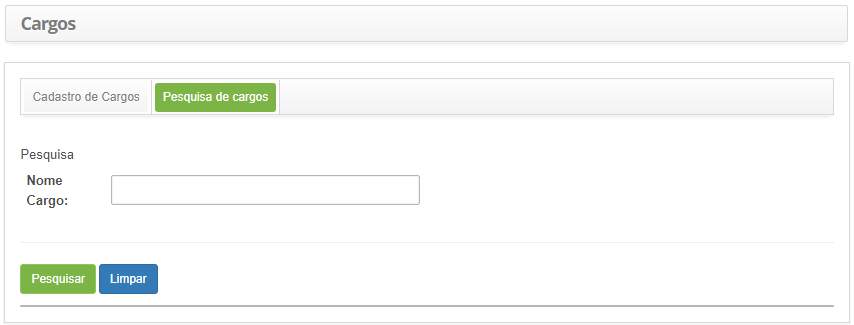
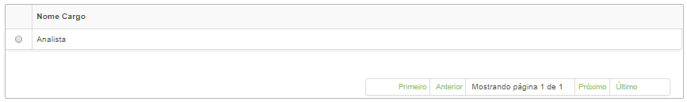
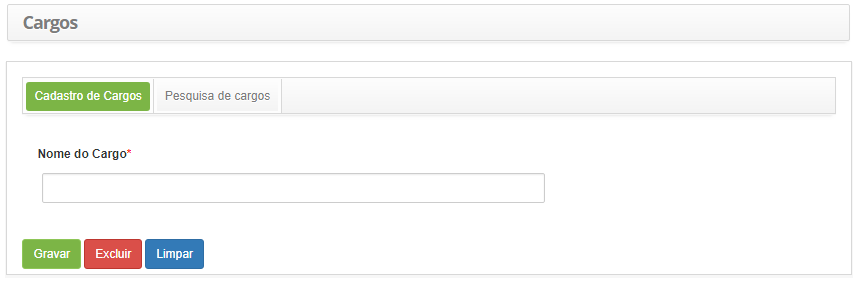

title: Cadastro e pesquisa de cargo

Description: Esta funcionalidade tem por objetivo registrar os cargos existentes
na organização.

# Cadastro e pesquisa de cargo

Esta funcionalidade tem por objetivo registrar os cargos existentes na
organização.

Como acessar
-----------

1.  Acesse a funcionalidade de cargo através da navegação no menu
    principal **Cadastros Gerais > Gerência de Pessoal > Cargos**.

Pré-condições
-----------

1.  Não se aplica.

Filtros
-------

1.  O seguinte filtro possibilita ao usuário restringir a participação de itens
    na listagem padrão da funcionalidade, facilitando a localização dos itens
    desejados:

    -   Nome cargo.

1.  Na tela de **Cargos**, clique na aba **Pesquisa de cargos**. Será
    apresentada a tela de pesquisa conforme ilustrada na figura abaixo:

    
    
    **Figura 1 - Tela de pesquisa de cargo**

1.  Realize a pesquisa de cargo.

-   Informe o nome do cargo que deseja pesquisar e clique no botão *Pesquisar*;

-   Após isso, será exibido o registro de cargo conforme a descrição informada;

-   Caso deseje listar todos os registros de cargo, basta clicar diretamente no
    botão *Pesquisar*.

Listagem de itens
----------------

1.  O seguinte campo cadastral está disponível ao usuário para facilitar a
    identificação dos itens desejados na listagem padrão da
    funcionalidade: Nome Cargo.

    
    
    **Figura 2 - Tela de listagem de cargo**

1.  Após a pesquisa, selecione o registro desejado. Feito isso, será direcionado
    para a tela de cadastro exibindo o conteúdo referente ao registro
    selecionado;

2.  Para alterar os dados do registro de cargo, basta modificar as informações
    dos campos desejados e clicar no botão *Gravar* para que seja gravada a
    alteração realizada no registro, onde a data, hora e usuário serão gravados
    automaticamente para uma futura auditoria.

Preenchimento dos campos cadastrais
---------------------------------

1.  Clique na aba **Cadastro de Cargos**, será apresentado a tela de **Cadastro
    de Cargos**, conforme ilustrada na figura abaixo:

    
    
    **Figura 3 - Tela de cadastro de cargo**

1.  Preencha os campos conforme orientações abaixo:

    -   **Nome do Cargo**: informe o nome do cargo, ex: Analista de Sistemas.

1.  Clique no botão *Gravar* para efetuar o registro, onde a data, hora e
    usuário serão gravados automaticamente para uma futura auditoria.

!!! tip "About"

    <b>Product/Version:</b> CITSmart | 8.00 &nbsp;&nbsp;
    <b>Updated:</b>07/23/2019 – Anna Martins
