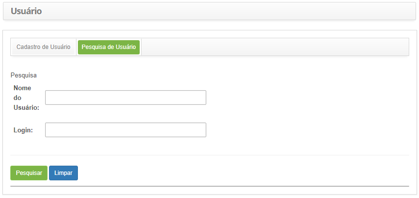
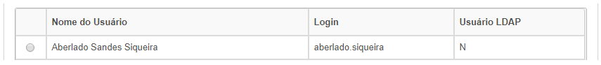
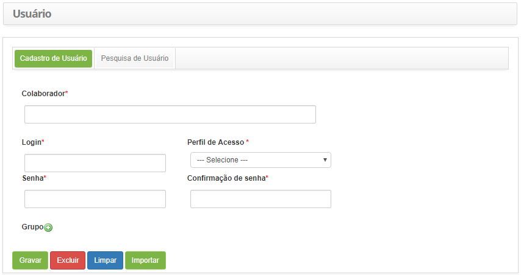

title: Cadastro e pesquisa de usuário
Description: Para que o colaborador possa acessar o sistema, é necessário criar
um usuário que irá receber as credenciais para acessar o sistema e determinar o
seu perfil de acesso.

# Cadastro e pesquisa de usuário

Para que o colaborador possa acessar o sistema, é necessário criar um usuário
que irá receber as credenciais para acessar o sistema e determinar o seu perfil
de acesso.

Como acessar
-----------

1.  Acesse a funcionalidade de Usuário através da navegação no menu
    principal **Cadastro Gerais > Gerência de Pessoal > Usuário**.

Pré-condições
-----------

1.  Ter um perfil de acesso definido (ver conhecimento [Cadastro e pesquisa de
    perfil de
    acesso]( );

2.  Ter o colaborador cadastrado (ver conhecimento [Cadastro e pesquisa de
    colaborador]( ).

Filtros
-------

1.  Os seguintes filtros possibilitam ao usuário restringir a participação de
    itens na listagem padrão da funcionalidade, facilitando a localização dos
    itens desejados:

    -  Nome do Usuário;

    -  Login.

1.  Clique na aba **Pesquisa de Usuário**. Após isso, será apresentada a tela de
    pesquisa, conforme ilustrada na figura abaixo:

    
    
    **Figura 1 - Tela de pesquisa de usuário**

1.  Realize a pesquisa do usuário.

-   Informe o nome e/ou login do usuário que deseja pesquisar e clique no
    botão *Pesquisar*. Após isso, será exibido o registro conforme os dados
    informados;

-   Caso deseje listar todos os registros, basta clicar diretamente no
    botão *Pesquisar*.

Listagem de itens
-----------------

1.  Os seguintes campos cadastrais estão disponíveis ao usuário para facilitar a
    identificação dos itens desejados na listagem padrão da
    funcionalidade: Nome do Usuário, Login e Usuário LDAP.

    
    
    **Figura 2 - Tela de listagem de usuário**

1.  Após a pesquisa, selecione o registro desejado. Feito isso, será direcionado
    para a tela de cadastro exibindo o conteúdo referente ao registro
    selecionado;

2.  Para alterar os dados do registro de usuário, basta modificar as informações
    dos campos desejados e clicar no botão *Gravar* para que seja gravada a
    alteração realizada no registro, onde a data, hora e usuário serão gravados
    automaticamente para uma futura auditoria.

Preenchimento dos campos cadastrais
---------------------------------

1.  Será apresentada a tela de **Cadastro de Usuário**, conforme ilustrada na
    figura abaixo:

    !!! note "NOTA"

        Nos casos de autenticação LDAP, quando o usuário logar pela primeira vez,
        o "perfil de acesso" do mesmo será definido pelo sistema, o qual é
        configurado no parâmetro "39" - LDAP - Id do perfil de acesso que será
        setado automaticamente caso o usuário não possua nenhum" (ver
        conhecimento **[Regras de parametrização -
        LDAP]().

    
    
    **Figura 3 - Tela de cadastro de usuário**

1.  Preencha os campos conforme orientações abaixo:

    -   **Colaborador**: informe o nome do colaborador que terá acesso ao sistema;

    -   **Login**: informe o login que servirá para o acesso do colaborador ao
    sistema;

    -   **Perfil de Acesso**: selecione o perfil de acesso que irá determinar as
    ações que o usuário poderá executar ao longo do sistema, assim como as
    funcionalidades do mesmo que ele poderá acessar;

    -   **Senha**: informe uma senha para acesso ao sistema;

    -   **Confirmação de senha**: informe a senha de acesso novamente;

    !!! note "NOTA"

        A digitação feita nos campos ‘Senha’ e ‘Confirmação de senha’ devem ser
        literalmente a mesma para aceitar o cadastro, inclusive a questão de caixa
        alta e caixa baixa.

    -   **Grupo**: adicione o(s) grupo(s) em que o usuário fará parte, para que o
    mesmo tenha permissão para trabalhar nos fluxos de trabalhos dos processos
    de gerenciamento;

        -   Clique no ícone  . Será exibida uma janela para pesquisa do grupo que
        deseja relacionar ao usuário;

        -   Realize a pesquisa do grupo desejado e selecione o mesmo. Feito isso,
        será adicionado o grupo ao cadastro do usuário;

    -   O sistema importa a carga na tabela de colaboradores e usuário na tabela de
    usuário através do botão *Importar* (ver conhecimento [Importação de
    funcionários]();

1.  Após os dados informados, clique no botão *Gravar* para efetuar o registro,
    onde a data, hora e usuário serão gravados automaticamente para uma futura
    auditoria.

!!! tip "About"

    <b>Product/Version:</b> CITSmart | 8.00 &nbsp;&nbsp;
    <b>Updated:</b>07/23/2019 – Anna Martins
