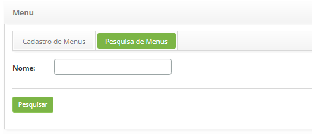
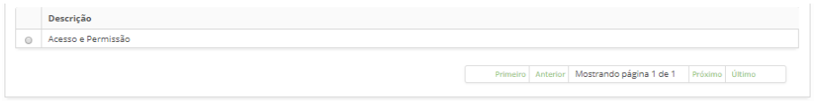
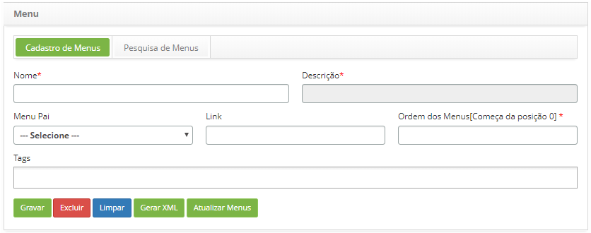

title: Cadastro e pesquisa de menu
Description: Esta funcionalidade tem por objetivo permitir ao usuário a
configuração dos itens de menu de acordo com as suas preferências.

# Cadastro e pesquisa de menu

Esta funcionalidade tem por objetivo permitir ao usuário a configuração dos
itens de menu de acordo com as suas preferências. Prover melhor usabilidade no
acesso aos menus, onde os itens podem ser organizados conforme a sua
necessidade.

Como acessar
------------

1.  Acesse o menu principal **Cadastros Gerais > Menu**.

Pré-condições
------------

1.  Não se aplica.

Filtros
-------

1.  O seguinte filtro possibilita ao usuário restringir a participação de itens
    na listagem padrão da funcionalidade, facilitando a localização dos itens
    desejados:

   
   
   **Figura 1 - Tela de pesquisa de menu**

1.  Realize a pesquisa do item de menu;

-   Informe a** **descrição do menu que deseja pesquisar e clique no
    botão *Pesquisar*. Após isso, será exibido o registro de menu conforme a
    descrição informada;

-   Caso deseje listar todos os registros de menu, basta clicar diretamente no
    botão *Pesquisar*.

Listagem de itens
----------------

1.  O seguinte campo cadastral está disponível ao usuário para facilitar a
    identificação dos itens desejados na listagem padrão da
    funcionalidade:** Descrição.**

    
    
    **Figura 2 - Tela de listagem de menu**

1.  Após a pesquisa, selecione o registro desejado. Feito isso, será direcionado
    para a tela de cadastro exibindo o conteúdo referente ao registro
    selecionado;

2.  Para alterar os dados do registro de menu, basta modificar as informações
    dos campos desejados e clicar no botão *Gravar* para que seja gravada a
    alteração realizada no registro, onde a data, hora e usuário serão gravados
    automaticamente para uma futura auditoria.

Preenchimento dos campos cadastrais
----------------------------------

1.  Será apresentada a tela de **Cadastro de Menu**, conforme ilustrada na
    figura abaixo:

    
    
    **Figura 3 - Tela de Cadastro de Menu**

1.  Preencha os campos conforme orientações abaixo:

    -   **Nome**: informe a palavra-chave do item de menu, ex.: \$menu.nome.Menu;

    -   **Descrição**: informe a descrição do novo item de menu, ex.: Cadastro de
    Menu;

    -   **Menu Pai**: selecione um menu pai, caso o novo item seja um sub-menu;

    -   **Link**: informe o link de acesso ao novo item de menu, ex.:
    /menu/menu.load;

    -   **Ordem dos Menus**: informe a posição do menu, ex.: 5;

    -   **Tags**: informe as tags para o item de menu (funcionalidade). As tags são
    palavras-chave que servem justamente como uma etiqueta e ajudam na hora de
    organizar informações, agrupando aquelas que receberam a mesma marcação,
    facilitando encontrar outras relacionadas.

1.  Após os dados informados, clique no botão *Gravar* para efetuar o registro,
    onde a data, hora e usuário serão gravados automaticamente para uma futura
    auditoria.

    -   O botão *Gerar XML* serve para gerar um arquivo no formato ".xml" dos menus;

    -   O botão *Atualizar Menus* serve para atualizar os menus.

    !!! warning "ATENÇÃO"

        Se faz necessário ter muito cuidado em relação à execução do
        botão Atualizar Menus, pois todas as alterações cadastrais dos menus serão
        perdidas desde a última vez que houve a geração de XML. Recomenda-se,
        portanto, a seguinte sequência de execução: 
        
        (1) botão Gerar XML 
        
        (2) botão Atualizar Menus.

!!! tip "About"

    <b>Product/Version:</b> CITSmart | 8.00 &nbsp;&nbsp;
    <b>Updated:</b>07/23/2019 – Anna Martins
