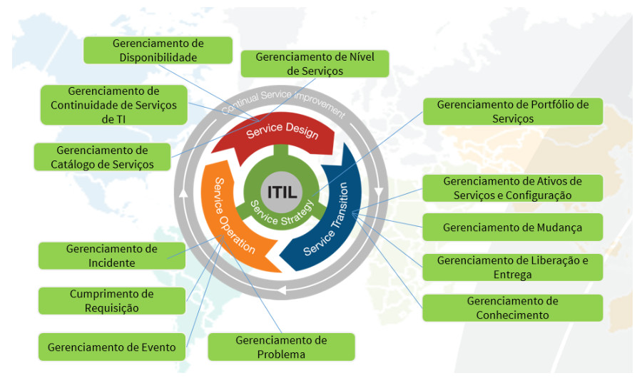

title:  Visão geral (ITSM)
Description: Disponibiliza uma visão geral do sistema ITSM. 
# Visão geral (ITSM)

Leia-me
---------

Este [link][1] explica como a base de conhecimento da CITSmart Corporation foi estruturada e como usá-la.

 CITSmart Enterprise ITSM
------------------------------------------------------------

É uma plataforma de governança corporativa inteligente na linha de um ITSM (*Information Technology Service Management*), cujo 
objetivo geral é apoiar as organizações no Gerenciamento de Serviços de Tecnologia da Informação (TI) e do Negócio com a adoção 
das melhores práticas ITIL (*Information Technology Infrastructure Library*).

**Por que adotá-lo?** Sabe-se que trabalhar com informações em tempo real na tomada de decisão torna as empresas mais 
competitivas e qualificadas para atender as suas demandas e suas atividades, a fim de diminuir as perdas ou prejuízos nos 
negócios já que os mesmos estão em constante monitoramento. Portanto, se bem aplicada, a tecnologia da informação faz com que os 
gestores passem a conhecer melhor as suas atividades empresariais e empregar os fluxos enérgicos de investimentos na direção mais 
adequada. Com isso, fornecendo às empresas uma estrutura de organização e implementação de serviços na qual aplica as melhores 
práticas ao ambiente organizacional traduzindo objetivos e metas em realidade mensurável.

A imagem abaixo mostra a cobertura significativa desta solução em relação aos processos previstos na biblioteca ITIL:

| **Estágios do ciclo de vida ITIL para serviços** | **Processos ITIL**                                                                                                                                               |
|----------------------------------------------|--------------------------------------------------------------------------------------------------------------------------------------------------------------|
| Service Strategy                             | [Gerenciamento de Portfólio de Serviços][2]                                                                                                                      |
| Service Design                               | [Gerenciamento de Nível de Serviços][3]; [Gerenciamento de Catálogo de Serviços][4]; [Gerenciamento de Continuidade de Serviços de TI][5]; [Gerenciamento de Disponibilidade][6] |
| Service Transition                           | [Gerenciamento de Mudança][7]; [Gerenciamento de Configuração e Ativo de Serviço][8]; [Gerenciamento de Liberação e Entrega][9]; [Gerenciamento de Conhecimento][10]              |
| Service Operation                            | [Gerenciamento de Requisições e Incidentes][11]; [Gerenciamento de Evento][12]; [Gerenciamento de Problema][13]                                                               |

Público-alvo da solução e principais benefícios
---------------------------------------------------

| Púlico-alvo                                      | Benefícios                                                                                                                                                                                                                                                                                                                        |
|--------------------------------------------------|-----------------------------------------------------------------------------------------------------------------------------------------------------------------------------------------------------------------------------------------------------------------------------------------------------------------------------------|
| Alta Direção                                     | 1. Promover melhorias na eficiência dos processos de prestação de serviços de TI e de negócio; 2. Visualizar relatórios e dashboards que apoiem mudanças e melhorias; 3. Visualizar a saúde dos seus serviços de negócio; 4. Visualizar o monitoramento estratégico de riscos; 5. Reconhecer o valor do serviço para o negócio.             |
| Atendimento ao Cliente                           | 1. Agilizar a solução dos problemas de seus clientes; 2. Melhorar a sua imagem; 3. Conectar equipes; 4. Corrigir problemas em tempo real; 5. Acompanhar as solicitações; 6. Usar base de conhecimento; 7. Rotear atendimentos para o serviço de campo; 8. Reduzir custos com inteligência cognitiva; 9. Monitorar eventos; 10. Identificar tendências. |
| Gestão de Fornecedores e Contratos Terceirizados | 1. Gerenciar contratos de prestação de serviços aplicando o SIAM (Integração e Gerenciamento de Serviços); 2. Avaliar o desempenho da prestação de serviço; 3. Fixar metas de atingimento de KPIs; 4. Gerenciar o fluxo financeiro dos contratos; 5. Aplicar multas/glosas.                                                                 |
| Gestão da Infraestrutura de TI                   | 1. Controlar os ativos, clientes, fornecedores e itens de configuração necessários para prover os serviços; 2. Administrar os acordos de nível de serviço (ANS); 3. Estruturar catálogos e portfólios de serviços; 4. Elaborar os desenhos de serviço no padrão BPMN; 5. Fazer medições de serviços com qualidade e garantia.               |

 Preparando-se com os primeiros passos antes de começar
------------------------------------------------------------------------------------------

1. Os termos e expressões mais relevantes: [Glossário][14]

2. Antes do início da instalação, é necessário serem observadas estas principais premissas:

    - Esta solução possui duas versões no mercado, a **Community** e a **Enterprise**: [Comparação][15]    
    - Entenda como navegar nas telas da solução: [Navegabilidade][16]
    - Conheça os três ambientes operacionais na solução, cada um com sua finalidade e características:
        - [Sistema][17] 
        - Smart Portal (Portal de Serviços) - [introdução][18] e documentação
        - [Portal do Conhecimento][19]
    - Cabe ao Administrador da solução realizar a configuração de permissão de acesso a cada opção do menu principal do sistema 
    para determinados usuários.
    
3. Manuais de instalação (por componente):

  - [CITSmart Enterprise ITSM][20]
  - [Inventory][21]
  - [EVM][22]
  - Mobile ([Android][23] e [iOS][24])
  
4. Perguntas mais frequentes: [FAQ][47]
  
 Entendendo a estruturação atual de sub-sistemas e funcionalidades da solução
----------------------------------------------------------------------------------------------------------------

- **Menu: Processos ITIL**
    - Objetivo geral: reúne as principais funcionalidades de todos os [Processos da ITIL][25] atendidos pela solução.
    - Sub-sistemas/Funcionalidades (neste caso são os **13 processos ITIL**, os quais têm o selo [PinkVERIFY][26] certificado 
    pela [Pink Elephant][27]):
1. **Portfólio e Catálogo** - [introdução][28] e documentação
2. **Níveis de Serviço** - [introdução][29] e documentação
3. **Mudança** - [introdução][30] e documentação
4. **Liberação** - [introdução][31] e documentação
5. **Conhecimento** - [introdução][32] e documentação
6. **Configuração e Ativo de Serviço** - [introdução][33] e documentação
7. **Evento** - [introdução][34] e documentação
8. **Requisições e Incidentes** - [introdução][35] e documentação
9. **Problema** - [introdução][36] e documentação
10. **Continuidade** - [introdução][37] e documentação
11. **Capacidade** - [introdução][38] e documentação
12. **Demanda** - [introdução][39] e documentação
13. **Disponibilidade** - [introdução][40] e documentação
- **Menu: Gerência Integrada**
    - Objetivo geral: reúne diversos módulos de gestão com o intuito de apoiar os processos ITIL e minimizar os riscos.
    - Documentação: link
    - Sub-sistemas/Funcionalidades:
        - **Automação das Operações de TI** - Refere-se às funcionalidades de verificação do agendamento das atividades 
        relacionadas aos processos de requisição, incidentes, mudanças, problema e liberação.
        - **Contratos** - Esse módulo tem por objetivo gerenciar o ciclo de vida dos contratos presentes na organização desde o 
        momento da solicitação interna de um serviço até o seu distrato ou encerramento. Para tanto é necessário manter o 
        cadastro de campos de assinaturas para serem associados a um grupo de assinatura, a fim da personalização de assinaturas 
        presentes no relatório de Ordens de Serviço. Estes relatórios de Ordens de Serviço são utilizados para registrar, 
        comprovar e cobrar pelos serviços prestados ao cliente.
        - **Força de Atendimento** - Esse módulo tem por objetivo gerenciar, acompanhar e monitorar o atendimento das 
        solicitações de serviços pelos técnicos de campo.
        - **Projetos** - Esse módulo tem por objetivo provê a gestão e acompanhamento dos projetos da organização.
        - **Provisionamento e Logística** - Esse módulo tem por objetivo realizar o gerenciamento das solicitações de compras de 
        produtos e serviços.
- **Menu: Relatórios**
    - Objetivo geral: disponibiliza os principais recursos e opções de emissão de relatórios operacionais/gerenciais da solução.
    - Documentação: link
    - Sub-sistemas/Funcionalidades:
        - Configurações
        - Conhecimentos
        - Contratos
        - Eventos
        - Incidentes/Requisição
        - Mudanças
        - Níveis de Serviço
        - Pessoal
        - Problemas
        - Relatórios Smart
- **Menu: Acesso e Permissão**
    - Objetivo geral: engloba todas as funcionalidades que diz respeito à definição da permissão de acesso ao sistema, garantindo 
    sigilo, foco e controle de quem pode o quê.
    - Documentação: link
    - Sub-sistemas/Funcionalidades:
        - Perfil de Acesso
        - Grupo
        - Continuidade
        - Portfólio
        - Requisições/Incidentes
        - SmartDecisions
- **Menu: Parametrização**
    - Objetivo geral: engloba os principais parâmetros do produto para que o comportamento e as regras de negócio sejam adaptados 
    às diversas necessidades do cliente. Permite personalizar determinada funcionalidade de acordo com os parâmetros 
    estabelecidos, por exemplo: alterando cálculos, fórmulas, metodologia, etc..
    - Documentação: link
    - Sub-sistemas/Funcionalidades:
        - Chat
        - Configuração LDAP
        - E-mail
        - Gerência de Configuração
        - Gerência de Conhecimento
        - Gerência de Liberação
        - Gerência de Mudança
        - Gerência de Problema
        - Gerência de Requisição e Incidente
        - Mobile
        - Ordem de Serviço (OS)
        - Parâmetros Citsmart
        - Provisionamento e Logística
        - Sistema
        - Smart Portal
        - Telefonia
- **Menu: Sistema**
    - Objetivo geral: engloba os principais recursos tecnológicos configuráveis do produto, possibilitando obter o máximo de 
    controle e segurança no produto.
    - Documentação: link
    - Sub-sistemas/Funcionalidades:
        - Acesso Remoto
        - Banco de Dados
        - Compatibilidade
        - Conexões Externas
        - Configurações
        - Controle de contrato
        - Controle de rendimento de Pessoal
        - Gerência de Importação
        - Grau de satisfação do atendimento
        - Importação e Carga de Dados
        - Manutenção de Fluxos
        - Notificações
        - Processamento Batch
        - Template de Solicitação de Serviço
        - Trilha de auditoria
        - Visões e Meta dados
        - Web Service
- **Recursos da solução em destaque**:
    - **Smart Reports** - [introdução][41] e documentação
    - **Smart Decision** - [introdução][42] e documentação
    - **Chat** - [introdução][43]
    - **Smart Button** - [introdução][44]
    - [Neuro][45] - recurso construtor e executor de fluxos incorporado na solução ITSM para potencializar a gestão de fluxos
    de negócio
    

 Identificando as principais tecnologias incorparadas
--------------------------------------------------------------------------------------------

Vários avanços tecnológicos estão sendo continuamente introduzidos no CITSmart Enterprise ITSM para melhorar seu desempenho, 
usabilidade, segurança, portabilidade, manutenibilidade e para alcançar a máxima satisfação dos seus clientes, os principais são:

- **DBMS**: compatibilidade com bancos: PostGreSQL, MS SQL Server e ORACLE - veja requisitos de versão mínima no manual de 
instalação
- **INTEGRAÇÕES**: ferramentas de Monitoração (Nagios e Zabbix), LDAP, Serviços de E-Mail e Asterisk
- **INVENTORY**: possui um agente de inventário próprio
- **JBOSS**: compatibilidade com JBoss 7.1.2
- **MOBILE**: permite a mobilidade (Android e iOS)
- **SGBD**: compatibilidade com bancos: PostGreSQL, MS SQL Server e ORACLE - veja requisitos de versão mínima no manual de 
instalação
- **SOLR**: adota a tecnologia bigdata para armazenamento/recuperação (buscas indexadas) na base de conhecimento e nas 
correlações de eventos
- **UX**: adoção de técnicas de User eXperience nas principais telas
- **WEB**: adota Java para toda a plataforma Web, tornando compatível com os navegadores: IE, Firefox e Chrome - veja requisitos 
de versão mínima no manual de instalação
- **PROTOCOLOS**: totalmente compatível com os protocolos HTTPS/SSL, DNS e IPv4 (sem exigir portas especiais configuradas no 
Firewall)
- **PROTEÇÕES**: aplica estratégia de defesa contra SQL Injection, falhas no gerenciamento de exceções e Local File Including

!!! note "NOTA"

    Qualquer tipo de sugestão ou relato de problemas relacionado com o conteúdo deste Guia do Usuário, queira por gentileza 
    acionar o equipe da CITSmart Corporation que o administra.
    
Veja também
--------------

- [Dicas sobre como realizar pesquisas no Portal do Conhecimento e Guia do Usuário][46]

!!! tip "About"

    <b>Product/Version:</b> CITSmart | 7.00 &nbsp;&nbsp;
    <b>Updated:</b>07/24/2019 - Larissa Lourenço
   
[1]:/pt-br/citsmart-platform-7/processes/knowledge/understanding-knowledge-base.html
[2]:/pt-br/citsmart-platform-7/processes/portfolio-and-catalog/overview.html
[3]:/pt-br/citsmart-platform-7/processes/service-level/overview.html
[4]:/pt-br/citsmart-platform-7/processes/portfolio-and-catalog/overview.html
[5]:/pt-br/citsmart-platform-7/processes/continuity/overview.html
[6]:/pt-br/citsmart-platform-7/processes/availability/overview.html
[7]:/pt-br/citsmart-platform-7/processes/change/overview.html
[8]:/pt-br/citsmart-platform-7/processes/configuration/overview.html
[9]:/pt-br/citsmart-platform-7/processes/release/overview.html
[10]:/pt-br/citsmart-platform-7/processes/knowledge/overview.html
[11]:/pt-br/citsmart-platform-7/processes/tickets/overview.ht
[12]:/pt-br/citsmart-platform-7/processes/event/overview.html
[13]:/pt-br/citsmart-platform-7/processes/problem/overview.html
[14]:/pt-br/glossary.html
[15]:/pt-br/citsmart-platform-7/initial-settings/version-comparison.html
[16]:/pt-br/citsmart-platform-7/get-started/navigate.html
[17]:/pt-br/citsmart-platform-7/get-started/system.html
[18]:/pt-br/citsmart-platform-7/get-started/smart-portal.html
[19]:/pt-br/citsmart-platform-7/processes/knowledge/knowledge-portal.html
[20]:/pt-br/citsmart-platform-7/get-started/installation.html
[21]:/pt-br/citsmart-platform-7/get-started/inventory-installation.html
[22]:/pt-br/citsmart-platform-7/additional-features/add-ons/evm-installation.html
[23]:/pt-br/citsmart-platform-7/additional-features/mobile-and-field-service/apps/android.html
[24]:/pt-br/citsmart-platform-7/additional-features/mobile-and-field-service/apps/ios.html
[25]:https://pt.wikipedia.org/wiki/ITILv3
[26]:https://www.pinkelephant.com/en-ca/PinkVERIFY/PinkVERIFYToolsets
[27]:https://www.pinkelephant.com/
[28]:/pt-br/citsmart-platform-7/processes/portfolio-and-catalog/overview.html
[29]:/pt-br/citsmart-platform-7/processes/service-level/overview.html
[30]:/pt-br/citsmart-platform-7/processes/change/overview.html
[31]:/pt-br/citsmart-platform-7/processes/release/overview.html
[32]:/pt-br/citsmart-platform-7/processes/knowledge/overview.html
[33]:/pt-br/citsmart-platform-7/processes/configuration/overview.html
[34]:/pt-br/citsmart-platform-7/processes/event/overview.html
[35]:/pt-br/citsmart-platform-7/processes/tickets/overview.html
[36]:/pt-br/citsmart-platform-7/processes/problem/overview.html
[37]:/pt-br/citsmart-platform-7/processes/continuity/overview.html
[38]:/pt-br/citsmart-platform-7/processes/capacity/overview.html
[39]:/pt-br/citsmart-platform-7/processes/demand/overview.html
[40]:/pt-br/citsmart-platform-7/processes/availability/overview.html
[41]:/pt-br/citsmart-platform-7/additional-features/reports/create/smart-reports/configuration/emit-report.html
[42]:/pt-br/citsmart-platform-7/additional-features/reports/create/dashboard/use/template-smart-decision.html
[43]:
[44]:
[45]:
[46]:/pt-br/citsmart-platform-7/processes/knowledge/tips-search-knowledge.html
[47]:

