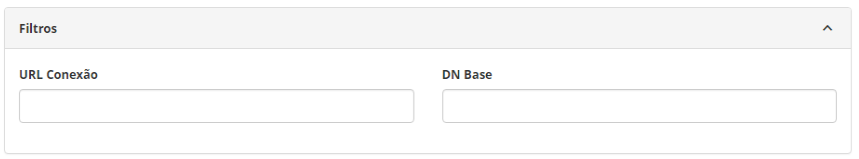
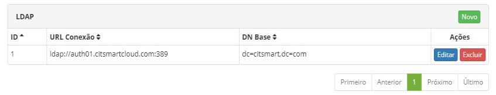
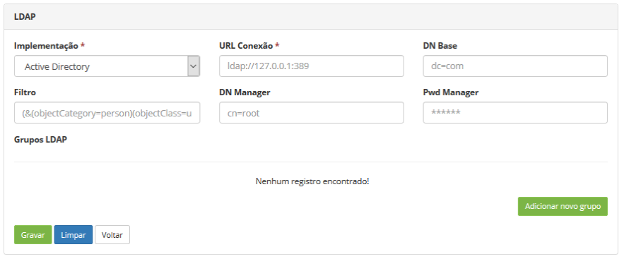
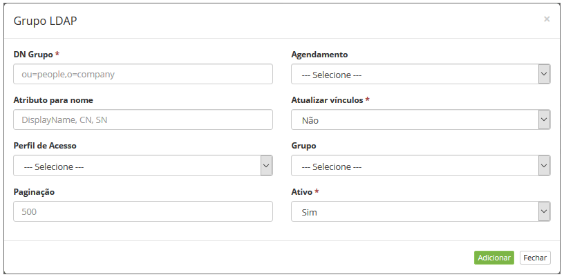
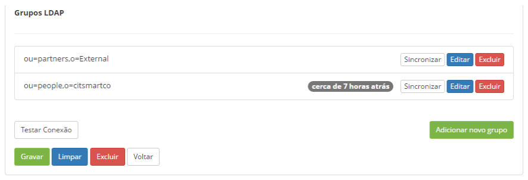

title: Cadastro e pesquisa de conexões LDAP
Description: Essa funcionalidade permite cadastrar múltiplas conexões LDAP e definir as configurações para cada uma delas.
# Cadastro e pesquisa de conexões LDAP

O LDAP (*Lightweight Directory Access Protocol* - Protocolo de acesso aos diretórios leves) é um protocolo padrão que permite
gerenciar diretórios, ou seja, acessar bancos de informações sobre os usuários de uma rede por meio de protocolos TCP/IP.

Essa funcionalidade permite cadastrar múltiplas conexões LDAP e definir as configurações para cada uma delas.

Como acessar
--------------

1. Acesse o menu principal **Parametrização > Configuração LDAP**.

Pré-condições
---------------

1. Cadastrar horários para agendamento da sincronização automática (ver [Cadastro e Pesquisa de Horários][1])

Filtros
----------

Os seguintes filtros possibilitam ao usuário restringir a participação de itens na listagem padrão da funcionalidade, facilitando
a localização dos itens desejados:

- Url Conexão;
- DN Base.
    

**Figura 1 - Tela de pesquisa de conexão LDAP**

Listagem de itens
--------------------

Os seguintes campos cadastrais estão disponíveis ao usuário para facilitar a identificação dos itens desejados na listagem padrão 
da funcionalidade: **ID, URL Conexão** e **DN Base**.

Existem botões de ação disponíveis ao usuário em relação a cada item da listagem, são eles: "Editar" e "Excluir".

**Figura 2 - Tela de lista de conexões LDAP**

Preenchimento dos campos cadastrais
------------------------------------

!!! warning "ATENÇÃO"

    Todos os campos são igualmente relevantes para viabilizar a conexão com o LDAP, enquanto o teste não for bem-sucedido o
    procedimento de configuração não pode ser considerado completado.
    
1. Será apresentada a tela de LDAP;

2. Clique no botão "Novo" (conforme a figura anterior). Feito isso, será apresentada a tela de Cadastro de Conexão LDAP, conforme 
ilustrada na figura a seguir:

    
    
    **Figura 3 - Tela de cadastro de conexão LDAP**
    
3. Preencha os campos conforme orientações abaixo:

    - **Implementação**: informe o tipo de implementação LDAP: AD ou OpenLDAP;
    - **URL de conexão**: informe a URL de conexão com a porta correspondente. A mesma é responsável pelo sincronismo com o LDAP;
    - **DN Base**: informe o DN (*Distinguished Name*) do domínio;
    - **Filtro**: defina o filtro para busca de informações;
    - **DN Manager**: informe o usuário com permissão de administrador no LDAP;
    - **Pwd Manager**: informe a senha do usuário mencionado no campo acima.
    
4. Clique no botão "Adicionar novo grupo" e após isso, será apresentada a tela para cadastro dos dados, conforme ilustrada na
figura abaixo:

    
    
    **Figura 4 - Tela de cadastro de grupo LDAP**
    
    !!! note "NOTA"
    
        Caso não exista grupos LDAP, preencher o campo “DN Grupo” apenas com um asterisco. Isto fará com que o sistema 
        verifique todo o domínio.
        
    - **DN Grupo**: informe o grupo LDAP, local onde estão as subpastas, onde os usuários estão localizados;
    - **Agendamento**: selecione o horário desejado. Essa opção só estará disponível se a configuração do *quartz* estiver 
    correta;
    - **Atributo para nome**: informe o atributo do LDAP que será setado como nome do usuário CITSmart;
    - **Atualizar vínculos**: por padrão o valor selecionado é “NÃO”. Serve para não atualizar os itens: Perfil de Acesso e 
    Grupo;
        - Sempre: o sistema atualiza os vínculos de Perfil de Acesso e Grupo sempre que o sistema sincronizar o LDAP;
        - Nunca: o sistema nunca atualiza os vínculos de Perfil de Acesso e Grupo nem mesmo na 1ª criação, ou seja, a carga
        de colaboradores é feita, porém, nenhum usuário estará em um Grupo ou Perfil de Acesso pré estabelecido;
        - Somente na criação: o sistema atualiza os vínculos de Perfil de Acesso e Grupo somente na criação de um novo usuário 
        quando o sistema sincronizar com LDAP.
    - **Perfil de acesso**: selecione o perfil de acesso que será atribuído automaticamente a cada sincronização;
    
    !!! info "IMPORTANTE"
    
        O sistema não permite excluir um usuário que tem origem no LDAP.
        
    - **Grupo**: informe o grupo que os usuários serão vinculados;
    - **Paginação**: defina o número máximo de usuários que a rotina de sincronização irá retornar;
    - **Ativo**: defina se o grupo LDAP será ativado. Por padrão o valor selecionado é “SIM”;
    - Após os dados informados, clique no botão "Adicionar". O grupo LDAP será adicionado na tela de conexão LDAP, conforme 
    exemplo ilustrado na figura abaixo:
    
    
    
    **Figura 5 - Grupos LDAP**
    
5. Após os dados informados, clique no botão "Gravar" para gravar a conexão do LDAP, onde a data, hora e usuário também serão
gravados automaticamente para uma futura auditoria.

6. Teste a conexão, para tanto basta clicar no botão "Testar Conexão".

    !!! warning "ATENÇÃO"
    
        Observe que antes de pedir para testar DEVE ser clicado o botão "Gravar" para salvar a configuração, caso contrário o 
        teste usará os dados anteriores às alterações feitas na tela.
        
7. Clique no botão "Sincronizar" para realizar a sincronização com LDAP, o que fará que efetivamente os dados fiquem 
equivalentes.

!!! abstract "SAIBA MAIS"

    Quando há um pedido de autenticação na tela de identificação do sistema (login e senha) é executado um ciclo de busca da 
    conexão correta com base nesta configuração, ou seja, há uma tentativa de autenticação para cada domínio aqui cadastrado
    (isso se houver mais de um).
    
!!! tip "About"

    <b>Product/Version:</b> CITSmart | 7.00 &nbsp;&nbsp;
    <b>Updated:</b>07/19/2019 – Larissa Lourenço
    
[1]:/pt-br/citsmart-platform-7/initial-settings/access-settings/profile/user-profile.html
