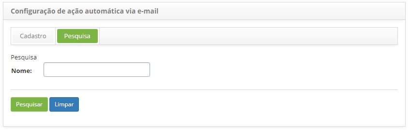
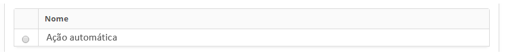
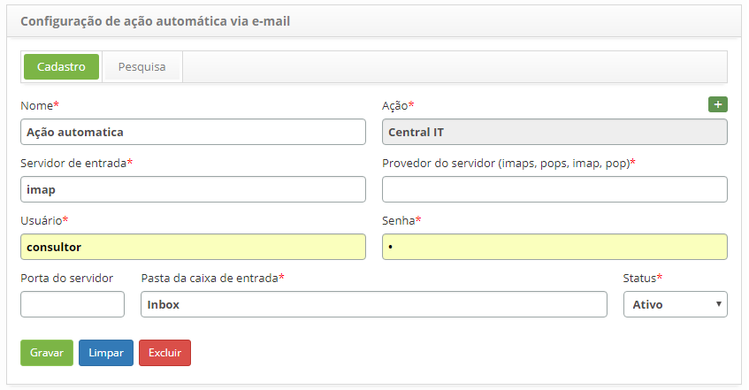

title: Manual de configuração de ação automática via e-mail
Description: A finalidade desta funcionalidade é programar a abertura automática de solicitações de serviço via e-mail.
# Manual de configuração de ação automática via e-mail

Como acessar
-------------

1. Acesse a funcionalidade de configuração de ação automática via e-mail através da navegação no menu principal
**Sistema > Configurações > Configuração de ação automática via e-mail**.

Pré-condições
--------------

1. Cadastrar ação automática de incidente/requisição/procedimento (ver conhecimento [Cadastro e pesquisa de ações automáticas][1], 
seção "Ações Automáticas - Incidentes/Requisições/Procedimentos").

Filtros
---------

1. O seguinte filtro possibilita ao usuário restringir a participação de itens na listagem padrão da funcionalidade, facilitando a 
localização dos itens desejados:

    - Nome.
    
2. Na tela de **Configuração de Ação Automática via E-mail**, clique na aba **Pesquisa**, será apresentada a respectiva tela de
pesquisa conforme ilustrada na figura abaixo:

    
    
    **Figura 1 - Tela de pesquisa de configuração de ação automática via e-mail**
    
3. Realize a pesquisa da configuração de ação automática via e-mail;

4. Informe o nome da ação automática via e-mail que deseja pesquisar e clique no botão "Pesquisar". Após isso, será exibido o 
registro conforme o nome informado;

5. Caso deseje listar todos os registros, basta clicar diretamente no botão "Pesquisar".

Listagem de itens
-------------------

1. O seguinte campo cadastral está disponível ao usuário para facilitar a identificação dos itens desejados na listagem padrão 
da funcionalidade: **Nome**.

    
    
    **Figura 2 - Tela de listagem de configuração de ação automática via e-mail**
    
2. Após a pesquisa, selecione o registro desejado. Feito isso, será direcionado para a tela de cadastro exibindo o conteúdo 
referente ao registro selecionado;

3. Para alterar os dados do registro de configuração da ação automática via e-mail, basta modificar as informações desejadas e
clicar no botão "Gravar".

Preenchimento dos campos cadastrais
-------------------------------------

1. Será apresentada a tela de **Configuração de ação automática via e-mail**, onde poderá registrar a configuração da ação 
automática via e-mail, conforme ilustrada na figura abaixo:

    
    
    **Figura 3 - Tela de configuração de ação automática via e-mail**
    
2. Preencha os campos conforme orientação abaixo:

    - **Nome**: informe o nome da ação automática;
    - **Ação**: informe a ação automática de incidentes/requisições/procedimentos. Essa ação será utilizada como template para a 
    abertura da solicitação de serviço, pois a mesma possui informações relevantes para a abertura de uma solicitação de 
    serviço;
    - **Servidor de entrada**: informe o servidor de entrada de e-mail, conforme mencionado no parâmetro 23;
    - **Provedor do servidor (impas, pops, imap, pop)**: informe o provedor do servidor de e-mails, conforme mencionado no 
    parâmetro 26;
    - **Usuário**: informe o usuário da conta de e-mail, conforme mencionado no parâmetro 24;
    - **Senha**: informe a senha de acesso de e-mail, conforme mencionado no parâmetro 25;
    - **Porta do servidor**: informe a porta do servidor de e-mails, conforme mencionado no parâmetro 27;
    - **Pasta de caixa de entrega**: informe a pasta da caixa de entrada de e-mails, conforme mencionado no parâmetro 28;
    - **Status**: informe o status da ação automática via e-mail.
    
3. Após preenchimento dos campos clique no botão "Gravar" para efetuar o registro, onde a data, hora e usuário serão gravados 
automaticamente para uma futura auditoria.

!!! tip "About"

    <b>Product/Version:</b> CITSmart | 7.00 &nbsp;&nbsp;
    <b>Updated:</b>07/19/2019 – Larissa Lourenço
    
[1]:/pt-br/citsmart-platform-7/plataform-administration/configuring-automatic-actions/automatic-actions.html
