title: Cadastro e pesquisa de ações automáticas
Description: As ações automáticas são associadas no cadastro de gerentes de eventos.
# Cadastro e pesquisa de ações automáticas

As ações automáticas são associadas no cadastro de gerentes de eventos. Estas ações serão relacionadas de acordo com o tipo do
evento desejado e disparadas sempre que for reconhecido um evento significativo.

- Ações Automáticas;
- Notificação;
- Mudanças;
- Problema;
- Incidentes/Requisições/Procedimentos.

Esta funcionalidade tem como objetivo relacionar as ações de incidentes/requisições e/ou notificação às ações automáticas. É 
importante notar que um único evento pode iniciar qualquer um ou a combinação destes processos por exemplo, uma falha é 
registrada como um incidente, e uma notificação é registrada para informar os interessados.

Como acessar
--------------

1. Acesse a funcionalidade de ações automáticas através da navegação no menu principal 
**Sistema > Ações Automáticas > Ações Automáticas**.

Pré-condições
----------------

1. Cadastrar ação automática de notificação (ver seção "Ações Automáticas - Notificação");

2. Cadastrar ação automática de mudança (ver seção "Ações Automáticas - Mudança");

3. Cadastrar ação automática de problema (ver seção "Ações Automáticas - Problema");

4. Cadastrar ação automática de incidentes/requisições/procedimentos (ver seção "Ações Automáticas -
Incidentes/Requisições/Procedimentos").

Filtros
---------

1. O seguinte filtro possibilita ao usuário restringir a participação de itens na listagem padrão da funcionalidade, facilitando
a localização dos itens desejados:

    - Nome.
    
    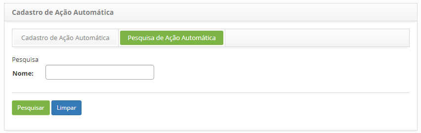
    
    **Figura 1 - Tela de pesquisa de ação automática**
    
2. Execute a busca automática de ações:

    - Digite o nome da ação automática que deseja pesquisar e clique no botão "Pesquisar". Depois disso, o registro de ação 
    automática será exibido de acordo com o nome inserido;
    
    - Se você quiser listar todos os registros de ação automática, basta clicar no botão "Pesquisar" diretamente.
    
Listagem de itens
-------------------

1. O seguinte campo cadastral está disponível ao usuário para facilitar a identificação dos itens desejados na listagem 
padrão da funcionalidade: **Nome**.

    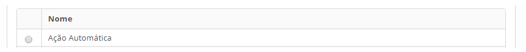
    
    **Figura 2 - Tela de listagem de tipo de ação**
    
2. Pesquise e selecione a ação que desejar conforme sua necessidade e será adicionada e exibida na tela de cadastro;

3. Clique no botão "Gravar" para efetuar o registro, onde a data, hora e usuário serão gravados automaticamente para uma futura 
auditoria.

Preenchimento dos campos cadastrais
-------------------------------------

1. Na aba Cadastro de Ação Automática preencha o campo, conforme figura abaixo:

    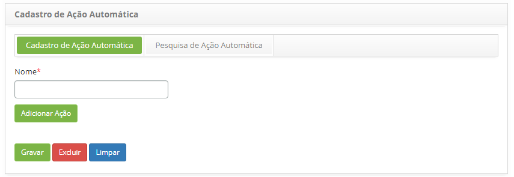
    
    **Figura 3 - Tela de cadastro de ação automática**
    
2. Clique no botão "Gravar" para finalizar o cadastro.

Ações automáticas - Notificação
--------------------------------

Esta funcionalidade tem como objetivo cadastrar ações automáticas de notificação. A notificação formaliza e comunica 
informações sobre o evento e é importante que as informações sobre um evento sejam descritas e completas para facilitar 
posteriormente a tomada de decisão. Este cadastro será associado às ações automáticas, e será usado nos cadastros de gerentes
de eventos do CITSmart Nagios, Zabbix, Inventory e Eventos Correlacionados.

Pré-condições
----------------

1. Cadastrar usuário (ver conhecimento Cadastro e pesquisa de usuário);

2. Cadastrar usuário (ver conhecimento Cadastro e pesquisa de usuário);

Como acessar
--------------

1. Acesse a funcionalidade através da navegação no menu principal**Sistema > Ações Automáticas > Ações Notificação**.

!!! note "NOTA"

    Convém que as notificações de eventos sejam enviadas somente para os responsáveis pelo tratamento das ações ou decisões 
    relacionadas. Isto evita notificações desnecessárias para aqueles que não estão diretamente envolvidos no processo dos 
    eventos.
    
Filtros
---------

1. O seguinte filtro possibilita ao usuário restringir a participação de itens na listagem padrão da funcionalidade, facilitando
a localização dos itens desejados:

    - Nome.

2. Na tela de **Cadastro de Ação da Notificação**, clique na aba **Pesquisa de Ação de Notificação**. Será apresentada a tela de
pesquisa conforme ilustrada na figura abaixo:

    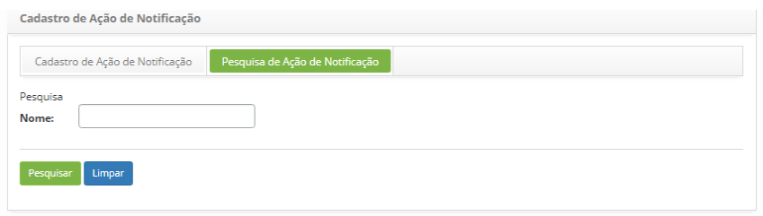
    
    **Figura 4 - Tela de pesquisa de ação de notificação**
    
3. Realize a pesquisa de ação automática de notificação:

    - Informe o nome da ação automática de notificação que deseja pesquisar e clique no botão "Pesquisar". Após isso, será exibido
    o registro de ação automática de notificação conforme o nome informado;
    
    - Caso deseje listar todos os registros de ação automática de notificação, basta clicar diretamente no botão "Pesquisar".
    
Listagem de itens
-------------------

1. O seguinte campo cadastral está disponível ao usuário para facilitar a identificação dos itens desejados na listagem padrão 
da funcionalidade: **Nome**.

    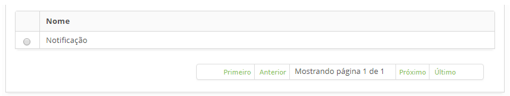
    
    **Figura 5 - Tela de listagem de ação de notificação**
    
2. Após a pesquisa, selecione o registro desejado. Feito isso, será direcionado para a tela de cadastro exibindo o conteúdo 
referente ao registro selecionado;

3. Para alterar os dados do registro de ação automática de notificação, basta modificar as informações dos campos desejados e 
clicar no botão "Gravar" para que seja gravada a alteração realizada no registro, onde a data, hora e usuário serão gravados 
automaticamente para uma futura auditoria.

Preenchimento dos campos cadastrais
-------------------------------------

1. Será apresentada a tela de **Cadastro de Ação Automática de Notificação**, conforme ilustrada na figura abaixo:

    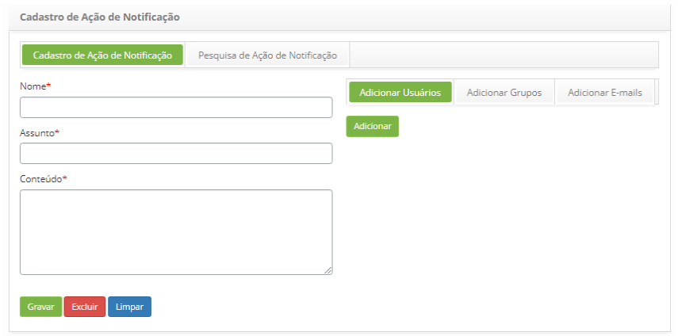
    
    **Figura 6 - Tela de cadastro de ação automática de notificação**
    
2. Preencha os campos conforme orientações abaixo:

    - **Nome**: informe o nome que desejar para a ação automática de notificação;
    - **Assunto**: informe o assunto da notificação;
    - **Conteúdo**: informe uma descrição com os motivos da notificação;
    - As notificações deverão ser enviadas para as pessoas responsáveis e interessadas, podendo escolher entre usuários, e/ou 
    grupos e/ou e-mail:
        - Para adicionar usuários, clique na aba **Adicionar Usuários**, clique no botão "Adicionar", e será apresentada a tela
        para pesquisa e seleção do usuário;
        - Para adicionar grupos, clique na aba **Adicionar Grupos**, clique no botão "Adicionar", será apresentada a tela 
        para pesquisa e seleção do grupo;
        - Para adicionar e-mail, clique na aba **Adicionar E-mails**, informe o e-mail no campo disponível e clique no 
        botão "Adicionar";
    - Clique no botão "Gravar" para efetuar o registro, onde a data, hora e usuário serão gravados automaticamente para uma 
    futura auditoria.
    
Ações automáticas - Mudança
------------------------------

Alguns eventos irão apresentar uma situação onde a ação apropriada precisará ser tratada pelo processo de gerenciamento de
mudança, ou seja, esta funcionalidade tem como objetivo realizar o cadastro de ações automáticas do tipo mudança. Este cadastro
será associado às ações automáticas, onde será usado nos cadastros de gerentes de eventos do CITSmart Nagios, Zabbix, Inventory
e Eventos Correlacionados.

Pré-condições
----------------

1. Cadastrar contrato (ver conhecimento Cadastro e pesquisa de contrato);

2. Cadastrar unidade (ver conhecimento Cadastro e pesquisa de unidade);

3. Cadastrar solicitante (colaborador) (ver conhecimento Cadastro e pesquisa de colaborador);

4. Cadastrar “Comitê Consultivo de Mudanças” (grupo) para que seja listado na tela de requisição de mudanças (ver conhecimento 
Cadastro e pesquisa de grupo);

5. Cadastrar tipo de mudança, o qual deverá ter o vínculo com o fluxo referente a requisição de mudança (ver conhecimento 
Cadastro e pesquisa de tipo de mudança);

6. Configure os parâmetros abaixo (ver conhecimento Regras de parametrização - mudança):

    - Parâmetro 47;
    - Parâmetro 279;
    - Parâmetro 280.
    
7. Vincular grupo aos contratos, associando os Solicitantes (colaboradores) já cadastrados a este grupo, para que sejam listados 
os contratos e os solicitantes relacionados na tela de requisição de mudança. Caso seja preciso criar um novo colaborador, é
necessário incluí-lo ao Grupo de Solicitante no qual esteja relacionado ao contrato para que o mesmo consiga realizar uma 
requisição de mudança, ou seja, para que o nome dele seja listado na tela de requisição de mudança (ver conhecimento Cadastro
e pesquisa de contrato);

8. Vincular unidade ao contrato para que a unidade seja listada na tela de requisição de mudança (ver conhecimento Cadastro e 
pesquisa de contrato).

Como acessar
--------------

1. Acesse a funcionalidade através da navegação no menu principal **Sistema > Ações Automáticas > Ações Mudança**.

Filtros
---------

1. O seguinte filtro possibilita ao usuário restringir a participação de itens na listagem padrão da funcionalidade, facilitando
a localização dos itens desejados:

    - Nome.
    
    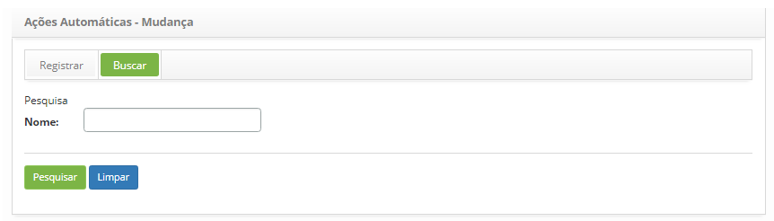
    
    **Figura 7 - Tela de pesquisa de ação automática de mudança**
    
2. Realize a pesquisa de ação automática de mudança;

    - Informe o nome da ação automática de mudança que deseja pesquisar e clique no botão "Pesquisar". Após isso, será exibido o 
    registro de ação automática de mudança conforme o nome informado;
    
    - Caso deseje listar todos os registros de ação automática de mudança, basta clicar diretamente no botão "Pesquisar".
    
Listagem de itens
-------------------

1. O seguinte campo cadastral está disponível ao usuário para facilitar a identificação dos itens desejados na listagem padrão 
da funcionalidade: **Nome**.

2. Na tela de **Ações Automáticas - Mudança**, clique na aba **Buscar**. Será apresentada a tela de pesquisa conforme ilustrada 
na figura abaixo:

    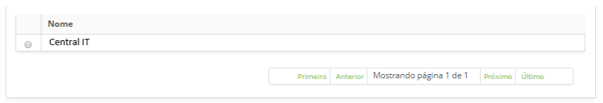
    
    **Figura 8 - Tela de listagem de ação automática de mudança**
    
3. Após a pesquisa, selecione o registro desejado. Feito isso, será direcionado para a tela de cadastro exibindo o conteúdo 
referente ao registro selecionado;

4. Para alterar os dados do registro de ação automática de mudança, basta modificar as informações dos campos desejados e clicar
no botão "Gravar" para que seja gravada a alteração realizada no registro, onde a data, hora e usuário serão gravados 
automaticamente para uma futura auditoria.

Preenchimento dos campos cadastrais
-------------------------------------

1. Será apresentada a tela de cadastro de ação automática de mudança, conforme ilustrada na figura abaixo:

    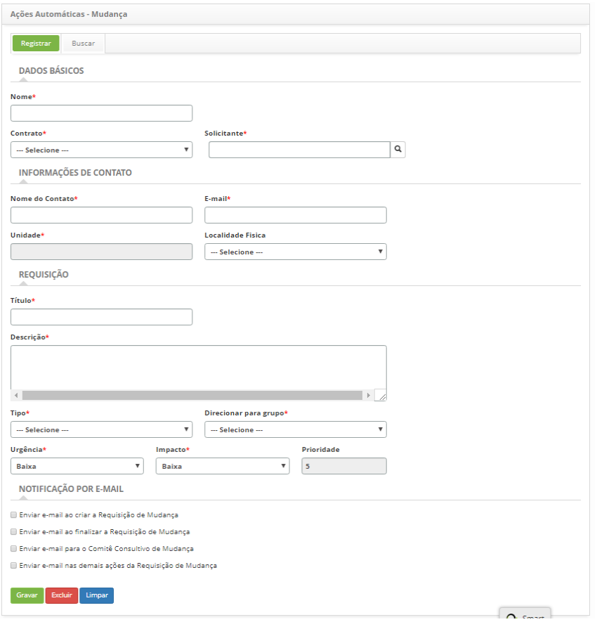
    
    **Figura 9 - Tela de cadastro de ações automáticas de mudança**
    
2. Preencha os campos conforme orientações abaixo:

    - **Nome**: informe o nome da ação automática para requisição de mudança;
    - **Contrato**: selecione o contrato para qual será feita a requisição de mudança;
    - **Solicitante**: informe o nome do solicitante, ou seja, o nome da pessoa que está solicitando a requisição de mudança;
    - **Nome do Contato**: informe o nome da pessoa para contato sobre a requisição de mudança;
    - **E-mail**: informe o e-mail para contato;
    - **Unidade**: informe a unidade do contato;
    - **Localidade Física**: informe a localidade física do contato;
    - **Título**: informe o título para a requisição de mudança;
    - **Descrição**: informe a descrição para a requisição de mudança;
    - **Tipo**: informe o tipo da requisição de mudança;
    - **Direcionar para grupo**: selecione o grupo para o qual será direcionada a requisição de mudança para o atendimento;
    - **Urgência**: indique a velocidade na qual a mudança precisa ser realizada;
    - **Impacto**: indique o grau de impacto da mudança;
    - **Prioridade**: este campo é para simples conferência. A prioridade será definida pelo sistema, após informar a urgência e 
    impacto;
    - Caso tenha definido no cadastro de grupo, que as opções de notificação de e-mail serão selecionadas ao registrar a 
    requisição de mudança, marque as opções de notificação por e-mail para que o solicitante receba as notificações sobre a 
    requisição de mudança.
    
3. Clique no botão Gravar para efetuar o registro, onde a data, hora e usuário serão gravados automaticamente para uma futura 
auditoria.

Ações automáticas - Problema
------------------------------

Alguns eventos irão apresentar uma situação onde a ação apropriada precisará ser tratada pelo processo de gerenciamento de 
problema, ou seja, esta funcionalidade tem como objetivo realizar o cadastro de ações automáticas do tipo problema. Este 
cadastro será associado às ações automáticas, onde será usado nos cadastros de gerentes de eventos do CITSmart Nagios, 
Zabbix, Inventory e Eventos Correlacionados.

Pré-condições
----------------

1. Cadastrar contrato (ver conhecimento Cadastro e pesquisa de contrato);

2. Cadastrar unidade (ver conhecimento Cadastro e pesquisa de unidade);

3. Cadastrar solicitante (colaborador) (ver conhecimento Cadastro e pesquisa de colaborador);

4. Cadastrar grupo (ver conhecimento Cadastro e pesquisa de grupo);

5. Cadastrar categoria de problema, a qual deverá ter o vínculo com o fluxo referente ao problema (ver conhecimento 
Cadastro e pesquisa de categoria de problema);

6. Vincular unidade ao contrato para que a unidade seja listada na tela de registro de problema (ver conhecimento 
Cadastro e pesquisa de contrato);

7. Vincular grupo aos contratos, associando os solicitantes (colaboradores) já cadastrados a este grupo, para que sejam listados
os contratos e os solicitantes relacionados na tela de registro de problema. Caso seja preciso criar um novo colaborador, é 
necessário incluí-lo ao grupo de solicitante no qual esteja relacionado ao contrato para que o mesmo consiga registrar um 
problema, ou seja, para que o nome dele seja listado na tela de registro de problema (ver conhecimento 
Cadastro e pesquisa de contrato).

Como acessar
--------------

1. Acesse a funcionalidade através da navegação no menu principal **Sistema > Ações Automáticas > Ações Problema**.

Filtros
---------

1. O seguinte filtro possibilita ao usuário restringir a participação de itens na listagem padrão da funcionalidade, facilitando
a localização dos itens desejados:

    - Nome.
    
    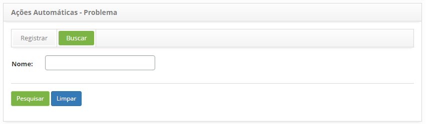
    
    **Figura 10 - Tela de pesquisa de ação automática de problema**
    
2. Realize a pesquisa de ação automática de problema;

    - Informe o nome da ação automática de problema que deseja pesquisar e clique no botão "Pesquisar". Após isso, será exibido o
    registro de ação automática de problema conforme o nome informado;
    
    - Caso deseje listar todos os registros de ação automática de problema, basta clicar diretamente no botão "Pesquisar".
    
Listagem de itens
-------------------

1. O seguinte campo cadastral está disponível ao usuário para facilitar a identificação dos itens desejados na listagem padrão
da funcionalidade: **Nome**.

    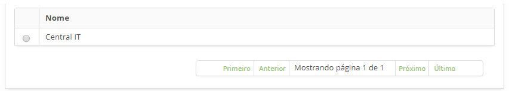
    
    **Figura 11 - Tela de listagem de ação automática de problema**
    
2. Após a pesquisa, selecione o registro desejado. Feito isso, será direcionado para a tela de cadastro exibindo o conteúdo 
referente ao registro selecionado;

3. Para alterar os dados do registro de ação automática de problema, basta modificar as informações dos campos desejados e clicar
no botão "Gravar" para que seja gravada a alteração realizada no registro, onde a data, hora e usuário serão gravados
automaticamente para uma futura auditoria.

Preenchimento dos campos cadastrais
-------------------------------------

1. Será apresentada a tela de cadastro de ação automática de problema, conforme ilustrada na figura abaixo:

    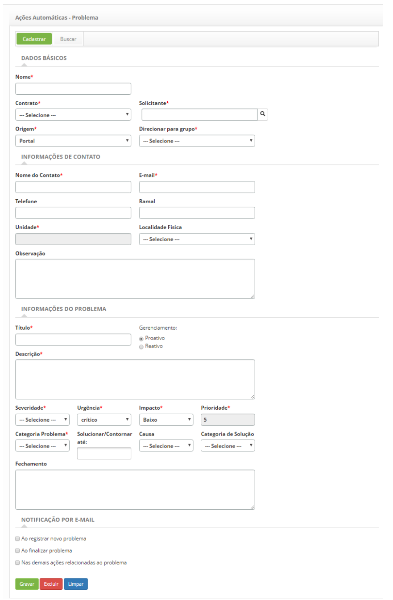
    
    **Figura 12 - Tela de cadastro de ações automáticas de problema**
    
2. Preencha os campos conforme orientações abaixo:

    - **Nome**: informe o nome da ação automática para requisição de problema;
    - **Contrato**: selecione o contrato para qual será feita a requisição de problema;
    - **Solicitante**: informe o nome do solicitante, ou seja, o nome da pessoa que está solicitando a requisição de problema;
    - **Origem**: informe a origem da requisição do problema;
    - **Direcionar para o grupo**: selecione o grupo para o qual será direcionada a requisição de problema para atendimento;
    - **Nome do Contato**: informe o nome da pessoa para contato sobre a requisição de problema;
    - **E-mail**: informe o e-mail para contato;
    - **Telefone**: informe o telefone do contato;
    - **Ramal**: informe o ramal do contato;
    - **Unidade**: informe a unidade do contato;
    - **Localidade Física**: informe a localidade física do contato;
    - **Observação**: descreva os detalhes adicionais sobre o contato, caso seja necessário;
    - **Título**: informe o título para o problema;
    - **Gerenciamento**: selecione o tipo de gerenciamento do problema:
        - **Proativo**: proveniente do Gerenciamento Proativo de Problemas para a prevenção da ocorrência de Incidentes. Se 
        preocupa em prevenir que incidentes ocorram. Responsável por tratar de assuntos idênticos antes que eles aconteçam,
        garantindo que tais cenários também sejam endereçados.
        - **Reativo**: proveniente do processo de Gerenciamento de Incidentes. Se preocupa com a resolução de problemas em 
        resposta a um ou mais incidentes. Executa a revisão e a análise de incidentes para identificar a quais grupos devem 
        ser endereçados e quais as ações necessárias para tratá-los.
    - **Descrição**: informe a descrição para a requisição de problema;
    - **Severidade**: indique a severidade do problema;
    - **Urgência**: indique a urgência para resolução do problema;
    - **Impacto**: indique o grau de impacto do problema;
    - **Prioridade**: este campo é para simples conferência. A prioridade vai de 1 a 5, sendo que o 1 é a prioridade mais alta e
    5 é a mais baixa e é definida pelo sistema, após informar a severidade, urgência e impacto.
    - **Categoria Problema**: selecione a categoria do problema;
    - **Solucionar/Contornar até**: defina a data limite para resolução do problema;
    - **Causa**: selecione a causa do problema;
    - **Categoria de Solução**: selecione a categoria de solução do problema;
    - **Fechamento**: informe a descrição da solução ou contorno do problema.
    
3. Caso tenha definido no cadastro de grupo, que as opções de notificação de e-mail serão selecionadas ao registrar a requisição
de problema, marque as opções de notificação por e-mail para que o solicitante receba as notificações sobre a requisição de 
problema;

4. Clique no botão "Gravar" para efetuar o registro, onde a data, hora e usuário serão gravados automaticamente para uma futura 
auditoria.

Ações automáticas - Incidentes/Requisições/Procedimentos
----------------------------------------------------------

Alguns eventos irão apresentar uma situação onde a ação apropriada precisará ser tratada pelo processo de gerenciamento de
incidentes, ou seja, esta funcionalidade tem como objetivo realizar o cadastro de ações automáticas do tipo 
incidente/requisição/procedimento. Este cadastro será associado às ações automáticas, onde será usado nos cadastros de 
gerentes de eventos do CITSmart Nagios, Zabbix, Inventory e Eventos Correlacionados.

Pré-condições
----------------

1. Cadastrar grupo (ver conhecimento Cadastro e pesquisa de grupo);

2. Cadastrar contrato (ver conhecimento Cadastro e pesquisa de contrato);

3. Vincular grupo aos contratos, associando os solicitantes (colaboradores) já relacionado a este grupo, para que sejam listados
os contratos e os solicitantes relacionados na tela de solicitação. Caso seja preciso criar um novo colaborador, é necessário 
incluí-lo ao grupo no qual está relacionado ao contrato para que o mesmo consiga abrir uma solicitação, ou seja, para que o nome
dele seja listado na tela de registro de solicitação (ver conhecimento Cadastro e pesquisa de contrato);

4. Vincular unidade aos contratos para que a mesma seja listada na tela de solicitação (ver conhecimento 
Cadastro e pesquisa de contrato);

5. Definir portfólio de serviços (ver conhecimento Cadastro de portfólio de serviços);

6. Definir tempo de atendimento dos serviços (ver conhecimento Cadastro e pesquisa de tempo de atendimento);

7. Definir grupo de primeiro nível para o atendimento da solicitação, caso não seja direcionado para um Grupo;

8. Cadastrar grupos de atividade periódica para agendamento das atividades da solicitação (ver conhecimento Cadastro
e pesquisa de grupo de atividade periódica).

Como acessar
--------------

1. Acesse a funcionalidade através da navegação no menu principal **Sistema > Ações Automáticas > Ações de 
Incidentes/Requisições/Procedimentos**.

!!! abstract "SAIBA MAIS"

    O gerenciamento de eventos apoia o processo de gerenciamento de incidentes, pois a partir dele é possível detectar com 
    antecedência falhas nos serviços e atuar rapidamente para evitar uma indisponibilidade do serviço para o usuário final.
    
Filtros
---------

1. O seguinte filtro possibilita ao usuário restringir a participação de itens na listagem padrão da funcionalidade, facilitando 
a localização dos itens desejados:

    - Nome.
    
    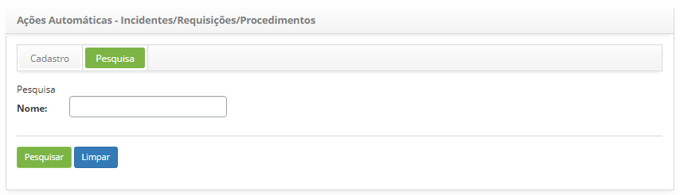
    
    **Figura 13 - Tela de pesquisa de ações automáticas de incidentes/requisições/procedimentos**
    
2. Realize a pesquisa de ação automática de incidentes/requisições/procedimentos;

    - Informe o nome da ação automática de incidentes/requisições/procedimentos que deseja pesquisar e clique no botão "Pesquisar".
    Após isso, será exibido o registro de ação automática de incidentes/requisições/procedimentos conforme o nome informado;
    
    - Caso deseje listar todos os registros de ação automática de incidentes/requisições/procedimentos, basta clicar diretamente
    no botão "Pesquisar".
    
Listagem de itens
-------------------

1. O seguinte campo cadastral está disponível ao usuário para facilitar a identificação dos itens desejados na listagem padrão 
da funcionalidade: **Nome**.

    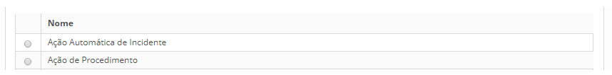
    
    **Figura 14 - Tela de listagem de ações automáticas de incidentes/requisições/procedimentos**
    
2. Após a pesquisa, selecione o registro desejado. Feito isso, será direcionado para a tela de cadastro exibindo o conteúdo 
referente ao registro selecionado;

3. Para alterar os dados do registro de ação automática de incidentes/requisições/procedimentos, basta modificar as informações
dos campos desejados e clicar no botão "Gravar" para que seja gravada a alteração realizada no registro, onde a data, hora e 
usuário serão gravados automaticamente para uma futura auditoria.

Preenchimento dos campos cadastrais
-------------------------------------

1. Será apresentada a tela de cadastro de ação automática de incidentes/requisições/procedimentos, conforme ilustrada na figura 
abaixo:

    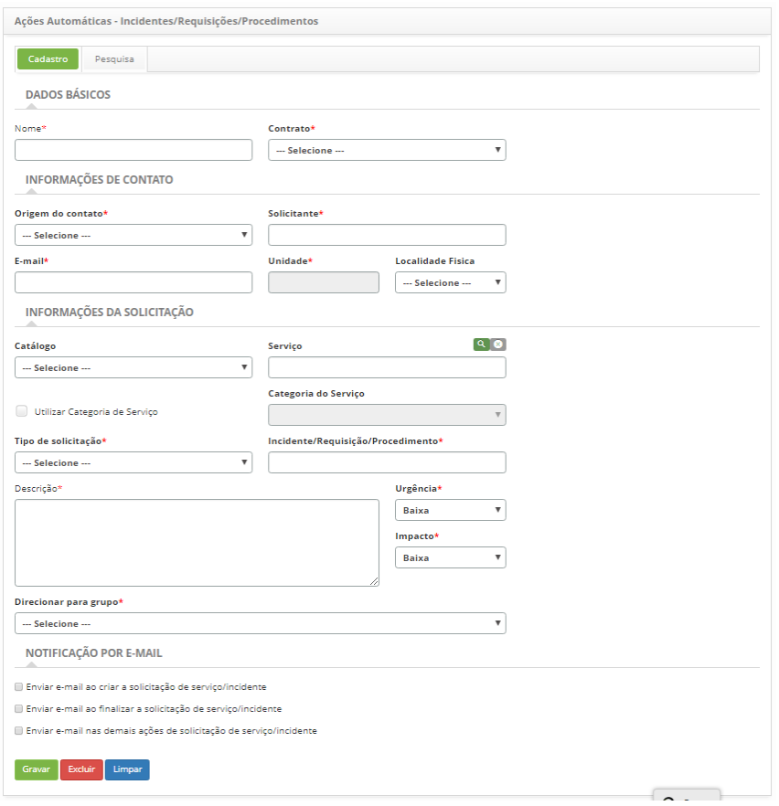
    
    **Figura 15 - Tela de cadastro de ações automáticas de incidentes/requisições/procedimentos**
    
2. Preencha os campos conforme orientações abaixo:

    - **Nome**: informe o nome que desejar para a ação automática de incidente/requisição/procedimento;
    - **Contrato**: selecione o contrato para qual será feita a abertura de incidente/requisição/procedimento;
    - **Origem do contato**: selecione a origem da solicitação;
    - **Solicitante**: selecione o nome do solicitante, ou seja, o nome da pessoa que está solicitando a abertura de incidente 
    ou requisição de serviço;
    - **E-mail**: informe o e-mail do solicitante;
    - **Unidade**: informe a unidade do solicitante;
    - **Localidade Física**: informe a localização física do solicitante;
    - **Catálogo**: caso tenha selecionado o contrato do tipo "contrato", será exibida neste campo a informação do Catálogo de
    Serviços de "Negócio" e caso tenha selecionado o contrato do tipo "contrato de apoio" ou "acordo de nível operacional", será
    exibida neste campo a informação do Catálogo de Serviços "Técnico";
    - **Serviço**: informe o serviço referente ao catálogo de serviços. Se o catálogo de serviços for de "negócio", serão 
    disponibilizados neste campo os serviços de negócio para seleção, mas se o catálogo de serviços for "técnico", serão 
    disponibilizados neste campo os serviços de apoio/técnico para seleção;
    - **Utilizar a categoria de serviços**: marque este campo, se optar buscar os serviços por categoria;
    - **Categoria de Serviços**: caso tenha optado pela busca de serviços por categoria, informe a categoria de serviço desejada.
    A categoria do serviço irá identificar a natureza do serviço, posicionando-o dentro de grupos semelhantes de atuação, 
    situando-o na hierarquia de sua categoria;
    - **Tipo de solicitação**: selecione o tipo da solicitação, se é uma abertura de incidente, requisição de serviço ou 
    procedimento;
        - **Incidente**: indicar caso a situação apresentada seja uma interrupção não planejada, uma redução na qualidade do 
        serviço ou falha de algum item de configuração que ainda não tenha impactado um serviço de TI. Ex.: O link de rede está
        fora, a rede está lenta, o servidor inacessível, etc;
        - **Requisição**: são pedidos de demandas realizados pelos usuários dentro do ambiente da Tecnologia da Informação. Podem
        ser desde pedidos de acesso até sugestões de melhoria a baixo custo. Ex.: Solicitação de configuração de algum 
        equipamento, requisição para adicionar algum software na estação de trabalho, etc.
        - **Procedimento**: refere-se ao processo/procedimento de continuidade do serviço de TI, no caso de ocorrência de 
        incidente crítico. É com o procedimento que você determinará o método que colocará o processo em pratica, ou seja, 
        determinar as etapas da execução, criar check-list, definir em que momento cada pessoa deve realizar cada atividade e 
        quais recursos devem ser utilizados para que haja a entrega do produto ou serviço de acordo com o esperado.
    - **Incidente/Requisição/Procedimento**: selecione o serviço a ser realizado;
    - **Descrição**: informe a descrição do incidente/requisição/procedimento. A descrição deve ser objetiva, incluindo toda
    informação necessária para o atendimento da solicitação;
    - **Urgência**: indique a velocidade na qual o serviço precisa ser realizado;
    - **Impacto**: indique o impacto do serviço;
    - **Direcionar para grupo**: selecione o grupo para o qual será direcionada a solicitação para o atendimento.
    - **Notificação por e-mail**: caso tenha definido no cadastro de grupo, que as opções de notificação de e-mail serão 
    selecionadas ao registrar a solicitação, marque as opções de "notificação por e-mail" para que o solicitante receba as 
    notificações sobre a solicitação.
    
3. Clique no botão "Gravar" para efetuar o registro, onde a data, hora e usuário serão gravados automaticamente para uma futura
auditoria.

!!! tip "About"

    <b>Product/Version:</b> CITSmart | 7.00 &nbsp;&nbsp;
    <b>Updated:</b>07/19/2019 – Larissa Lourenço
