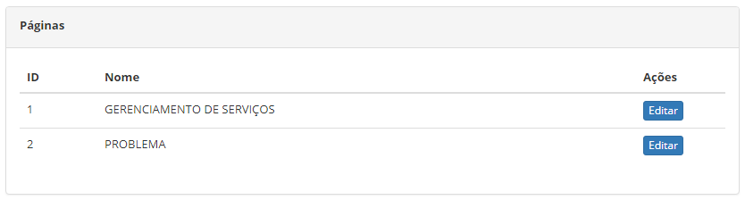
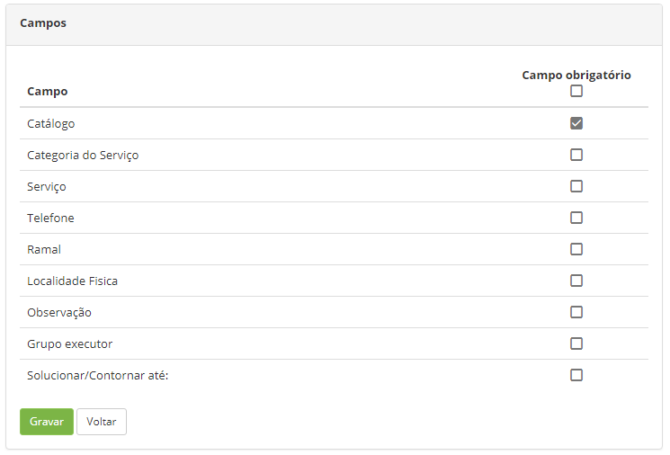

title: Configuração de campos de obrigatoriedade
Description: Esta funcionalidade tem por objetivo configurar campos que podem ser obrigatórios.
# Configuração de campos de obrigatoriedade

Esta funcionalidade tem por objetivo configurar campos que podem ser obrigatórios.

Como acessar
--------------

1. Acesse a funcionalidade de configuração de campos através da navegação no menu principal 
**Sistema > Configurações > Páginas - Configuração de campos**.

Pré-condições
---------------

1. Não se aplica.

Filtros
---------

1. Não se aplica.

Listagem de itens
--------------------

1. O seguinte campo cadastral está disponível ao usuário para facilitar a identificação dos itens desejados na listagem padrão 
da funcionalidade: **ID** e **Nome**.

2. Existe um botão de ação disponível ao usuário em relação a cada item da listagem, é ele: "Editar".

**Figura 1 - Páginas**

Preenchimentos dos campos cadastrais
--------------------------------------

1. Clique no botão "Editar" (conforme ilustrado na figura anterior). Feito isso, será apresentada a tela para configuração de 
obrigatoriedade dos campos, conforme ilustrada na figura a seguir:

    
    
    **Figura 2 - Campos**
    
2. Marque o(s) campo(s) que deseja que seu preenchimento seja obrigatório;

3. Clique no botão "Gravar" para efetuar o registro, onde a data, hora e usuário serão gravados automaticamente para uma futura 
auditoria.

!!! tip "About"

    <b>Product/Version:</b> CITSmart | 7.00 &nbsp;&nbsp;
    <b>Updated:</b>07/22/2019 – Larissa Lourenço
