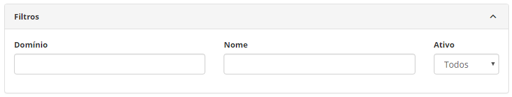
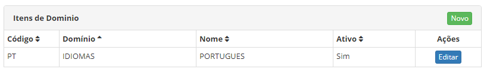
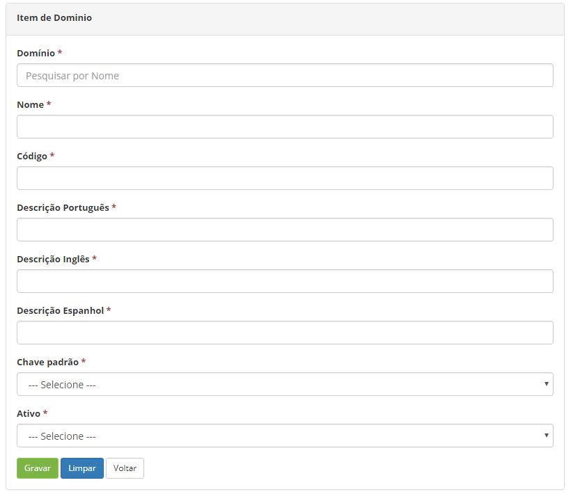

title: Cadastro e pesquisa de itens de domínio
Description: A funcionalidade de Itens de Domínio tem por objetivo permitir a customização das opções do campo de uma tela.
# Cadastro e pesquisa de itens de domínio

A funcionalidade de Itens de Domínio tem por objetivo permitir a customização das opções do campo de uma determinada tela do 
sistema. Para utilizar a mesma, deverá ter conhecimento sobre a codificação do sistema.

Como acessar
--------------

1. Acesse a funcionalidade de Itens de Domínio através da navegação no menu principal 
**Sistema > Configurações de Domínio > Itens de Domínio**.

Pré-condições
---------------

1. Ter o domínio cadastrado (ver conhecimento [Cadastro e pesquisa de domínios](/pt-br/citsmart-platform-7/plataform-administration/customizable-fields/register-domain.html).

Filtros
--------

1. Os seguintes filtros possibilitam ao usuário restringir a participação de itens na listagem padrão da funcionalidade, facilitando
a localização dos itens desejados, conforme ilustrado na figura abaixo:

    - Domínio;
    - Nome;
    - Ativo.
    
2. Na tela de **Itens de Domínios**, são exibidos os registros de itens de domínios listados, conforme ilustrada na figura abaixo:

    
    
    **Figura 1 - Tela de pesquisa de itens de domínios**
    
3. Para buscar um registro de item de domínio específico, basta preencher os filtros conforme sua necessidade.

Listagem de itens
-------------------

1. Os seguintes campos cadastrais estão disponíveis ao usuário para facilitar a identificação dos itens desejados na listagem 
padrão da funcionalidade: **Código, Domínio, Nome** e **Ativo**.

2. Existe um botão de ação disponíveil ao usuário em relação a cada item da listagem, é ele: "Editar".

    
    
    **Figura 2 - Tela de listagem de itens de domínios**
    
3. Para alterar os dados do registro de domínio, clique no botão "Editar".

Preenchimento dos campos cadastrais
------------------------------------

1. Será apresentada a tela de **Itens de Domínio**;

2. Clique no botão "Novo" (conforme a figura anterior). Feito isso, será apresentada a respectiva tela de **Cadastro de Item de 
Domínio**, conforme ilustrada na figura abaixo:

    
    
    **Figura 3 - Cadastro de item de domínio**
    
3. Preencha os campos conforme orientação abaixo:

    - **Domínio**: informe o domínio, no qual irá inserir o novo item;
    - **Nome**: informe o nome do item de domínio, ou seja, descrição da opção a ser inserida no campo referente ao domínio 
    selecionado;
    - **Código**: informe o código do item de domínio;
    - **Descrição Português**: informe o nome do item de domínio em português;
    - **Descrição Inglês**: informe o nome do item de domínio em inglês para internacionalização;
    - **Descrição Espanhol**: informe o nome do item de domínio em Espanhol para internacionalização;
    - **Chave padrão**: informe o se o item de domínio é uma chave padrão;
    - **Ativo**: selecione a situação do item de domínio.
    
4. Após os dados informados, clique no botão "Gravar" para efetuar a operação.

!!! tip "About"

    <b>Product/Version:</b> CITSmart | 7.00 &nbsp;&nbsp;
    <b>Updated:</b>07/22/2019 – Larissa Lourenço
