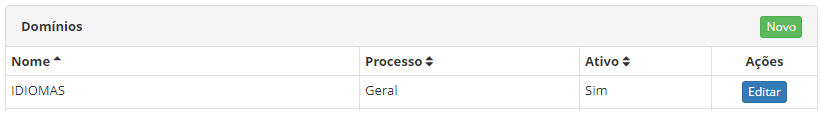

title: Cadastro e pesquisa de domínios
Description: A funcionalidade de Domínio tem por objetivo permitir o cadastro de domínios para inserção de novos itens de domínio.
# Cadastro e pesquisa de domínios

A funcionalidade de Domínio tem por objetivo permitir o cadastro de domínios para inserção de novos itens de domínio, ou seja, 
novas opções no campo de uma determinada tela do sistema. Para utilizar a mesma, deverá ter conhecimento sobre a codificação do
sistema.

Como acessar
---------------

1. Acesse o menu principal **Sistema > Configurações de Domínio > Domínios**.

Pré-condições
---------------

1. Não se aplica.

Filtros
---------

1. Os seguintes filtros possibilitam ao usuário restringir a participação de itens na listagem padrão da funcionalidade, facilitando
a localização dos itens desejados:

    - Nome;
    - Processo;
    - Ativo.
    
2. Na tela de **Domínios**, são exibidos os registros de domínios listados, conforme ilustrada na figura abaixo:

    
    
    **Figura 1 -Tela de pesquisa de domínio**
    
3. Para buscar um registro de domínio específico, basta preencher os filtros conforme sua necessidade.

Listagem de itens
-------------------

1. Os seguintes campos cadastrais estão disponíveis ao usuário para facilitar a identificação dos itens desejados na listagem
padrão da funcionalidade: **Nome, Processo** e **Ativo**.

    
    
    **Figura 2 - Tela de listagem de domínio**
    
2. Existe um botão de ação disponível ao usuário em relação a cada item da listagem, é ele: "Editar".

Preenchimento dos campos cadastrais
-------------------------------------

1. Será apresentada a tela de Domínios. Clique no botão "Novo". Feito isso, será apresentada a respectiva tela de **Cadastro 
de Domínio**, conforme ilustrada na figura abaixo:

    
    
    **Figura 3 - Cadastro de domínio**
    
2. Preencha os campos conforme orientação abaixo:

    - **Nome**: informe o nome do domínio. O mesmo deverá ter uma relação com algum enumerado especificado no código do sistema;
    - **Processo**: selecione o processo referente ao domínio;
    - **Tipo**: selecione o tipo de domínio;
    - **Ativo**: selecione a situação domínio.
    
3. Após os dados informados, clique no botão "Gravar" para efetuar a operação.

!!! tip "About"

    <b>Product/Version:</b> CITSmart | 7.00 &nbsp;&nbsp;
    <b>Updated:</b>07/22/2019 – Larissa Lourenço
