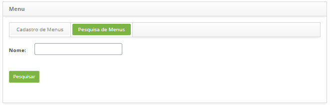
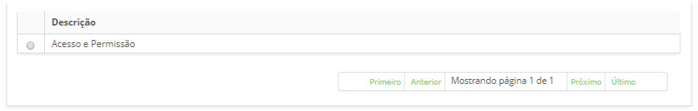
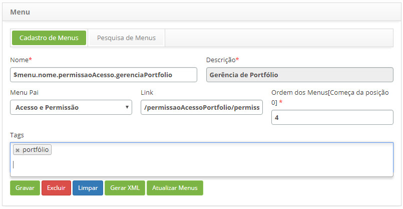
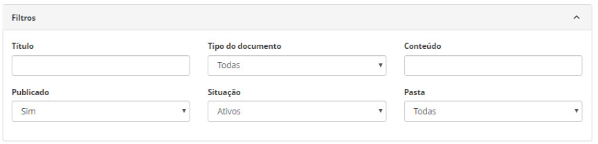
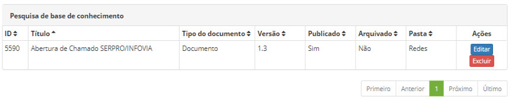
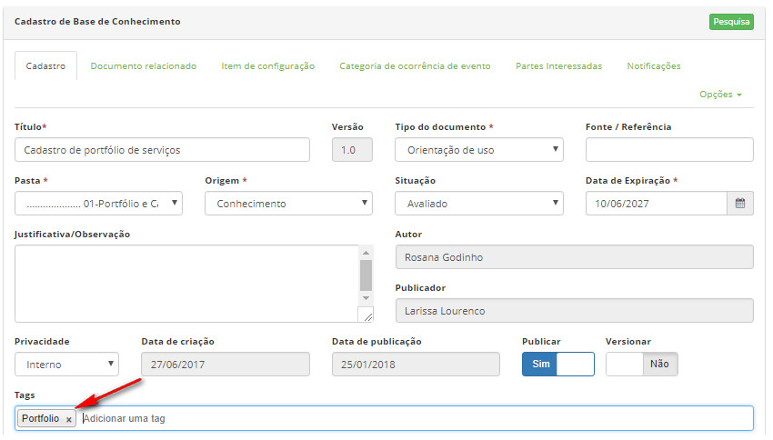
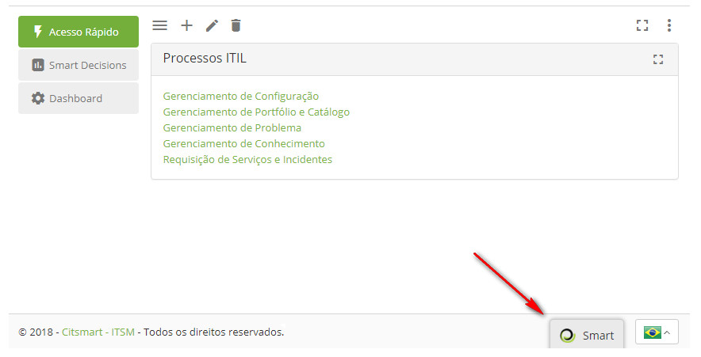
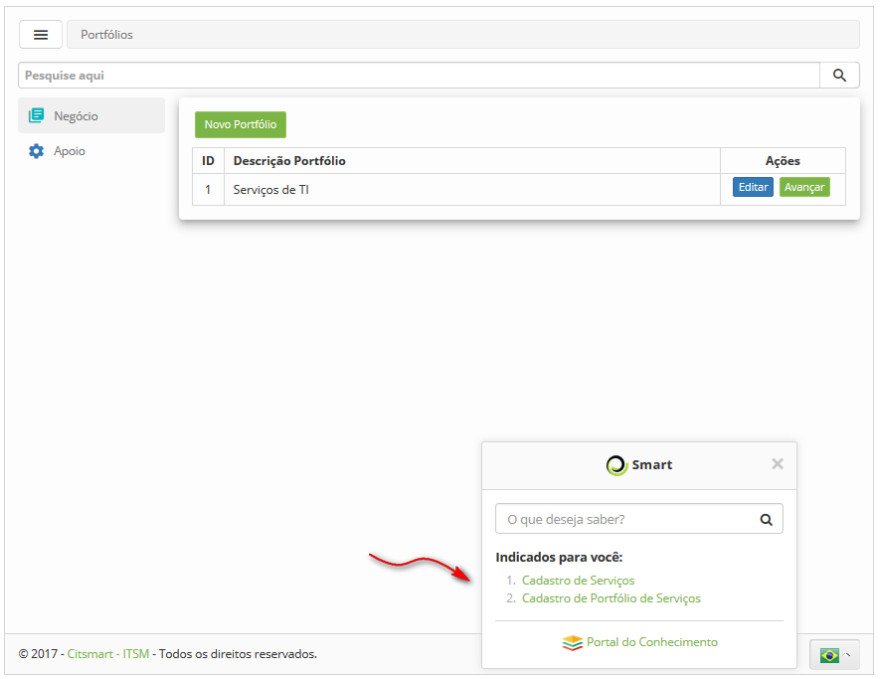

title:  Smart Button
Description: O Smart Button facilita a busca de conhecimentos relacionados à determinada funcionalidade. 
# Smart Button

O Smart Button facilita a busca de conhecimentos relacionados à determinada funcionalidade. Por isso, o mesmo é exibido em todas as 
funcionalidades do sistema.

Ao configurar as tags no registro do item de menu de uma determinada funcionalidade e no registro do conhecimento referente à 
funcionalidade, quando estiver navegando na mesma e clicar no Smart Button, serão apresentados os conhecimentos indicados 
referentes à funcionalidade. No item abaixo é apresentado o passo a passo de como configurar essas tags.

Pré-condições
---------------

1. Não se aplica.

Preenchimento dos campos cadastrais
---------------------------------------

1. Não se aplica.

Configuração das tags para utilização do Smart Button
--------------------------------------------------------

Como acessar
--------------

1. Acesse o menu principal **Cadastros Gerais > Menu**

Filtros
----------

1. O seguinte filtro possibilita ao usuário restringir a participação de itens na listagem padrão da funcionalidade, facilitando a 
localização dos itens desejados:

    - Nome.
    
    
    
    **Figura 1 - Tela de pesquisa de menu**
    
Listagem de itens
------------------

1. O seguinte campo cadastral está disponível ao usuário para facilitar a identificação dos itens desejados na listagem padrão da
funcionalidade: **Descrição**.

    
    
    **Figura 2 - Tela de listagem de itens**
    
Configurando as tags
------------------------

1. Configure as tags no registro do item de menu da determinada funcionalidade:

    - Na guia de **Pesquisa de Menus**, busque pelo registro do item de menu referente a funcionalidade desejada. Feito isso, 
    será exibido registro do item de menu;
    - Informe as tags desejadas, conforme exemplo ilustrado na figura abaixo:
    
    
    
    **Figura 3 - Item de menu**
    
Configurando as tags dos conhecimentos referentes à determinada funcionalidade
--------------------------------------------------------------------------------

Como acessar
--------------

1. Acesse o menu principal **Processos ITIL > Gerência de Conhecimento > Gerenciamento de Conhecimento**.

Filtros
----------

1. O seguinte filtro possibilita ao usuário restringir a participação de itens na listagem padrão da funcionalidade, facilitando
a localização dos itens desejados:

    - Título;
    - Tipo de documento;
    - Conteúdo;
    - Publicado;
    - Situação;
    - Pasta.
    
    
    
    **Figura 4 - Tela de pesquisa de conhecimentos**
    
Listagem de itens
---------------------

1. Os seguintes campos cadastrais estão disponíveis ao usuário para facilitar a identificação dos itens desejados na listagem
padrão da funcionalidade: **ID, Título, Tipo de documento, Versão, Publicado, Arquivado** e **Pasta**.

2. Existem botões de ação disponíveis ao usuário em relação a cada item da listagem, são eles: "Editar" e "Excluir".

**Figura 5 - Tela de listagem de conhecimentos**

Configurando as Tags
-----------------------

1. Ao acessar a funcionalidade, será apresentada a tela de Gerenciamento de Conhecimentos:

- Busque pelo conhecimento desejado;
- Informe a tag de acordo com a que foi informada no registro do item de menu da funcionalidade. A figura abaixo ilustra um 
exemplo:

**Figura 6 - Registro de conhecimento**

!!! warning "ATENÇÃO"

    Ao realizar a configuração das tags no registro do item de menu e no registro do conhecimento, será necessário aguardar o 
    tempo de sincronização (talvez tenha que sair e entrar novamente do sistema) para que os conhecimentos sejam exibidos no
    Smart Button.
    
Verificando a integração das tags dos conhecimentos referente à determinada funcionalidade
---------------------------------------------------------------------------------------------

1. Após a configuração das tags, ao entrar na determinada funcionalidade, basta clicar no **Smart Button** conforme indicado na 
figura abaixo:

    
    
    **Figura 7 - Smart button**
    
2. Serão apresentados os conhecimentos indicados referentes à funcionalidade, conforme exemplo ilustrado na figura abaixo:

    
    
    **Figura 8 - Conhecimentos indicados**
    
3. Para visualizar o conteúdo do conhecimento, bastar clicar no mesmo.

!!! tip "About"

    <b>Product/Version:</b> CITSmart | 7.00 &nbsp;&nbsp;
    <b>Updated:</b>07/30/2019 - Larissa Lourenço
