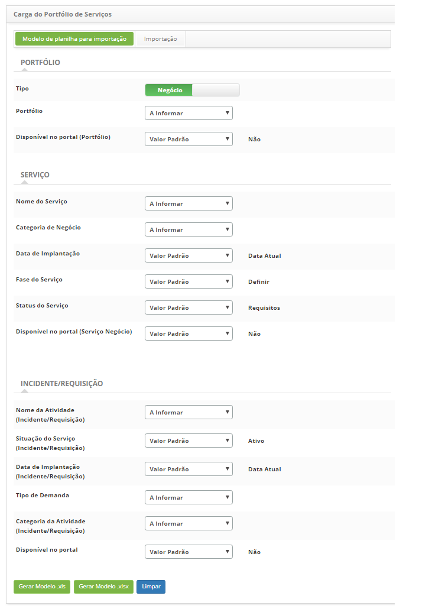
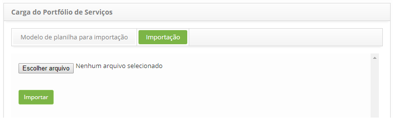

title: Carga do portfólio de serviços
Description: O objetivo desta funcionalidade é otimizar a criação de vários serviços e consequentemente de suas atividades.
# Carga do portfólio de serviços

O objetivo desta funcionalidade é otimizar a criação de vários serviços e consequentemente de suas atividades dentro de um ou 
mais portfólios de serviços.

Como acessar
--------------

1. Acesse a funcionalidade de carga do portfólio de serviços através da navegação no menu principal 
**Sistema > Importação e Carga de Dados > Carga do Portfólio de Serviços**.

Pré-condições
----------------

1. Cadastrar tipo de serviço (ver conhecimento [Cadastro e pesquisa de tipo de serviço](/pt-br/citsmart-platform-7/processes/portfolio-and-catalog/type-service.html));

2. Cadastrar a categoria de serviço (ver conhecimento [Cadastro e pesquisa de categoria de serviço](/pt-br/citsmart-platform-7/processes/portfolio-and-catalog/service-category.html)).

Filtros
---------

1. Não se aplica.

Listagem de itens
-------------------

1. Não se aplica.

Cadastrando modelo de planilha para importação - Preenchimento dos campos cadastrais
---------------------------------------------------------------------------------------

1. Após isso, será apresentada a tela de **Carga do Portfólio de Serviços** para registro de modelo de planilha para importação, 
conforme ilustrada na figura abaixo:

    
    
    **Figura 1 - Tela de cadastro de modelo de planilha para importação**
    
2. O cadastro de planilha para importação está estruturado conforme o passo a passo para se criar um portfólio de serviços com as
etapas Portfólio, Serviço e Atividade (Incidente/Requisição). De acordo com o campo, os valores a se preencher podem ser:

    - **Valor Padrão**: Será apresentado um valor padrão já pré-definido;
    - **A Informar**: Ao gerar a planilha esse campo estará disponível para preenchimento;
    - **Informado**: Será apresentado um campo para escolha do valor com o qual se deseja preencher.
    
    - Portfólio:
        - **Tipo**: selecione se o tipo de portfólio, que pode ser de “Negócio” ou “Apoio”;
        - **Portfólio**: selecione a opção de preenchimento do campo;
        - **Disponível no portal (Portfólio)**: selecione a opção de preenchimento do campo.
        
    - Serviço:
        - **Nome do Serviço**: selecione a opção de preenchimento do campo;
        - **Categoria de Negócio**: selecione a opção de preenchimento do campo;
        - **Data de Implantação**: selecione a opção de preenchimento do campo;
        - **Fase do Serviço**: selecione a opção de preenchimento do campo;
            - Se a opção escolhida for "Á informar", será apresentada a opção "Adicionar campos de Classificação". Caso queira 
            adicionar os campos de classificação, basta clicar na opção referente. Feito isso, serão apresentados os respectivos
            campos para serem preenchidos com as opções desejadas;
            - Se a opção escolhida for "Informado" será apresentado um campo para escolha da fase. Ao informar a fase "Analisar" 
            serão exibidos os campos de classificação para serem preenchidos.
        - **Status do Serviço**: se a opção escolhida no campo anterior "Fase do Serviço" for "Á informar", esse campo será 
        preenchido de forma automática com a mesma opção escolhida, mas caso não seja, selecione a opção de preenchimento do
        campo;
        - **Disponível no portal (Serviço Negócio)**: selecione a opção de preenchimento do campo.
        
    - Incidente/Requisição:
        - **Nome da Atividade (Incidente/Requisição)**: selecione a opção de preenchimento do campo;
        - **Situação do Serviço (Incidente/Requisição)**: selecione a opção de preenchimento do campo;
        - **Data de Implantação (Incidente/Requisição)**: selecione a opção de preenchimento do campo;
        - **Tipo de Demanda**: selecione a opção de preenchimento do campo;
        - **Categoria da Atividade (Incidente/Requisição)**: selecione a opção de preenchimento do campo;
        - **Disponível no Portal**: selecione a opção de preenchimento do campo.
        
3. Para gerar modelo de planilha em formato ".xls", basta clicar no botão Gerar Modelo .xls.

4. Para gerar modelo de planilha em formato ".xlsx", basta clicar no botão Gerar Modelo .xlsx.

!!! note "NOTA"

    Ao gerar as planilhas independente do formato, o usuário encontrará campos com hiperlink. Esses campos recuperam a referência
    do enumerado com a descrição do campo. Nesses casos o usuário utilizará o enumerado para preenchimento correto da lista.
    
Realizando importação de portfólio de serviço
------------------------------------------------

1. Na tela de **Carga do Portfólio de Serviços**, na aba **Importação**, é apresentada a respectiva tela, conforme ilustração 
abaixo:

    
    
    **Figura 2 - Importação de portfólio de serviços**
    
2. Clique no botão "Escolher arquivo" e será exibida uma janela para escolha do arquivo;

3. Selecione o arquivo, o qual deve estar em formato ".xls" ou ".xlsx";

4. Clique no botão "Importar";

5. Os dados importados poderão ser visualizados no Portfólio de Serviços.

!!! info "IMPORTANTE"

    Ao realizar a importação, caso haja alguma inconsistência entre os valores adotados no sistema e os valores informados na 
    planilha, o sistema exibirá um alerta.
    
!!! tip "About"

    <b>Product/Version:</b> CITSmart | 7.00 &nbsp;&nbsp;
    <b>Updated:</b>07/22/2019 – Larissa Lourenço
