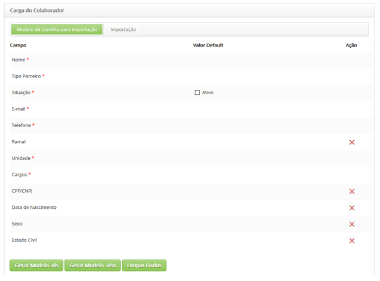
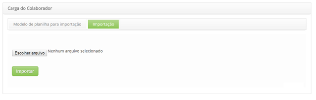

title: Importação
Description: Esta funcionalidade tem por objetivo otimizar a criação de novos cadastros de colaboradores.
# Importação

Esta funcionalidade tem por objetivo otimizar a criação de novos cadastros de colaboradores.

Cadastro modelo de planilha para importação
---------------------------------------------

1. Acesse a funcionalidade de carga do colaborador através da navegação no menu principal 
(**Sistema > Importação e Carga de Dados > Carga Colaborador*). Após isso, será apresentada a tela de **Carga do Colaborador** para
registro de modelo de planilha para importação, conforme ilustrada na figura abaixo:

    
    
    **Figura 1 - Tela de cadastro de modelo de planilha para importação**
    
2. O modelo está estruturado conforme o cadastro de colaborador, indicando os campos obrigatórios e os opcionais que são possíveis 
excluir antes de gerar o modelo de planilha.

3. Para gerar modelo de planilha em formato ".xls", basta clicar no botão "Gerar Modelo .xls";

4. Para gerar modelo de planilha em formato ".xlsx", basta clicar no botão "Gerar Modelo .xlsx";

5. O modelo de planilha terá os campos para preenchimento e algumas informações de valores permitidos.

Realizando importação de colaborador
-------------------------------------

1. Na tela de **Carga do Colaborador**, na aba **Importação**, é apresentada a respectiva tela, conforme ilustração abaixo:

    
    
    **Figura 2 - Importação de Colaborador**
    
2. Clique no botão "Escolher arquivo" e será exibida uma janela para escolha do arquivo;

3. Selecione o arquivo, o qual deve estar em formato ".xls" ou ".xlsx;

4. Clique no botão "Importar";

5. Os dados importados poderão ser visualizados na pesquisa de registro de colaboradores.

!!! info "IMPORTANTE"

    Ao realizar a importação, caso haja alguma inconsistência entre os valores adotados no sistema e os valores informados na 
    planilha, o sistema exibirá um alerta.
    
!!! tip "About"

    <b>Product/Version:</b> CITSmart | 7.00 &nbsp;&nbsp;
    <b>Updated:</b>07/22/2019 – Larissa Lourenço
