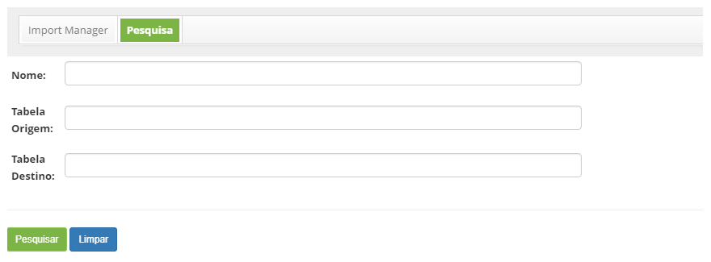
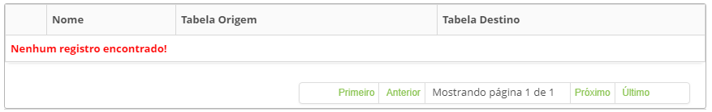
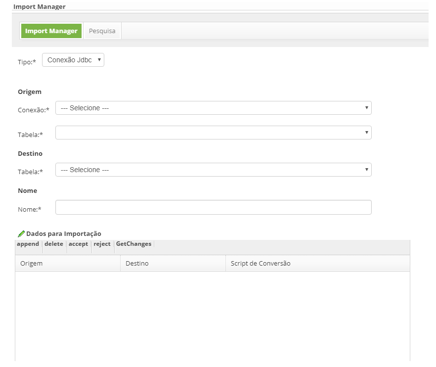

title: Gerência de importação (execução)
Description: Gerência de importação (execução)
# Gerência de importação (execução)

Como acessar
--------------

1. Acesse a funcionalidade de gerência de importação através da navegação no menu principal **Sistema > Gerência de Importação**.

Pré-condições
----------------

1. Não se aplica.

Filtros
---------

1. Os seguintes filtros possibilitam ao usuário restringir a participação de itens na listagem padrão da funcionalidade, facilitando
a localização dos itens desejados:

    - Nome;
    - Tabela Origem;
    - Tabela Destino.
    
2. Na tela de **Gerência de Importação**, clique na guia **Pesquisa**, será apresentada a tela de pesquisa conforme ilustrada na 
figura abaixo:

    
    
    **Figura 1 - Tela de pesquisa de importação**
    
3. Realize a pesquisa de importação;

    - Informe o nome, tabela origem e/ou tabela destino da importação e clique no botão "Pesquisar". Após isso, será exibido o 
    registro conforme os dados informados;
    
    - Caso deseje listar todos os registros de importação, basta clicar diretamente no botão "Pesquisar".
    
Listagem de itens
--------------------

1. Os seguintes campos cadastrais estão disponíveis ao usuário para facilitar a identificação dos itens desejados na listagem 
padrão da funcionalidade: **Nome, Tabela Origem** e **Tabela Destino**.

    
    
    **Figura 2 - Tela de listagem de importação**
    
2. Após a pesquisa, selecione o registro desejado. Feito isso, será direcionado para a aba de cadastro exibindo o conteúdo 
referente ao registro selecionado;

3. Para alterar os dados da importação, basta modificar as informações desejadas e clicar no botão "Gravar".

Preenchimento dos campos cadastrais
-------------------------------------

1. Será apresentada a tela para **Gerência de Importação**, conforme ilustrada na figura abaixo:

    
    
    **Figura 3 - Gerência de importação**
    
2. Preencha os campos conforme orientações abaixo:

    - **Tipo**: selecione o tipo de importação.
    
3. Informe os dados de Origem da Importação:

    - **Conexão**: selecione a conexão;
    - **Tabela**: selecione a tabela.
    
4. Informe os dados de Destino da Importação:

    - **Tabela**: selecione a tabela;
    - **Nome**: informe o nome da importação.
    
5. Informe os dados para Importação:

    - Clique em **append**;
    - Será listado uns campos abaixo para preenchimento;
    - Informe a **origem, destino** e **script de conversão** para importação.
    
6. Clique no botão "Executar" para execução da importação de dados;

7. Clique no botão "Gravar" para efetuar o registro, neste caso a data, hora e usuário serão armazenados automaticamente para uma 
futura auditoria.

!!! tip "About"

    <b>Product/Version:</b> CITSmart | 7.00 &nbsp;&nbsp;
    <b>Updated:</b>07/22/2019 – Larissa Lourenço
