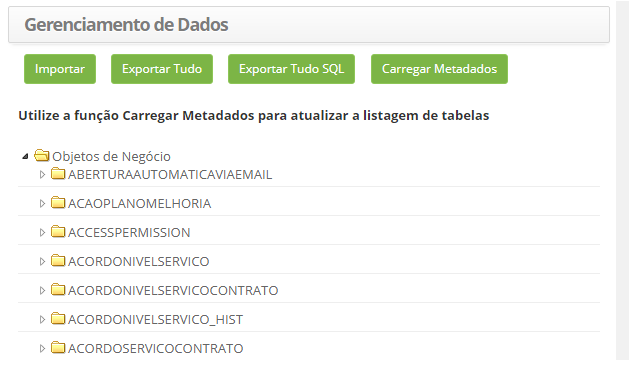
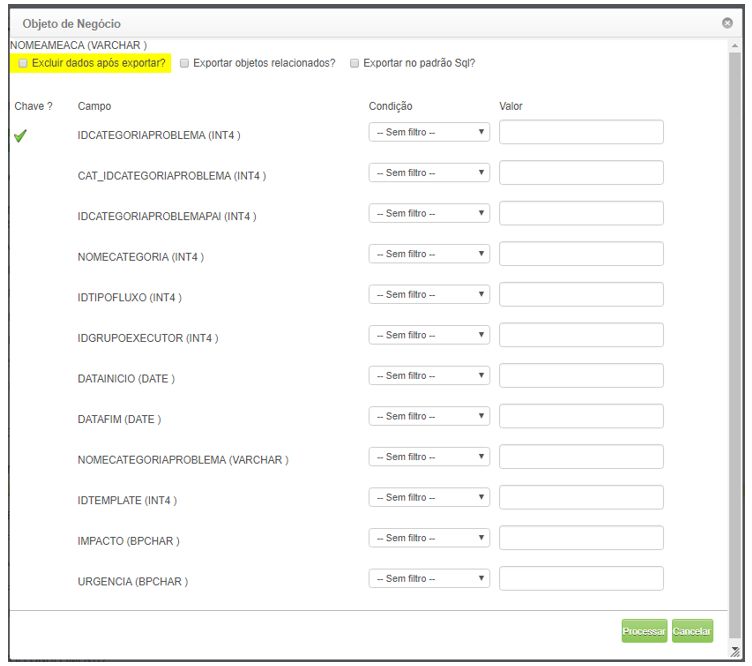
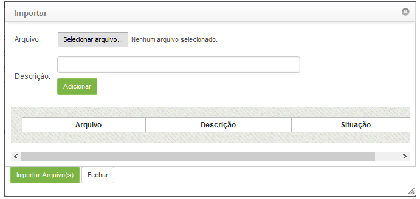

title: Gerenciamento de dados (importação e exportação)
Description: O objetivo desta funcionalidade é gerar exportação e importação de dados das tabelas do sistema.
# Gerenciamento de dados (importação e exportação)

O objetivo desta funcionalidade é gerar exportação e importação de dados das tabelas do sistema.

Como acessar
---------------

1. Acesse a funcionalidade de gerenciamento de dados através da navegação no menu principal 
**Sistema > Banco de Dados > Gerenciamento de Dados**.

Gerenciamento de dados
-----------------------

1. Será apresentada a tela **Gerenciamento de Dados** contendo uma listagem das tabelas do sistema, conforme ilustrada na figura
abaixo:

    
    
    **Figura 1 - Gerenciamento de dados**
    
2. Para gerar exportação das tabelas do sistema em formato ".XML", basta clicar no botão "Exportar Tudo", onde será realizada a 
exportação de todas as tabelas do sistema no formato referente;

3. Para gerar exportação das tabelas do sistema em formato ".SQL", basta clicar no botão "Exportar Tudo SQL", onde será realizada a 
exportação de todas as tabelas do sistema com os comandos SQLs;

4. Caso deseje exportar uma tabela, proceder conforme os passos abaixo:

    - Clique duas vezes na tabela desejada;
    - Será aberta uma janela exibindo os dados existentes na tabela (veja figura abaixo);
    - Caso queira excluir a tabela após exportação, marque o campo referente;
    - Caso queira exportar objetos relacionados, marque o campo referente;
    - Caso queira exportar a tabela no padrão SQL, marque o campo referente;
    - Caso seja necessário, poderá informar uma condição e o valor para os campos da tabela;
    - Clique no botão "Processar" para realizar a exportação da tabela.
    
    
    
    **Figura 2 - Tela de configuração do objeto de negócio**
    
5. Caso deseje exportar um campo de uma tabela, proceder conforme os passos abaixo:

    - Clique no ícone  da tabela para exibir os campos da tabela;
    - Clique duas vezes no campo da tabela;
    - Uma tela de objeto de negócios será aberta para o campo de tabela idêntico à figura anterior;
    - Caso queira excluir o campo após exportação, marque o campo referente;
    - Caso queira exportar objetos relacionados, marque o campo referente;
    - Caso queira exportar o campo no padrão SQL, marque o campo referente;
    - Clique no botão "Processar" para realizar a exportação do campo da tabela.
    
6. Para realizar a importação de dados, clique no botão "Importar", onde será exibida uma janela para realizar o upload de 
arquivos;

    
    
    **Figura 3 - Tela de upload de arquivos**
    
    - Clique no botão "Escolher arquivo";
    - Selecione o arquivo, o qual foi feita a exportação;
    - Informe uma descrição para o mesmo, caso seja necessário;
    - Clique em "Adicionar" e clique em "Importar Arquivo(s)".
    
!!! tip "About"

    <b>Product/Version:</b> CITSmart | 7.00 &nbsp;&nbsp;
    <b>Updated:</b>07/22/2019 – Larissa Lourenço
