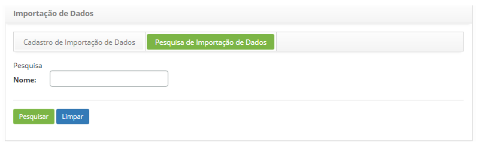
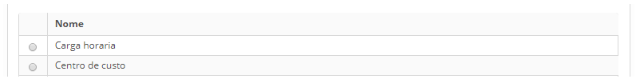
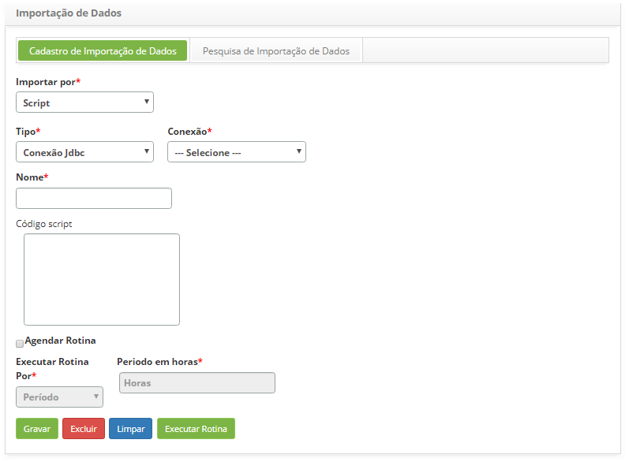
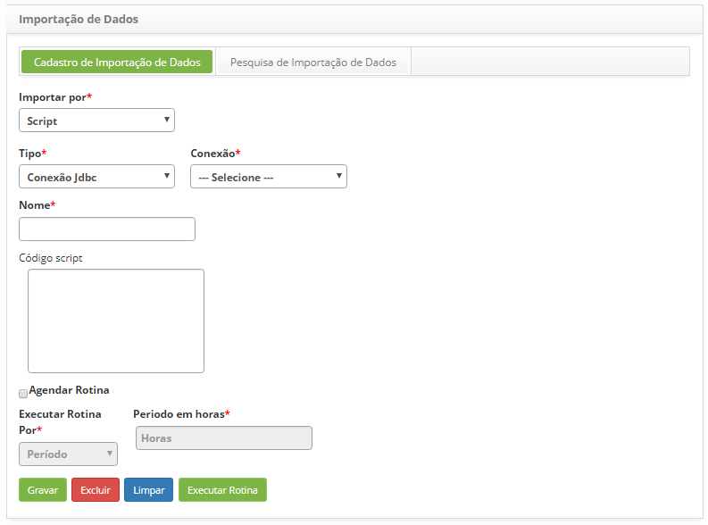
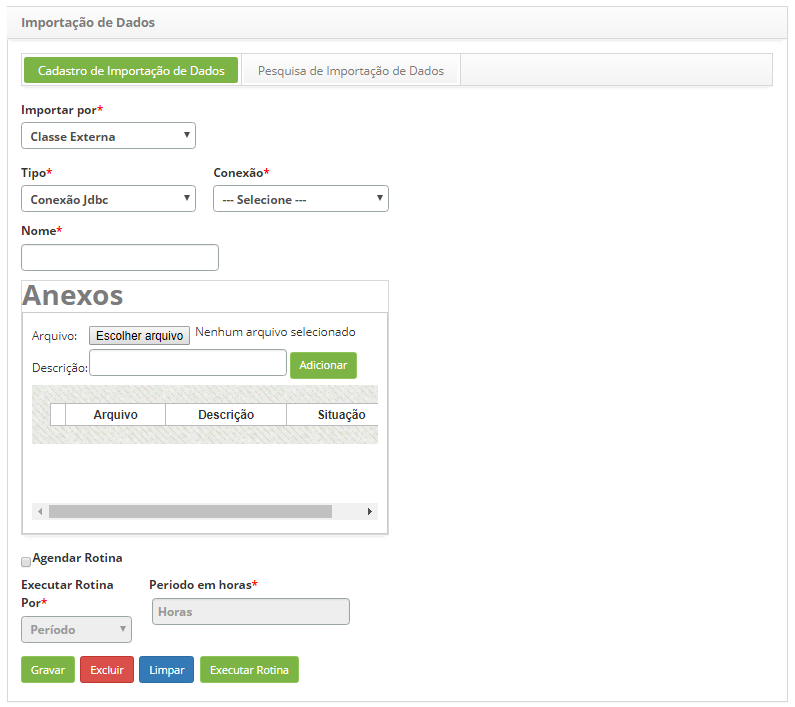
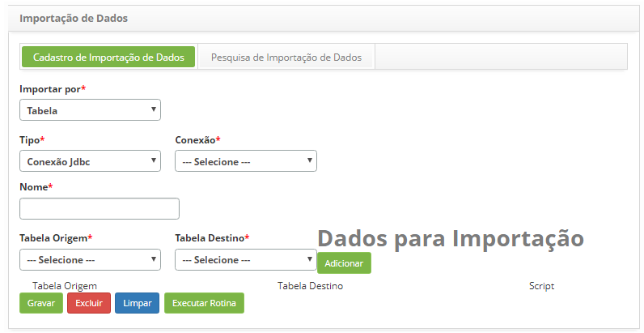

title: Cadastro e pesquisa de importação de dados
Description: A finalidade desta funcionalidade é realizar a importação de dados de uma outra base de dados para base de dados.
# Cadastro e pesquisa de importação de dados

A finalidade desta funcionalidade é realizar a importação de dados de uma outra base de dados para base de dados do CITSmart.

Como acessar
--------------

1. Acesse a funcionalidade de importação de dados através da navegação no menu principal 
**Sistema > Importação e Carga de Dados > Importação de Dados**.

Pré-condições
---------------

1. Conhecimento em programação e banco de dados;

2. Cadastrar conexão externa (ver conhecimento [Manual de configuração de conexões externas de banco de dados](/pt-br/citsmart-platform-7/plataform-administration/database/register-external-connections.html)).

Filtros
---------

1. O seguinte filtro possibilita ao usuário restringir a participação de itens na listagem padrão da funcionalidade, facilitando a 
localização dos itens desejados:

    - Nome.
    
2. Na tela de **Importação de Dados**, clique na guia **Pesquisa de Importação de Dados**, será apresentada a tela de pesquisa
conforme ilustrada na figura abaixo:

    
    
    **Figura 1 - Tela de pesquisa de importação de dados**
    
3. Realize a pesquisa de importação de dados;

4. Informe o nome da importação de dados que deseja pesquisar e clique no botão "Pesquisar". Após isso, será exibido o registro 
conforme o nome informado. Caso deseje listar todos os registros de visão, basta clicar diretamente no botão "Pesquisar".

Listagem de itens
--------------------

1. O seguinte campo cadastral está disponível ao usuário para facilitar a identificação dos itens desejados na listagem padrão
da funcionalidade: **Nome**.

    
    
    **Figura 2 - Tela de listagem de importação de dados**
    
2. Após a pesquisa, selecione o registro desejado. Feito isso, será direcionado para a aba de cadastro exibindo o conteúdo 
referente ao registro selecionado;

3. Para alterar os dados do registro da importação de dados, basta modificar as informações desejadas e clicar no botão "Salvar".

Preenchimento dos campos cadastrais
------------------------------------

1. Será apresentada a tela de **Importação de Dados** para cadastro de importação de dados, conforme ilustrada na figura abaixo:

    
    
    **Figura 3 - Importação de dados por script**
    
2. No campo **Importar por**, selecione a forma de importação, que pode ser **Script, Classe Externa** ou **Tabela**;

3. Caso a forma de importação seja por **Script**, proceda conforme os passos descritos abaixo:

    
    
    **Figura 4 - Importação de dados por script**
    
    - **Tipo**: selecione o tipo de importação;
    - **Conexão**: selecione a conexão;
    - **Nome**: informe o nome da importação;
    - **Código Script**: insira o código javascript baseado na especificação da tecnologia do Mozilla Rhino.
    
4. Se desejar, selecione a opção para **Agendar Rotina**, onde poderá executar essa rotina pelo período ou horário informado;

5. Caso a forma de importação seja por **Classe Externa**, proceda conforme os passos descritos abaixo:

    
    
    **Figura 5 - Importação de dados por classe externa**
    
    - **Tipo**: selecione o tipo de importação;
    - **Conexão**: selecione a conexão;
    - **Nome**: informe o nome da importação.
    
6. Na tela de **Anexos**: através de "Escolher arquivo", escolha um ou mais arquivos do tipo .jar e o(s) nomeie com uma Descrição,
logo após clique em "Adicionar", lembrando que os arquivos serão executados de acordo com a ordem de inserção;

7. Se desejar, selecione a opção para **Agendar Rotina**, onde poderá executar essa rotina pelo período ou horário informado;

8. Caso a forma de importação seja por **Tabela**, proceda conforme os passos descritos abaixo:

    
    
    **Figura 6 - Importação de dados por tabela**
    
    - **Tipo**: selecione o tipo de importação;
    - **Conexão**: selecione a conexão;
    - **Nome**: informe o nome da importação;
    - **Tabela de Origem**: selecione a tabela de origem, ou seja, a tabela da conexão selecionada que contém os dados que serão 
    importados;
    - **Tabela de Destino**: selecione a tabela de destino, ou seja, a tabela que vai receber as informações referente a migração.
    
9. Após a escolha das tabelas, seus dados deverão ser adicionados para importação, e se for necessário, através do campo 
**Script** poderá fazer um tratamento das colunas caso não sejam do mesmo tipo de dado;

10. Clique no botão "Executar Rotina" para execução da importação de dados;

11. Clique no botão "Gravar" para efetuar o registro, neste caso a data, hora e horário serão armazenados automaticamente para uma
futura auditoria.

!!! tip "About"

    <b>Product/Version:</b> CITSmart | 7.00 &nbsp;&nbsp;
    <b>Updated:</b>07/22/2019 – Larissa Lourenço
