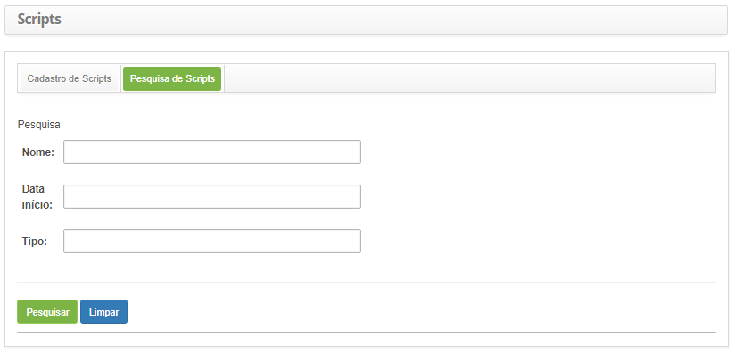
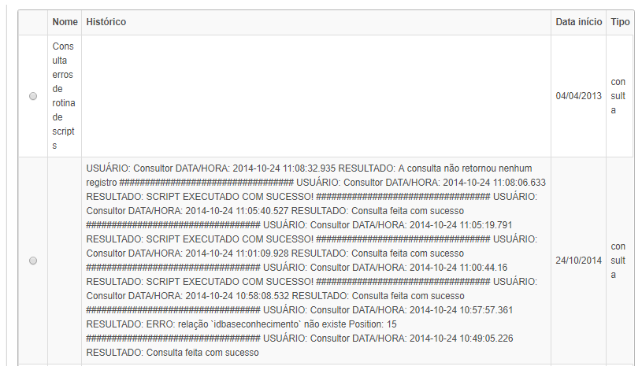
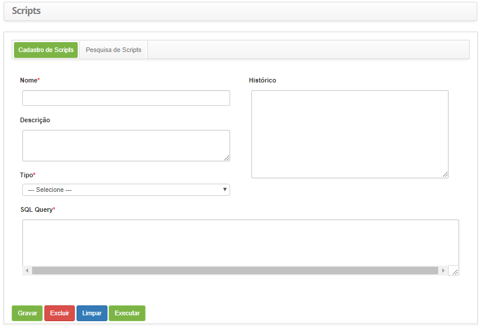

title: Cadastro e pesquisa de scripts
Description: O objetivo é manter registro de scripts para a execução dos mesmos no sistema.
# Cadastro e pesquisa de scripts

O objetivo é manter registro de scripts para a execução dos mesmos no sistema.

Como acessar
--------------

1.Acesse a funcionalidade de execução de scripts através da navegação no menu principal 
**Sistema > Banco de Dados > Execução de Scripts**.

Pré-condições
----------------

1. Não se aplica.

Filtros
----------

1. Os seguintes filtros possibilitam ao usuário restringir a participação de itens na listagem padrão da funcionalidade, facilitando 
a localização dos itens desejados:

    - Nome;
    - Data início;
    - Tipo.
    
2. Na tela de **Scripts**, clique na guia **Pesquisa de Scripts**, será apresentada a tela de pesquisa conforme ilustrada na figura
abaixo:

    
    
    **Figura 1 - Tela de pesquisa de scripts**
    
3. Realize a pesquisa de scripts;

    - Informe o nome, data de início e/ou tipo do script e clique no botão "Pesquisar". Após isso, será exibido o registro conforme
    os dados informados;
    - Caso deseje listar todos os registros de scripts, basta clicar diretamente no botão "Pesquisar".
    
Listagem de itens
-------------------

1. Os seguintes campos cadastrais estão disponíveis ao usuário para facilitar a identificação dos itens desejados na listagem
padrão da funcionalidade: **Nome, Histórico, Data início** e **Tipo**.

    
    
    **Figura 2 - Tela de listagem de scripts**
    
2. Após a pesquisa, selecione o registro desejado. Feito isso, será direcionado para a aba de cadastro exibindo o conteúdo 
referente ao registro selecionado;

3. Para alterar os dados de modelo de script, basta modificar as informações desejadas e clicar no botão "Gravar".

Preenchimento dos campos cadastrais
-------------------------------------

1. Será apresentada a tela de **Cadastro de Scripts**, conforme ilustrada na figura abaixo:

    
    
    **Figura 3 - Cadastro de scripts**
    
2. Preencha os campos conforme orientações abaixo:

    - **Nome**: informe o nome do Script;
    - **Descrição**: informe a descrição do Script;
    - **Tipo**: informe o tipo de Script que será executado;
    - **SQL Query**: informe o comando SQL.
    
3. Clique no botão "Gravar" para efetuar o registro, onde a data, hora e usuário serão gravados automaticamente para uma futura 
auditoria;

4. Após efetuar o registro do Script, clique no botão "Executar" para execução do Script, onde será exibido o resultado da 
execução no campo **Histórico**.

!!! tip "About"

    <b>Product/Version:</b> CITSmart | 7.00 &nbsp;&nbsp;
    <b>Updated:</b>07/22/2019 – Larissa Lourenço
