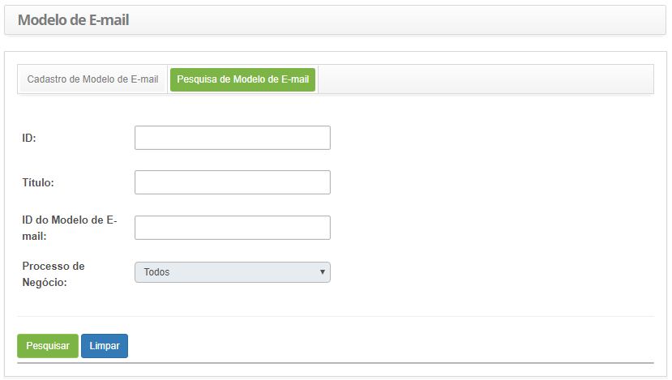
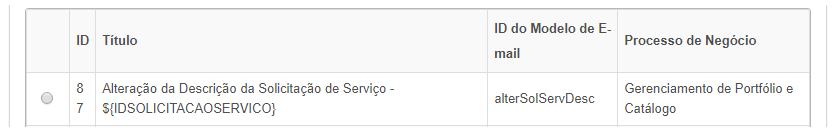
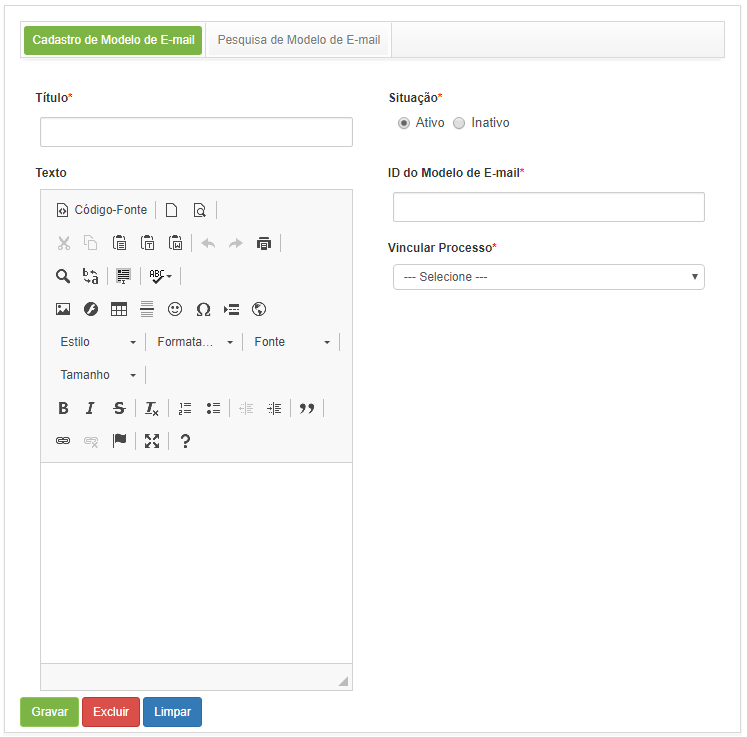
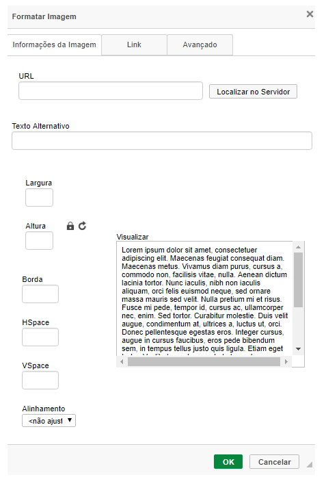
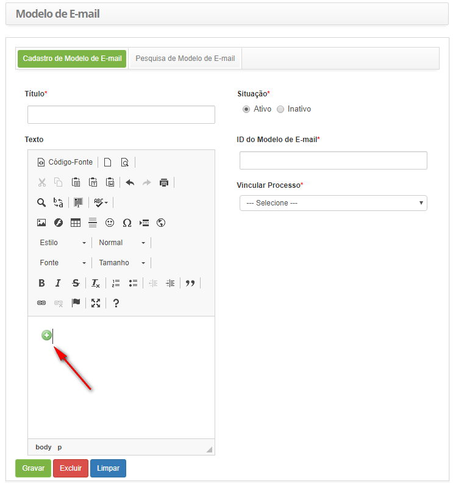
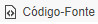

title: Cadastro e pesquisa de configuração de modelo de e-mail
Description: Esta funcionalidade tem por objetivo criar modelos de e-mail para notificações do sistema.
# Cadastro e pesquisa de configuração de modelo de e-mail

Esta funcionalidade tem por objetivo criar modelos de e-mail para notificações do sistema.

Como acessar
--------------

1. Acesse a funcionalidade de modelo de e-mail através da navegação no menu principal **Sistema > Configurações > Modelo de E-mail**.

Pré-condições
---------------

1. Não se aplica.

Filtros
---------

1. Os seguintes filtros possibilitam ao usuário restringir a participação de itens na listagem padrão da funcionalidade, facilitando
a localização dos itens desejados:

    - ID;
    - Título;
    - ID do Modelo de E-mail;
    - Processo de Negócio.
    
2. Na tela de **Modelo de E-mail**, clique na guia **Pesquisa de Modelo de E-mail**, será apresentada a tela de pesquisa conforme 
ilustrada na figura abaixo:

    
    
    **Figura 1 - Tela de pesquisa de modelo de e-mail**
    
3. Realize a pesquisa de modelo de e-mail;

    - Informe o ID, título, identificador e/ou processo de negócio do modelo de e-mail e clique no botão "Pesquisar". Após isso, 
    será exibido o registro conforme os dados informados;
    
    - Caso deseje listar todos os registros de modelo de e-mail, basta clicar diretamente no botão "Pesquisar".
    
Listagem de itens
------------------

1. Os seguintes campos cadastrais estão disponíveis ao usuário para facilitar a identificação dos itens desejados na listagem 
padrão da funcionalidade: **ID, Título, ID do Modelo de E-mail** e **Processo de Negócio**.

    
    
    **Figura 2 - Tela de listagem de modelo de e-mail**
    
2. Após a pesquisa, selecione o registro desejado. Feito isso, será direcionado para a aba de cadastro exibindo o conteúdo 
referente ao registro selecionado;

3. Para alterar os dados de modelo de e-mail, basta modificar as informações desejadas e clicar no botão "Gravar".

Preenchimento dos campos cadastrais
-------------------------------------

1. Será apresentada a tela de **Cadastro de Modelo de E-mail**, conforme ilustrada na figura abaixo:

    
    
    **Figura 3 - Cadastro de modelo de e-mail**
    
2. Preencha os campos conforme orientações abaixo:

    - **Título**: informe o título do modelo de e-mail;
    - **Situação**: informe a situação do modelo de e-mail, marcando uma das opções: ativo ou inativo;
    - **Texto**: descreva o modelo de e-mail;
    - **ID do Modelo de E-mail**: informe o identificador do modelo de e-mail;
    - **Vincular Processo**: informe o processo referente ao modelo de e-mail;
    
3. Caso queira adicionar uma imagem ao modelo de e-mail que está sendo criado, proceda da seguinte forma:

    - Na tela de **Galeria de Imagens**, selecione a categoria na qual foi adicionada a imagem. Feito isso, clique no botão "URL"
    da imagem para exibição do endereço da imagem;
    - Copie o endereço da imagem, feche a tela de galeria;
    - Na tela de **Modelo de E-mail**, no campo Texto, clique no ícone  para inserção da imagem;
    - Será exibida uma tela para informar a URL da imagem que deseja adicionar no modelo de e-mail, conforme ilustrada na figura 
    abaixo:
    
    
    
    **Figura 4 - Inserção de imagem no modelo de e-mail**
    
    - No campo **URL**, cole o endereço da imagem, o qual foi copiado da imagem na galeria de imagens. Após isso, será 
    apresentada a imagem no campo **Visualização**;
    - Caso seja necessário, informe um texto alternativo para imagem;
    - Clique em "Ok" para efetuar a operação;
    - Será inserida a imagem no modelo de e-mail, conforme exemplo ilustrado na figura abaixo:
    
    
    
    **Figura 5 - Modelo de e-mail com imagem**
    
4. Após definição do modelo de e-mail, clique no botão "Gravar" para efetuar o registro, onde a data, hora e usuário serão 
gravados automaticamente para uma futura auditoria.

Criando um novo modelo de e-mail a partir de HTML
---------------------------------------------------

Caso o modelo de e-mail tenha sido feito em HTML, basta seguir os passos abaixo para transcrevê-lo no campo **Texto**:

1. Copie (crtl +C) o conteúdo HTLM;

2. Clique no botão ;

3. Verifique se o resultado final foi o esperado.

!!! note "NOTA"

    Todas as demais orientações das seções anteriores são igualmente válidas neste cenário.
    
!!! tip "About"

    <b>Product/Version:</b> CITSmart | 7.00 &nbsp;&nbsp;
    <b>Updated:</b>07/23/2019 – Larissa Lourenço
