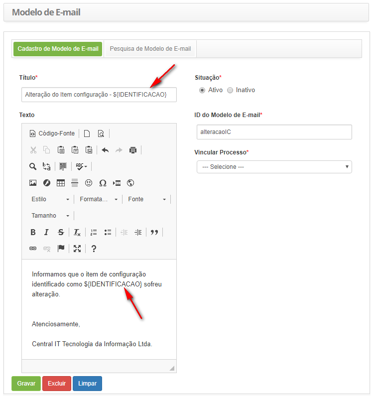
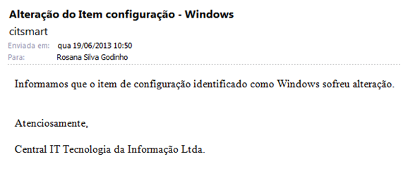
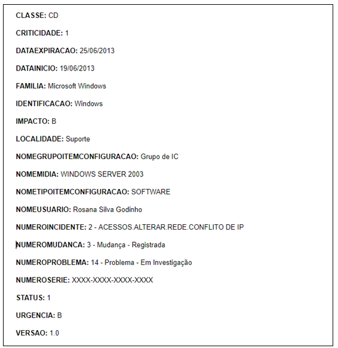

title: Campos-chave de e-mails de Item de configuração
Description: Fornecer a relação dos campos-chave disponíveis para o cadastro de modelo de e-mail relacionado ao item de configuração.
# Campos-chave de e-mails de Item de configuração

Tem o objetivo de fornecer a relação dos campos-chave disponíveis para o cadastro de modelo de e-mail relacionado ao item de 
configuração.

Campos-Chave
-----------------

São relacionados abaixo os campos chave disponíveis para inserção no cadastro de modelo de e-mail relacionado ao item de 
configuração:

|        Campo-Chave        |                                                           Descrição                                                           |
|:-------------------------:|:-----------------------------------------------------------------------------------------------------------------------------:|
|       ${CLASSE}           |          Classe do Item de Configuração (IC).Informa a descrição da classe do item de configuração.                           |
|        ${CRITICIDADE}     |     Criticidade do Serviço.Informa a identificação da criticidade do serviço referente ao item de configuração                |
|     ${DATAEXPIRACAO}      | Data de Expiração.Informa a data de expiração do item de configuração.                                                        |
|       ${DATAINICIO}       |     	Data  Inicial do Registro de IC.Informa a data em que foi realizado o registro de item de configuração.                 |
|          ${FAMILIA}       |    Família do Item de Configuração.Informa a descrição da família do item de configuração.                                    |
|    ${IDENTIFICACAO}       |     Identificação do Item de Configuração (IC).Informa a identificação do item de configuração.                               |
|    ${IMPACTO}             |     Impacto do Item de Configuração (IC).Informa a identificação do impacto do item de configuração.                          |
|         ${LOCALIDADE}     |      Localidade do Item de Configuração (IC).Informa a descrição da localidade do item de configuração.                       |
|${NOMEGRUPOITEMCONFIGURACAO}|                Grupo de IC.Informa a descrição do grupo de item de configuração.                                             |
|   ${NOMEMIDIA}            |   Mídia.Informa a descrição da mídia relacionada ao item de configuração.                                                     |
|${NOMETIPOITEMCONFIGURACAO}|   Tipo de Item de Configuração (IC).Informa a descrição do tipo de item de configuração.                                      |
|  ${NOMEUSUARIO}           |     Colaborador (Usuário).Informa o nome do colaborador que realizou o registro do item de configuração.                      |                              |
|     ${NUMEROINCIDENTE}    |         Incidente/Requisição.Informa a descrição de incidente/requisição relacionado ao item de configuração.                 |
|   ${NUMEROMUDANCA}        |    Mudança.Informa a descrição da requisição de mudança relacionada ao item de configuração.                                  |
|    ${NUMEROPROBLEMA}      |    Problema.Informa a descrição do problema relacionado ao item de configuração.                                              |
|  ${NUMEROSERIE}           |     Número de Série do IC.Informa o número de série do item de configuração.                                                  |
|     ${STATUS}             |  Status do IC.Informa a identificação do status do item de configuração.                                                      |
|${URGENCIA}                |    Urgência.Informa a identificação da urgência do item de configuração.                                                      |
| ${VERSAO}                 |    Versão do IC.Informa a descrição da versão do item de configuração.                                                        |

**Tabela 1 - Lista de campos chave**

Utilização dos Campos-Chave
-----------------------------

Segue abaixo os exemplos de utilização dos campos chave disponíveis para inserção no cadastro de modelo de e-mail relacionado ao
item de configuração.

**Figura 1 - Exemplo da inserção dos campos chave no modelo de e-mail**

**Figura 2 - Exemplo do resultado de envio do Modelo de E-mail**

**Figura 3 -Exemplos de campos-chave exibidos no e-mail**

!!! tip "About"

    <b>Product/Version:</b> CITSmart | 7.00 &nbsp;&nbsp;
    <b>Updated:</b>07/23/2019 – Larissa Lourenço
