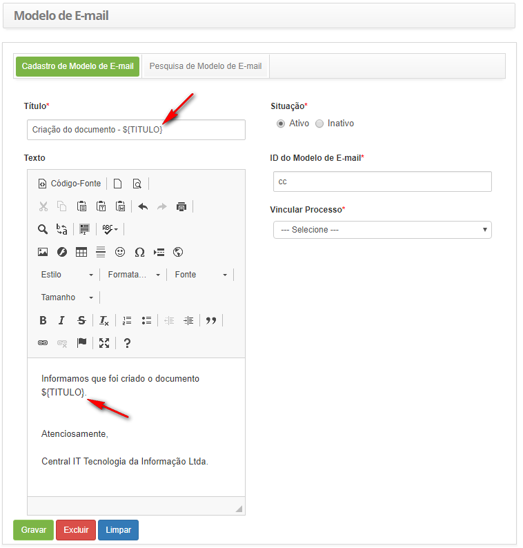
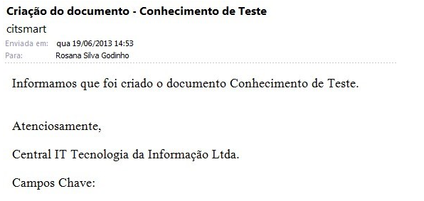
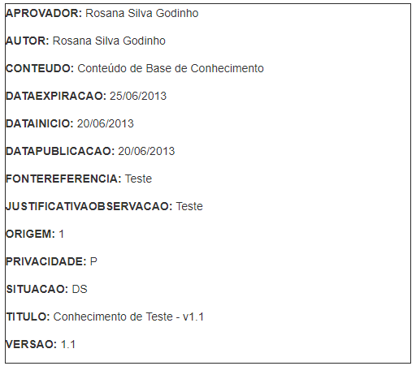

title: Campos-chave dos e-mails de base de conhecimento
Description: fornecer a relação dos campos chave disponíveis para o cadastro de modelo de e-mail relacionada à base de conhecimento.
# Campos-chave dos e-mails de base de conhecimento

Este documento tem o objetivo de fornecer a relação dos campos chave disponíveis para o cadastro de modelo de e-mail relacionada 
à base de conhecimento.

Relação dos Campos Chave
----------------------------

São relacionados abaixo os campos chave disponíveis para inserção no cadastro de modelo de e-mail relacionado à base de 
conhecimento:

|         CAMPO-CHAVE        |                                         DESCRIÇÃO                                         |
|:--------------------------:|:-----------------------------------------------------------------------------------------:|
|        ${APROVADOR}        |           Aprovador do Conhecimento. Informa o nome do aprovador do conhecimento.          |
|          ${AUTOR}          |               Autor do Conhecimento. Informa o nome do autor do conhecimento.              |
|         ${CONTEUDO}        |         Conteúdo do Conhecimento. Informa a descrição do conteúdo do conhecimento.         |
|      ${DATAEXPIRACAO}      |               Data de Expiração. Informa a data de expiração do conhecimento.              |
|        ${DATAINICIO}       |         Data de Criação do Conhecimento. Informa a data de criação do conhecimento.        |
|      ${DATAPUBLICACAO}     |              Data de Publicação. Informa a data de publicação do conhecimento.             |
|     ${FONTEREFERENCIA}     |       Fonte/Referência do Conhecimento. Informa a descrição da fonte do conhecimento.      |
| ${JUSTIFICATIVAOBSERVACAO} | Justificativa/Observação. Informa a descrição da justificativa/observação do conhecimento. |
|        ${ORIGEM}           |       Origem do conhecimento.Informa a identificação da origem do nome do conhecimento.    |
|       ${PRIVACIDADE}       |    Privacidade do Conhecimento. Informa a identificação da privacidade do conhecimento.    |
|         ${SITUACAO}        |       Situação do Conhecimento. Informa a identificação da situação do conhecimento.       |
|          ${TITULO}         |           Título do Conhecimento. Informa a descrição do título do conhecimento.           |
|          ${VERSAO}         |                  Versão do Conhecimento. Informa a versão do conhecimento.                 |

**Tabela 1 - Tabela de Campos-Chave**

Utilização dos campos-chave
------------------------------

Segue abaixo os exemplos de utilização dos campos chave disponíveis para inserção no cadastro de modelo de e-mail relacionado à 
base de conhecimento.

**Figura 1 - Exemplo de inserção dos campos-chave no modelo de e-mail**

**Figura 2 - Exemplo do Resultado de Envio do Modelo de E-mail**

**Figura 3 -Exemplos de campos-chave exibidos no e-mail**

!!! tip "About"

    <b>Product/Version:</b> CITSmart | 7.00 &nbsp;&nbsp;
    <b>Updated:</b>07/22/2019 - Anna Martins
