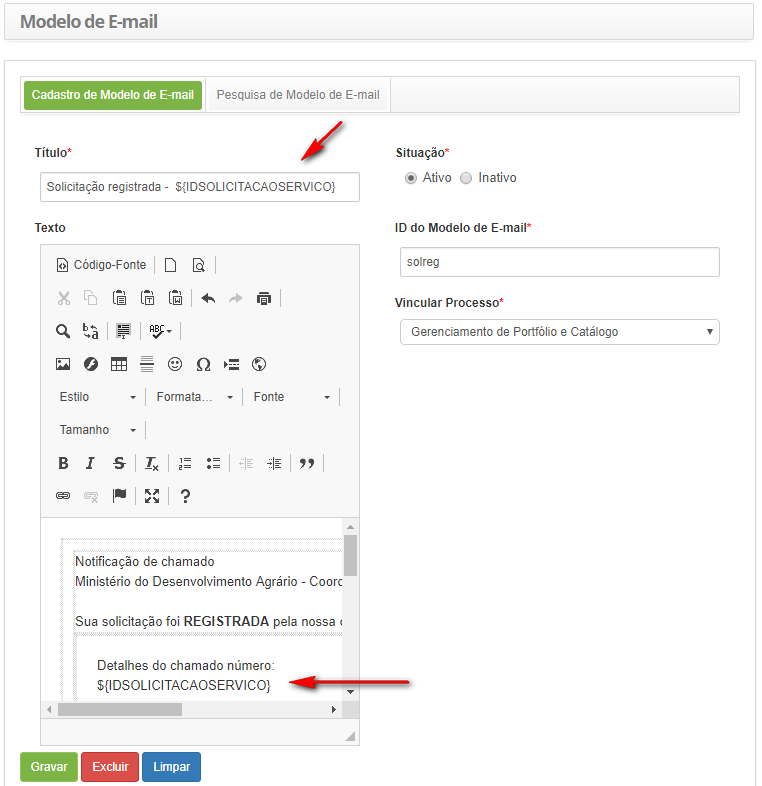
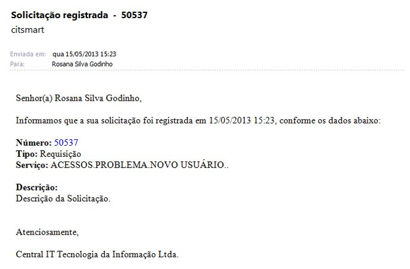
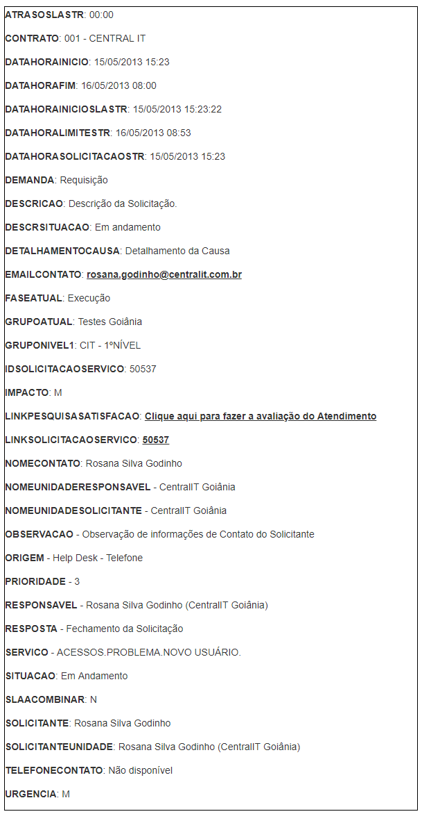

title: Campos-chave dos e-mails de solicitação
Description: Fornecer a relação dos campos chave disponíveis para o cadastro de modelo de e-mail de Solicitação de serviço.
# Campos-chave dos e-mails de solicitação

Este documento tem o objetivo de fornecer a relação dos campos chave disponíveis para o cadastro de modelo de e-mail de Solicitação 
de Serviço.

Relação dos Campos Chave
----------------------------

São relacionados abaixo os campos chave disponíveis para inserção no cadastro de modelo de e-mail relacionado à Solicitação
de Serviço:

|        Campo-Chave        |                                                           Descrição                                                           |
|:-------------------------:|:-----------------------------------------------------------------------------------------------------------------------------:|
|      ${ATRASOSLASTR}      |                     Tempo de Atraso do SLA.Informa o tempo de atraso do SLA (Acordo de Nível de Serviço).                     |
|        ${CONTRATO}        |                Contrato da Solicitação.Informa o nome do contrato referente à solicitação de serviço/incidente.               |
|     ${DATAHORAINICIO}     | Data e hora de início do registro da solicitação.Informa a data e hora que foi registrado a solicitação de serviço/incidente. |
|       ${DATAHORAFIM}      |          Data da finalização da Solicitação.Informa a data em que foi finalizada a solicitação de serviço/incidente.          |
|  ${DATAHORAINICIOSLASTR}  |               Data e hora de início do SLA.Informa a data e hora de início do SLA (Acordo de Nível de Serviço).               |
|    ${DATAHORALIMITESTR}   |       Prazo limite para atendimento da solicitação.Informa o prazo limite (data e hora) para atendimento da solicitação.      |
| ${DATAHORASOLICITACAOSTR} |      Data e hora do atendimento da solicitação.Informa a data e hora do atendimento da solicitação de serviço/incidente.      |
|         ${DEMANDA}        |                          Tipo de Solicitação.Informa o tipo de solicitação (Incidente ou Requisição).                         |
|        ${DESCRICAO}       |                            Descrição da Solicitação.Informa a descrição da solicitação de serviço.                            |
|      ${DESCRSITUACAO}     |             Descrição da Situação da Solicitação.Informa a descrição da Situação em que a Solicitação se encontra.            |
|    ${DETALHAMENTOCAUSA}   |                        Detalhamento da Causa do Incidente.Informa o detalhamento da causa do incidente.                       |
|      ${EMAILCONTATO}      |                              E-mail do Solicitante para Contato.Informa o e-mail do solicitante.                              |
|        ${FASEATUAL}       |                           Fase Atual da Solicitação.Informa a fase atual da solicitação de serviço.                           |
|       ${GRUPOATUAL}       |    Grupo Atual de Atendimento da Solicitação.Informa o grupo atual, responsável pelo atendimento da solicitação de serviço.   |
|       ${GRUPONIVEL1}      |                    Grupo de Nível 1.Informa o grupo de nível 1 configurado para atendimento da solicitação.                   |
|  ${IDSOLICITACAOSERVICO}  |                               Número da Solicitação.Informa o número da solicitação de serviço.                               |
|         ${IMPACTO}        |          Impacto da Solicitação de Serviço / Incidente.Informa a identificação do impacto da solicitação de serviço.          |
| ${LINKPESQUISASATISFACAO} |        Link para pesquisa de satisfação.Informa o link para fazer a avaliação do atendimento da solicitação de serviço.       |
| ${LINKSOLICITACAOSERVICO} |             Link para a solicitação de serviço.Informa o link para exibição do registro da solicitação de serviço.            |
|       ${NOMECONTATO}      |                          Nome do Solicitante para Contato.Informa o nome do solicitante para contato.                         |
|     ${NOMEGRUPOATUAL}     |                  Retorna a descrição do Nome do grupo em que se encontra atualmente a solicitação de serviço.                  |
|       ${NOMESERVICO}      |                                     Nome do Serviço.Informa o nome do serviço solicitado.                                     |
| ${NOMEUNIDADERESPONSAVEL} |                Unidade do Responsável.Informa a unidade do responsável pelo registro da solicitação de serviço.               |
| ${NOMEUNIDADESOLICITANTE} |                                    Unidade do Solicitante.Informa a unidade do solicitante.                                   |
|       ${OBSERVACAO}       |                 Observação do Contato do Solicitante.Informa a observação descrita na solicitação de serviço.                 |
|         ${ORIGEM}         |                               Origem da Solicitação.Informa a origem da solicitação de serviço.                               |
|       ${PRIORIDADE}       |            Prioridade do Atendimento da Solicitação.Informa a prioridade do atendimento da solicitação de serviço.            |
|       ${RESPONSAVEL}      |            Responsável pelo Registro da Solicitação.Informa o responsável pelo registro da solicitação de serviço.            |
|        ${RESPOSTA}        |              Descrição do Fechamento da Solicitação.Informa a descrição do fechamento da solicitação de serviço.              |
|         ${SERVICO}        |                                Serviço Solicitado.Informa o nome do serviço que foi solicitado.                               |
|        ${SITUACAO}        |                    Situação da Solicitação;Informa a situação em que a solicitação de serviço se encontra.                    |
|      ${SLAACOMBINAR}      |                                        SLA “A Combinar”.Informa se o SLA é a combinar.                                        |
|       ${SOLICITANTE}      |                                       Nome do Solicitante.Informa o nome do solicitante.                                      |
|   ${SOLICITANTEUNIDADE}   |               Nome do Solicitante e Unidade.Informa o nome do solicitante e a unidade em que o mesmo é alocado.               |
|     ${TELEFONECONTATO}    |                 Telefone do Solicitante para Contato.Informa o número de telefone do solicitante para contato.                |
|        ${URGENCIA}        |                     Urgência da Solicitação.Informa a identificação da urgência da solicitação de serviço.                    |

**Tabela 1 - Lista de campos chave**

Utilização dos campos chaves
------------------------------

Segue abaixo os exemplos de utilização dos campos chave disponíveis para inserção no cadastro de modelo de e-mail relacionado à 
Solicitação de Serviço.

**Figura 1 - Exemplo da inserção dos campos chave no modelo de e-mail**

**Figura 2 - Exemplo do resultado de envio do modelo de e-mail**

**Figura 3 - Exemplo de campos chave preenchidos**

!!! tip "About"

    <b>Product/Version:</b> CITSmart | 7.00 &nbsp;&nbsp;
    <b>Updated:</b>07/23/2019 – Anna Martins
