title: Cadastro e pesquisa de caixa de e-mail
Description:Configurar o envio e o recebimento de e-mail a partir de diferentes servidores com vistas a atender contratos distintos.
# Cadastro e pesquisa de caixa de e-mail

Esta funcionalidade tem por objetivo configurar o envio e recebimento de e-mail de servidores diferentes para cada contrato, assim 
um mesmo CITSmart poderá atender vários clientes diferentes e cada um com a sua própria caixa de e-mail.

Como acessar
--------------

1. Acesse a funcionalidade através da navegação no menu principal **Parametrização > Caixa de e-mail**.

Pré-condições
---------------

1. Não se aplica.

Filtros
---------

1. O seguinte filtro possibilita ao usuário restringir a participação de itens na listagem padrão da funcionalidade, facilitando a 
localização dos itens desejados:

    - Servidor.
    
    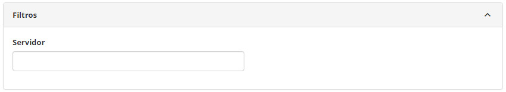
    
    **Figura 1 - Tela de pesquisa de caixa de e-mail**
    
Listagem de itens
------------------

1. Os seguintes campos cadastrais estão disponíveis ao usuário para facilitar a identificação dos itens desejados na listagem padrão
da funcionalidade: **ID** e **Servidor**.

    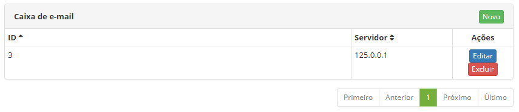
    
    **Figura 2 - Tela de listagem de caixa de e-mail**
    
2. Existem botões de ação disponíveis ao usuário em relação a cada item da listagem, são eles: "Editar" e "Excluir".

Preenchimento dos campos cadastrais
-------------------------------------

1. Clique no botão "Novo". Será apresentada tela de cadastro de caixa de e-mail, conforme figura abaixo:

    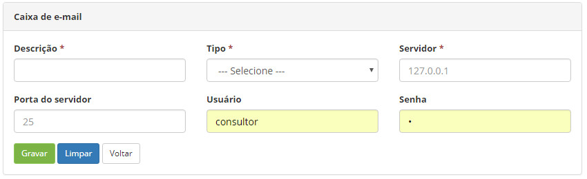
    
    **Figura 3 - Tela de cadastro de caixa de e-mail**
    
2. Preencha os campos, conforme orientação abaixo:

    - **Descrição**: descrição da Caixa de e-mail - A caixa de e-mail pode ser de Entrada ou de Saída, por isso a descrição é
    necessária em ambos os tipos;
    - **Tipo**:
        - **Entrada**: ao escolher essa opção, significa que o usuário irá parametrizar uma rota por onde os e-mails que precisam
        ser lidos pelo sistema chegarão (por isso chamado caixa de entrada). Serão abertos novos campos cadastrais ao escolher 
        essa opção, são eles:
        
    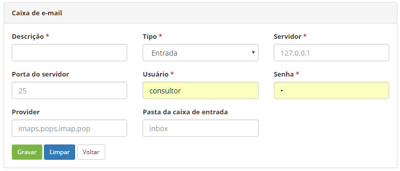
    
    **Figura 4 - Tela de cadastro de caixa de e-mail tipo entrada**
    
    - **Servidor**: nome do servidor de e-mail;
    - **Porta do servidor**: é o canal por onde o servidor enviará as informações (ex: 25);
    - **Usuário**: nome ou login do usuário para autenticação no servidor de e-mail;
    - **Senha**: identificação única para entrada do servidor de e-mail;
    - **Provider**: tipo de provedor de e-mail;
    - **Pasta da caixa de entrada**: descrever o nome da caixa de entrada. Exemplificado na figura abaixo:
    
    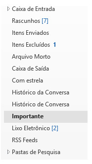
    
    **Figura 5 - Exemplo de caixa de e-mail**
    
    - **Saída**: ao escolher essa opção, significa que o usuário irá parametrizar uma rota por onde os e-mails que precisam 
    ser enviados a partir do sistema sairão (por isso chamado de caixa de saída). Serão abertos novos campos cadastrais ao 
    escolher essa opção, são eles:
        
    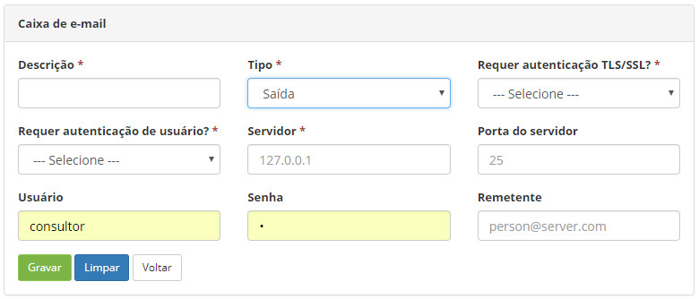
    
    **Figura 6 - Tela de cadastro de caixa de e-mail de saída**
    
    - **Requer autenticação TLS/SSL?**
        - Os certificados SSL (Secure Sockets Layer) fazem parte da segurança de sites. Ao acessar um site com SSL, o certificado
        SSL do site permite que você criptografe os dados que envia.
        - O Transport Layer Security (TLS), assim como o seu antecessor Secure Sockets Layer (SSL), é um protocolo de segurança
        que protege as telecomunicações via internet para serviços como e-mail (SMTP), navegação por páginas (HTTPS) e outros 
        tipos de transferência de dados.
    - **Requer autenticação de usuário?**
        - Sim - ao marcar Sim, significa que o ISP identificará o remetente do e-mail. Nesse caso será necessário informar os 
        campos usuário e senha;
        - Não - ao marcar Não, significa que o ISP poderá não identificar o remetente do e-mail. Nesse caso não será necessário 
        informar os campos usuário e senha;
    - **Servidor**: endereço do servidor (ex: 127.0.0.1);
    - **Porta do servidor**: é o canal por onde o servidor enviará as informações (ex: 25);
    - **Usuário**: nome ou login do usuário para autenticação no servidor de e-mail;
    - **Senha**: identificação única para entrada do servidor de e-mail;
    - **Remetente**: endereço de e-mail que será usado como remetente, poderá ser cadastrado mais de um e-mail.
    
3. Feito isso o próximo passo será identificar em quais contratos serão usados a informação de caixa de e-mail, para isso o
usuário deverá acessar a tela de Cadastro de Contrato.

Vinculando caixa de e-mail ao contrato
-----------------------------------------

1. Acesse a funcionalidade através da navegação no menu principal 
**Processos ITIL > Gerência de Portfólio e Catálogo > Cadastro de Contratos** (ver conhecimento Cadastro e pesquisa de contrato);

2. Localize o contrato (novo ou já existente) que deseja vincular a caixa de e-mail cadastrada e selecione-o;

3. No campo "Caixa de saída de e-mail", o usuário poderá selecionar as opções:

    - **Padrão** (já parametrizado) (ver conhecimento Regras de parametrização - E-mail );
    - **Outras caixas de e-mail parametrizadas como saída** (ver seção anterior) - utilizado nos casos em que o usuário tiver
    mais de uma caixa de saída por contrato, o sistema utilizará o servidor e informações cadastradas na tela 
    **Parametrização > Caixa de E-mail**;
    
    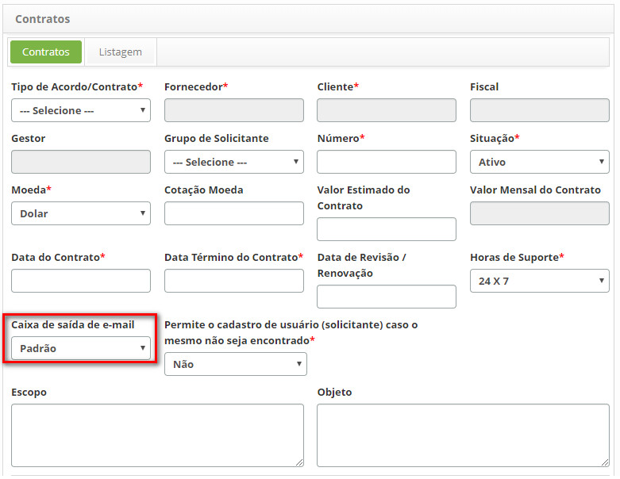
    
    **Figura 7 - Tela de vínculo de caixa de e-mail ao contrato**
    
4. Feito isso o usuário poderá identificar diferentes caixas de e-mail de saída que será utilizada no fluxo de trabalho que são 
carregados durante as solicitações de serviços.

Vinculando caixa de e-mail a um fluxo
----------------------------------------

!!! note "NOTA"

    Esse passo não é obrigatório. Essa funcionalidade somente será necessária se durante o cadastrar de fluxo o usuário sentir 
    necessidade de direcionar o e-mail para uma caixa de saída diferente da padrão. O e-mail de saída padrão do sistema 
    continuará funcionando, mesmo que essa parametrização não seja feita.
    
1. Acesse a funcionalidade através da navegação no menu principal **Sistema > Manutenção de fluxos** (ver conhecimento
Aprovação de solicitação via e-mail);

2. Ao cadastrar um novo fluxo:

    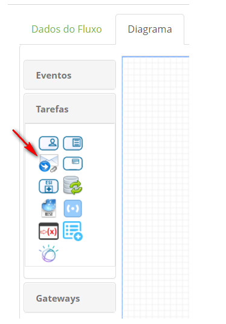
    
    **Figura 8 - Tela de novo fluxo**
    
3. Ao editar um fluxo existente, localize a figura 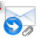 no fluxo, clique para editar e as seguintes
telas serão apresentadas:

    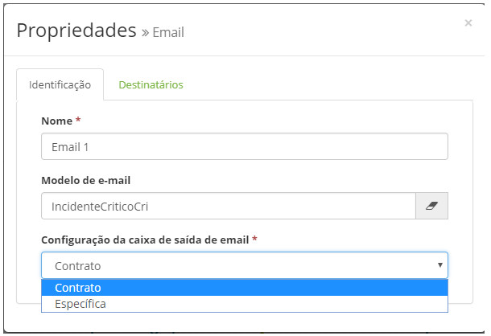
    
    **Figura 9 - Tela de configuração de caixa de saída de e-mail**
    
    - Na opção Configuração da caixa de saída de e-mail, selecione a opção "Contrato" para utilizar a caixa de e-mail configurada
    no contrato;
    
    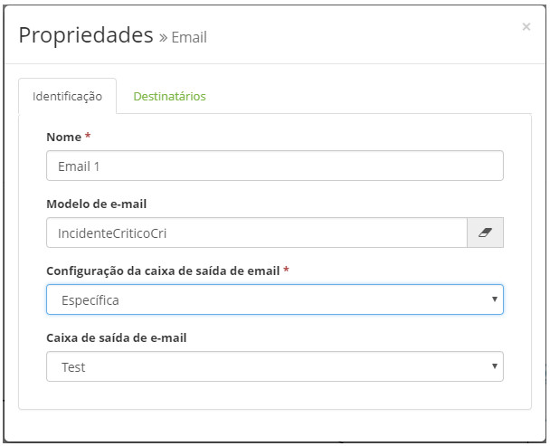
    
    **Figura 10 - Tela de configuração de caixa de saída de e-mail**
    
    - Na opção Configuração da caixa de saída de e-mail a opção "Específica", o sistema abre o campo 'Caixa de saída de e-mail' 
    com as caixas de saída cadastradas.
    
4. Conclua a parametrização do fluxo incluindo os "Destinatários" selecionados;

5. O uso de diferentes caixas de e-mail de saída poderá ser percebida após aberta uma solicitação de serviço, que possui 
parametrizado o fluxo que possui a Caixa de e-mail selecionada.

!!! tip "About"

    <b>Product/Version:</b> CITSmart | 7.00 &nbsp;&nbsp;
    <b>Updated:</b>07/23/2019 – Larissa Lourenço
