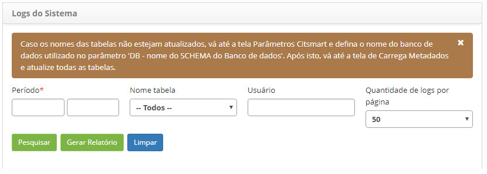
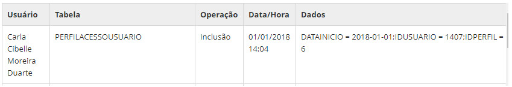

title: Verificação do log do sistema
Description: Esta funcionalidade tem por objetivo verificar o log do sistema para trilha de auditoria.
# Verificação do log do sistema

Esta funcionalidade tem por objetivo verificar o log do sistema para trilha de auditoria.

Como acessar
-------------

1. Acesse a funcionalidade de logs do sistema através da navegação no menu principal 
**Sistema > Trilha de Auditoria > Logs do Sistema**.

Pré-condições
---------------

1. Não se aplica.

Filtros
--------

1. Os seguintes filtros possibilitam ao usuário restringir a participação de itens na listagem padrão da funcionalidade, facilitando
a localização dos itens desejados:

    - **Período**: informe o período que deseja verificar o log do sistema;
    - **Nome tabela**: selecione uma tabela, caso queira verificar o log de uma tabela específica do sistema;
    
    !!! warning "ATENÇÃO"
    
        Caso os nomes das tabelas não estejam atualizados, acesse a funcionalidade Parâmetros CITSmart e defina o nome do banco 
        de dados utilizado no parâmetro ' DB - nome do SHEMA do banco de dados '. Após isto, acesse funcionalidade Carrega Meta 
        Dados e atualize todas as tabelas.
        
    - **Usuário**: informe o nome do usuário, caso queira verificar o log do sistema referente ao usuário;
    - **Quantidade de logs por página**: selecione a quantidade de logs que serão exibidos por página.
    
2. Clique no botão " Pesquisar" e será exibido o log do sistema conforme os dados informados;

3. Caso queira gerar o relatório do log do sistema, clique no botão "Gerar Relatório".

    
    
    **Figura 1 - Tela de log do sistema**
    
Listagem de itens
-------------------

1. Os seguintes campos cadastrais estão disponíveis ao usuário para facilitar a identificação dos itens desejados na listagem 
padrão da funcionalidade: **Usuário, Tabela, Operação, Data/Hora e Dados**.

**Figura 2 - Tela de listagem de log do sistema**

Preenchimento dos campos cadastrais
--------------------------------------

1. Não se aplica.

!!! tip "About"

    <b>Product/Version:</b> CITSmart | 7.00 &nbsp;&nbsp;
    <b>Updated:</b>07/23/2019 – Larissa Lourenço
