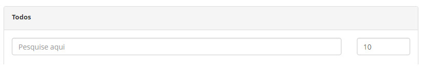
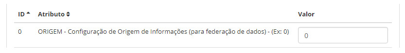

title:  Configuração de parâmetro
Description: Visa permitir a automatização dos processos com base em parâmetros definidos pelo usuário.. 
# Configuração de parâmetro

Esta funcionalidade visa permitir a automatização dos processos com base em parâmetros definidos pelo usuário.

Como acessar
--------------

1. Acesse a funcionalidade de Parâmetros do CITSmart através da navegação no menu principal **Parametrização > Parâmetros CITSmart**.

Pré-condições
---------------

1. Não se aplica.

Filtros
----------

1. O seguinte filtro possibilita ao usuário restringir a participação de itens na listagem padrão da funcionalidade, facilitando a
localização dos itens desejados:

    - Pesquise aqui.
    
    
    
    **Figura 1 - Tela de pesquisa de parâmetros do CITSmart**
    
2. Realize a pesquisa do parâmetro;

    - **Parâmetro CITSmart**: informe o nome do parâmetro, caso deseje filtrar pelo nome;
    - **ID**: informe o número de identificação do parâmetro, caso deseje filtrar pelo ID.
    
3. Selecionado o parâmetro, informe o devido valor do parâmetro para efetuar a configuração.

Listagem de itens
-------------------

1. Os seguintes campos cadastrais estão disponíveis ao usuário para facilitar a identificação dos itens desejados na listagem 
padrão da funcionalidade: **ID, Atributo** e **Valor**.

**Figura 2 - Tela de listagem de parâmetros**

Preenchimento dos campos cadastrais
---------------------------------------

1. Não se aplica.

!!! tip "About"

    <b>Product/Version:</b> CITSmart | 7.00 &nbsp;&nbsp;
    <b>Updated:</b>08/05/2019 - Larissa Lourenço
