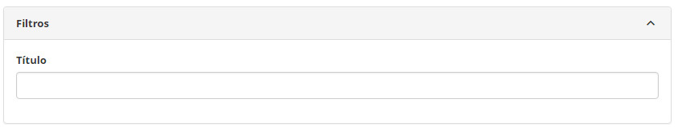
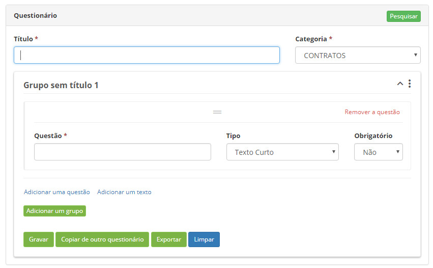

title: Cadastro e pesquisa de questionários
Description: Disponibiliza ações diversas, tais como, incluir, alterar e excluir questionários (formulários).
# Cadastro e pesquisa de questionários

Esta funcionalidade permite criar questionários (formulários) de uma forma muito genérica, multi-propósito e fácil para serem 
utilizados em outras rotinas do sistema.

!!! abstract "SAIBA MAIS"

    Esta é a segunda geração tecnológica desta funcionalidade, ela surge mais poderosa e mais flexível, porém de uma maneira muito 
    fácil é possível importar os questionários construídos na primeira geração, evitando retrabalho aos cliente e consultores. 
    Explicações mais detalhadas estão neste documento.
    
Como acessar
-------------

1. Acesse a funcionalidade através da navegação no menu principal **Sistema > Visões e Metadados > Questionário**.

Pré-condições
---------------

1. Ter pelo menos uma categoria de Questionário cadastrada no sistema ([Cadastro e pesquisa de Categoria de Questionário](/pt-br/citsmart-platform-7/plataform-administration/questionnaires/questionnaires-management/questionnaire-category.html)).

Filtros
---------

1. O seguinte filtro possibilita ao usuário restringir a participação de itens na listagem padrão da funcionalidade, facilitando a
localização dos itens desejados:

    - Título.
    
    
    
    **Figura 1 - Tela de pesquisa de questionário**
    
Listagem de itens
-------------------

1. O seguinte campo cadastral está disponível ao usuário para facilitar a identificação dos itens desejados na listagem padrão da
funcionalidade: **Título**.

2. Existe um botão de ação disponível ao usuário em relação a cada item da listagem, é ele: "Editar".

**Figura 2 - Tela de listagem de questionário**

Preenchimento dos campos cadastrais
------------------------------------

1. Ao clicar nos botões "Novo" e "Editar" estão disponíveis os campos de preenchimento do cadastro, conforme figura abaixo:

    
    
    **Figura 3 - Detalhes do questionário**
    
    - **Título**: texto curto que identifica facilmente o propósito do questionário;
    - **Categoria**: lista de categorias pré-cadastradas que ajudam a gerenciar conjuntos de Questionários;
    - **Grupo**: um Questionário organiza seus itens de forma agrupada por algum critério subjetivo do consultor ou cliente, pode
    haver mais de um grupo no questionário (como se fossem vários assuntos);
        - **Título do Grupo**: logo em frente da palavra "Grupo" é possível editar e trocar a expressão "sem título 1" por um
        título significativo para descrever a finalidade/critério do agrupamento;
        - Um grupo pode ter uma ou mais Questões, cada uma composta por:
            - **Questão**: título da Questão para que seja possível o leitor entender o que deve responder;
            - **Tipo**: existem diversos tipos de questões, cada um provocará um comportamento diferente quando o Questionário 
            for executado;
            - **Obrigatório**: indica se a questão pode ou não aceitar ser gravada sem preenchimento.
            
2. O botão "Adicionar uma questão" permite inserir mais uma questão logo após a última delas;

3. O botão "Adicionar um texto" permite editar um conteúdo numa caixa de texto para que orientações possam ser mostradas no
Questionário, quando da sua execução;

4. O botão "Adicionar um grupo" acrescenta outro Grupo logo após o último para ser preenchido;

5. O botão "Exportar" permite gravar em um disco um arquivo eletrônico contendo todas as características do Questionário 
selecionado.

!!! note "NOTA"

    Para garantir maior produtividade, o botão "Copiar de outro questionário" permite ao Administrador que importe Questionários 
    construídos tanto na forma anterior, quanto na forma atual.
    
!!! tip "About"

    <b>Product/Version:</b> CITSmart | 7.00 &nbsp;&nbsp;
    <b>Updated:</b>07/24/2019 – Larissa Lourenço
