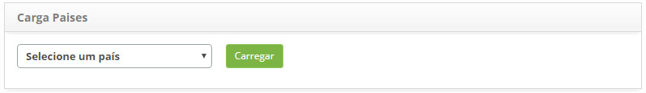
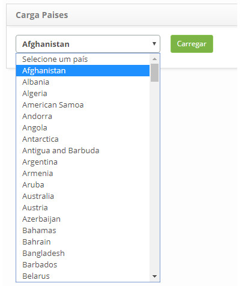
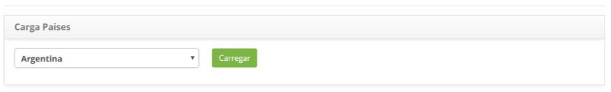
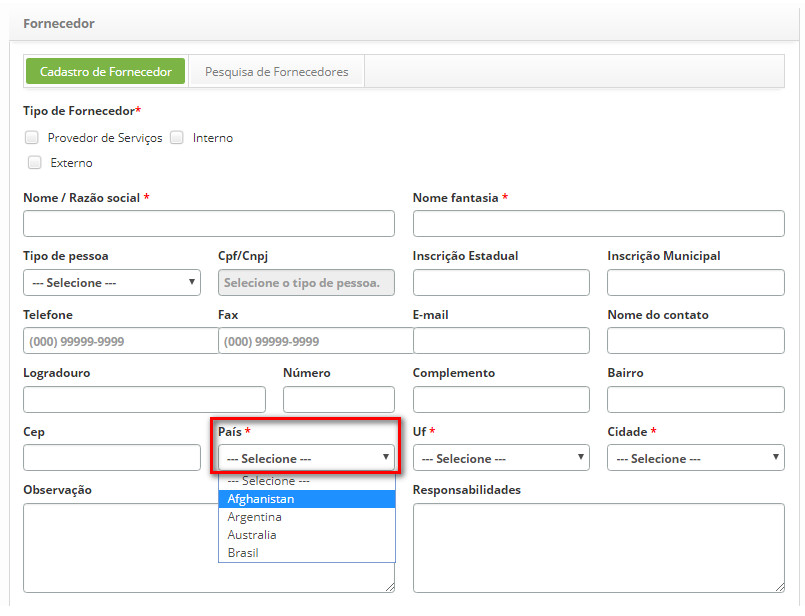

title:  Carga de países 
Description: O objetivo é realizar a carga de países nas telas de Fornecedor e Unidade. 
# Carga de países

O objetivo é realizar a carga de países nas telas de Fornecedor e Unidade.

Como acessar
--------------

1. Acesse a funcionalidade de carga de países através da navegação no menu principal **Sistema > Banco de Dados > Carga Países**.

Pré-condições
----------------

1. Não se aplica.

Filtros
---------

1. Não se aplica.

Listagem de itens
--------------------

1. Não se aplica.

Preenchimento dos campos cadastrais
-------------------------------------

1. Não se aplica.

Carga de países
------------------

1. Será apresentada a tela Carga Países contendo uma listagem dos países, conforme ilustrada na figura abaixo:

    
    
    **Figura 1 - Tela de carga países**
    
2. Selecione o país desejado e clique no botão "Carregar";

3. Será exibida uma mensagem confirmando o sucesso da carga do país.

Exemplificando uma carga de país
---------------------------------

1. Selecione o país desejado:

    
    
    **Figura 2 - Tela de carga países**
    
    
    
    **Figura 3 - Tela de carga países**
    
2. Verifique se o mesmo se encontra nas funcionalidades de Cadastro de Fornecedores e Cadastro de Unidades, em 
**Processos ITIL > Gerência de Portfólio e Catálogo > Fornecedor**:

**Figura 4 - Tela de cadastro de fornecedor**

!!! tip "About"

    <b>Product/Version:</b> CITSmart | 7.00 &nbsp;&nbsp;
    <b>Updated:</b>07/24/2019 - Larissa Lourenço
