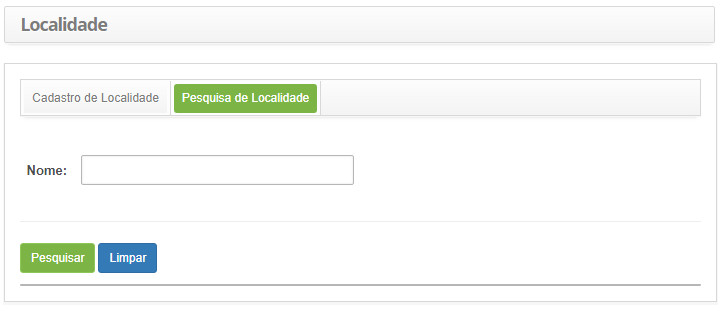
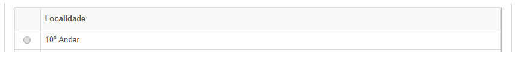
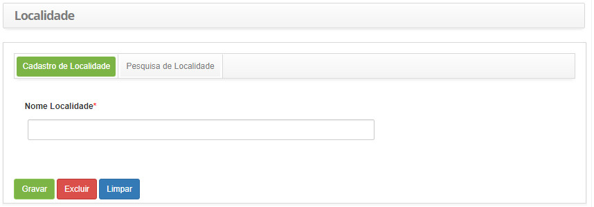

title: Cadastro e pesquisa de localidade
Description: Disponibiliza ações diversas, tais como, incluir, alterar e excluir os locais em que os solicitantes de serviços.
# Cadastro e pesquisa de localidade

Esta funcionalidade tem por objetivo registrar os locais em que os solicitantes de serviços estão alocados, podendo ser o nome da
unidade, cidade, nome do órgão etc.

Como acessar
-------------

1. Acesse a funcionalidade de localidade através da navegação no menu principal
**Cadastros Gerais > Gerência de Pessoal > Localidade**.

Pré-condições
---------------

1. Não se aplica.

Filtros
---------

1. O seguinte filtro possibilita ao usuário restringir a participação de itens na listagem padrão da funcionalidade, facilitando a
localização dos itens desejados:

    - Nome.
    
    
    
    **Figura 1 - Tela de pesquisa de localidade**
    
2. Realize a pesquisa de localidade:

    - Informe o nome da localidade que deseja pesquisar e clique no botão "Pesquisar". Após isso, será exibido o registro de 
    localidade conforme a descrição informada;
    
    - Caso deseje listar todos os registros de localidade, basta clicar diretamente no botão "Pesquisar".
    
Listagem de itens
------------------

1. O seguinte campo cadastral está disponível ao usuário para facilitar a identificação dos itens desejados na listagem padrão da
funcionalidade: **Localidade**.

    
    
    **Figura 2 - Tela de listagem de localidade**
    
2. Após a pesquisa, selecione o registro desejado. Feito isso, será direcionado para a tela de cadastro exibindo o conteúdo
referente ao registro selecionado;

3. Para alterar os dados do registro de localidade, basta modificar as informações dos campos desejados e clicar no botão 
"Gravar" para que seja gravada a alteração realizada no registro, onde a data, hora e usuário serão gravados automaticamente
para uma futura auditoria.

Preenchimento dos campos cadastrais
-------------------------------------

1. Clique na aba **Cadastro de Localidade**, conforme ilustrada na figura abaixo:

    
    
    **Figura 3 - Tela de cadastro de localidade**
    
2. Preencha os campos conforme orientações abaixo:

    - **Nome Localidade**: informe o nome da localidade.
    
3. Clique no botão "Gravar" para efetuar o registro, onde a data, hora e usuário serão gravados automaticamente para uma futura
auditoria.

!!! tip "About"

    <b>Product/Version:</b> CITSmart | 7.00 &nbsp;&nbsp;
    <b>Updated:</b>07/24/2019 - Larissa Lourenço
