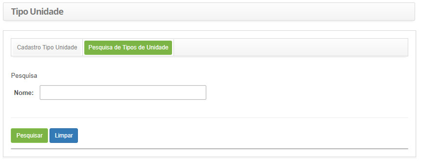
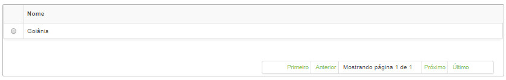
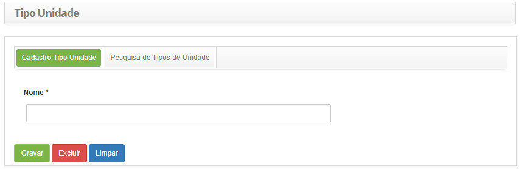

title: Cadastro e pesquisa de tipo de unidade
Description: Disponibiliza ações diversas, tais como, incluir, alterar e excluir os tipos de unidade. 
# Cadastro e pesquisa de tipo de unidade

Esta funcionalidade tem por objetivo registrar os tipos de unidade.

Como acessar
---------------

1. Acesse a funcionalidade de tipos de unidade através da navegação no menu principal 
**Cadastros Gerais > Gerência de Pessoal > Tipo de Unidade**.

Pré-condições
---------------

1. Não se aplica.

Filtros
---------

1. O seguinte filtro possibilita ao usuário restringir a participação de itens na listagem padrão da funcionalidade, facilitando a
localização dos itens desejados:

    - Nome.
    
2. Clique na aba **Pesquisa de Tipos de Unidade**, será apresentada a tela de **Pesquisa de Tipo de Unidade**, conforme ilustrada na
figura abaixo:

    
    
    **Figura 1 - Tela de pesquisa de tipos de unidade**
    
3. Realize a pesquisa de tipo de unidade:

    - Informe o nome do tipo de unidade que deseja pesquisar e clique no botão "Pesquisar". Após isso, será exibido o registro de
    tipo de unidade conforme a descrição informada;
    
    - Caso deseje listar todos os registros de tipo de unidade, basta clicar diretamente no botão "Pesquisar".
    
Listagem de itens
------------------

1. O seguinte campo cadastral está disponível ao usuário para facilitar a identificação dos itens desejados na listagem padrão 
da funcionalidade: **Nome**.

    
    
    **Figura 2 - Tela de listagem de tipos de unidade**
    
2. Após a pesquisa, selecione o registro desejado. Feito isso, será direcionado para a tela de cadastro exibindo o conteúdo 
referente ao registro selecionado;

3. Para alterar os dados do registro de tipo de unidade, basta modificar as informações dos campos desejados e clicar no botão
"Gravar" para que seja gravada a alteração realizada no registro, onde a data, hora e usuário serão gravados automaticamente
para uma futura auditoria.

Preenchimento dos campos cadastrais
--------------------------------------

1. Clique na aba **Cadastro Tipo Unidade**, será apresentada a tela de **Cadastro de Tipo de Unidade**, conforme ilustrada na 
figura abaixo:

    
    
    **Figura 3 - Tela de cadastro de tipo de unidade**
    
2. Preencha os campos conforme orientações abaixo:

    - **Nome**: informe o nome do tipo de unidade.
    
3. Clique no botão "Gravar" para efetuar o registro, onde a data, hora e usuário serão gravados automaticamente para uma futura
auditoria.

!!! tip "About"

    <b>Product/Version:</b> CITSmart | 7.00 &nbsp;&nbsp;
    <b>Updated:</b>07/24/2019 - Larissa Lourenço
