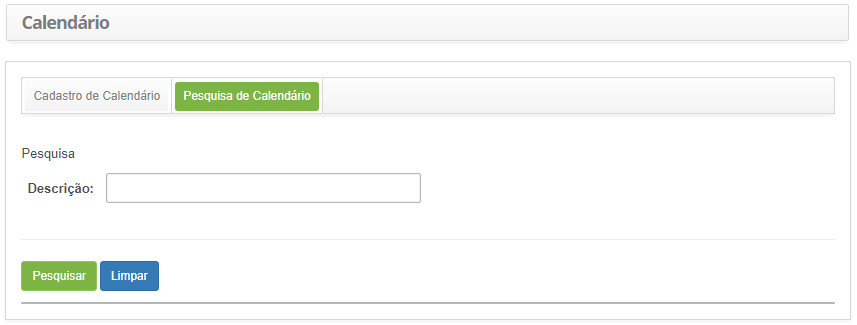
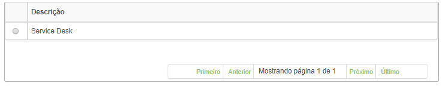
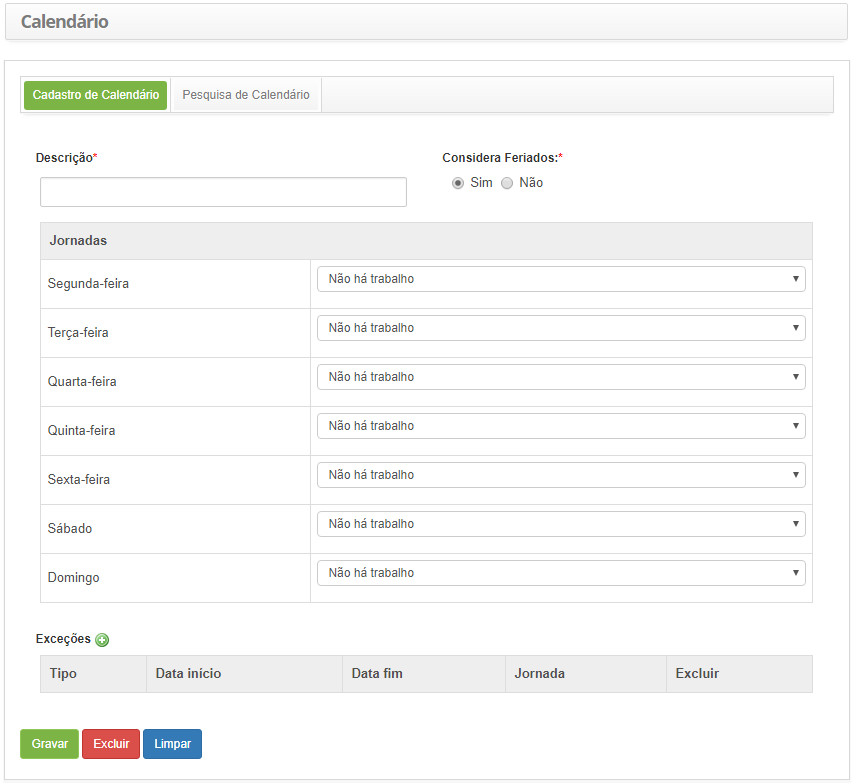
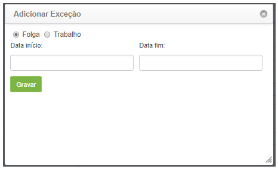

title:  Cadastro e pesquisa de calendário
Description: Disponibiliza ações diversas, tais como, incluir, alterar e excluir calendários (escalas) de jornadas de trabalho. 
# Cadastro e pesquisa de calendário

Esta funcionalidade tem por objetivo criar calendários (escalas) de jornadas de trabalho.

Como acessar
---------------

1. Acesse a funcionalidade de calendário através da navegação no menu principal **Cadastros Gerais > Gerência de Pessoal > Calendário**.

Pré-condições
---------------

1. Cadastrar perfil de acesso (ver conhecimento [Cadastro e pesquisa de perfil de acesso](/pt-br/citsmart-platform-7/initial-settings/access-settings/profile/user-profile.html));

2. Cadastrar jornada de trabalho (ver conhecimento [Cadastro e pesquisa de jornadas de trabalho](/pt-br/citsmart-platform-7/plataform-administration/time/create-working-day.html)).

Filtros
----------

1. O seguinte filtro possibilita ao usuário restringir a participação de itens na listagem padrão da funcionalidade, facilitando a
localização dos itens desejados:

    - Descrição.
    
2. Clique na aba **Pesquisa de Calendário**, será apresentada a tela de **Pesquisa de Calendário**, conforme ilustrado na figura 
abaixo:

    
    
    **Figura 1 - Tela de pesquisa de calendário**
    
3. Realize a pesquisa de calendário:

    - Informe a descrição do calendário (escala de trabalho) e clique no botão "Pesquisar". Após isso, será exibido o registro de
    calendário conforme os dados informados;
    
    - Caso deseje listar todos os registros de calendários, basta clicar diretamente no botão "Pesquisar".
    
Listagem de itens
-------------------

1. O seguinte campo cadastral está disponível ao usuário para facilitar a identificação dos itens desejados na listagem padrão da 
funcionalidade: **Descrição**.

    
    
    **Figura 2 - Tela de listagem de calendário**
    
2. Após a pesquisa, selecione o registro desejado, será direcionado para a tela de cadastro exibindo o conteúdo referente ao 
registro selecionado;

3. Para alterar os dados do registro de calendário, basta modificar as informações dos campos desejados e clicar no botão "Gravar"
para que seja gravada a alteração realizada no registro, onde a data, hora e usuário serão gravados automaticamente para uma 
futura auditoria.

Preenchimento dos campos cadastrais
--------------------------------------

1. Clique na aba **Cadastro de Calendário**, será apresentada a tela de **Cadastro de Calendário**, conforme ilustrada na figura 
abaixo:

    
    
    **Figura 3 - Tela de cadastro de calendário**
    
2. Preencha os campos conforme orientações abaixo:

    - **Descrição**: informe a descrição do calendário;
    - **Considera Feriados**: informe se serão considerados feriados no calendário;
    - **Jornadas**: informe para cada dia da semana, uma jornada de trabalho que definirá a escala;
    - **Exceções**: adicione as exceções do calendário, como por exemplo, uma folga no meio da semana. A mesma poderá ser 
    adicionada clicando no ícone de exceções .
    
3. Ao clicar no ícone de exceções, será aberta uma janela onde poderão ser inseridas as exceções para dias de folga ou trabalho.

    
    
    **Figura 4 - Tela de registro de exceção**
    
    - Selecione o tipo de exceção:
        - **Folga**: refere-se à interrupção total de trabalho;
        - **Trabalho**: refere-se à interrupção parcial de trabalho.
        
4. Informe a data inicial e final da exceção. Se o tipo de exceção escolhido for “Trabalho”, selecione a jornada de trabalho. 
Clique no botão "Gravar" para efetuar o registro, onde a data, hora e usuário serão gravados automaticamente para uma futura 
auditoria.

!!! tip "About"

    <b>Product/Version:</b> CITSmart | 7.00 &nbsp;&nbsp;
    <b>Updated:</b>07/24/2019 - Larissa Lourenço
        
