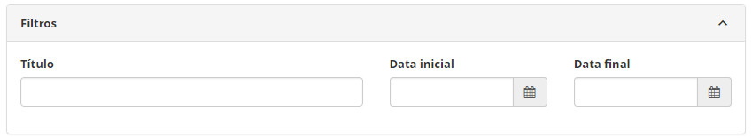
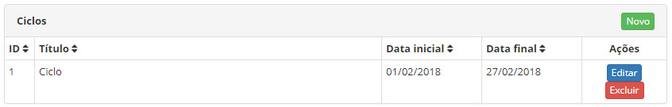
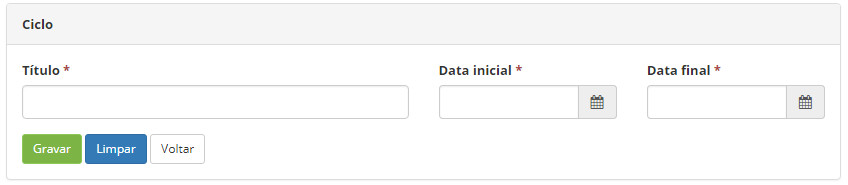

title:  Cadastro e pesquisa de ciclos
Description: Disponibiliza ações diversas, tais como, incluir, alterar e excluir os ciclos de período com data inicial.
# Cadastro e pesquisa de ciclos

Esta funcionalidade tem por objetivo criar ciclos de período com data inicial e final a ser usado no controle financeiro.

!!! info "IMPORTANTE"

    O 'Relatório de Lucratividade dos Atendimentos por Contrato' depende do cadastramento de ciclos.
    
!!! note "NOTA"

    Cada item cadastrado na opção "Atributos Financeiros" dentro de "Serviço de Negócio" de um Portfólio qualquer tem como um dos 
    seus campos o Ciclo, um ciclo deverá ser selecionado em uma lista naquele formulário.
    
Como acessar
--------------

1. Acesse a funcionalidade através da navegação no menu principal **Cadastros Gerais > Gerência de Pessoal > Ciclo**.

Pré-condições
----------------

1. Não se aplica.

Filtros
---------

1. Os seguintes filtros possibilitam ao usuário restringir a participação de itens na listagem padrão da funcionalidade, facilitando
a localização dos itens desejados:

    - Título;
    - Data inicial;
    - Data final.
    
    
    
    **Figura 1 - Tela de pesquisa de ciclos**
    
Listagem de itens
-------------------

1. Os seguintes campos cadastrais estão disponíveis ao usuário para facilitar a identificação dos itens desejados na listagem
padrão da funcionalidade: **ID, Título, Data inicial** e **Data final**.

2. Existem botões de ação disponíveis ao usuário em relação a cada item da listagem, são eles: "Editar" e "Excluir".

**Figura 2 - Tela de listagem de ciclos**

Preenchimento dos campos cadastrais
-------------------------------------

1. Ao clicar no boão "Novo" (conforme ilustrado na figura anterior) é possível cadastrar um novo ciclo

    
    
    **Figura 3 - Tela de cadastro de ciclos**
    
    - **Título**: define o título usado nas listas de ciclos;
    - **Data inicial**: define a data que o ciclo começa;
    - **Data final**: define a data que o ciclo termina.
    
    !!! warning "ATENÇÃO"
    
        Cada intervalo de datas deve ser único, mesmo com títulos diferentes e o sistema cuida de impedir este tipo de 
        redundância e inconsistência.
        
    !!! info "IMPORTANTE"
    
        Não é permitido a exclusão do ciclo, caso este esteja vinculado a alguma receita ou despesa do controle financeiro.
        
!!! tip "About"

    <b>Product/Version:</b> CITSmart | 7.00 &nbsp;&nbsp;
    <b>Updated:</b>07/24/2019 - Larissa Lourenço
