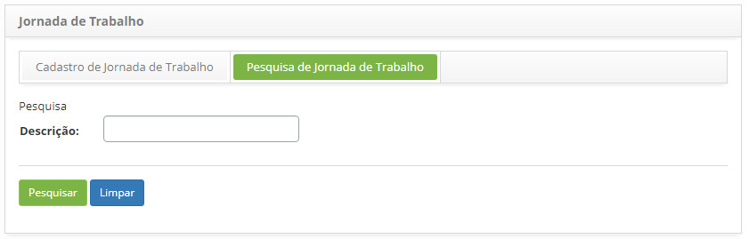
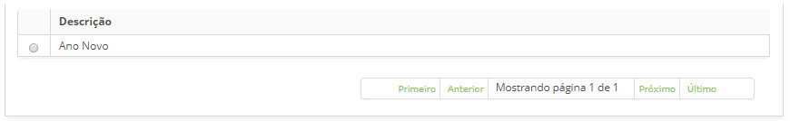
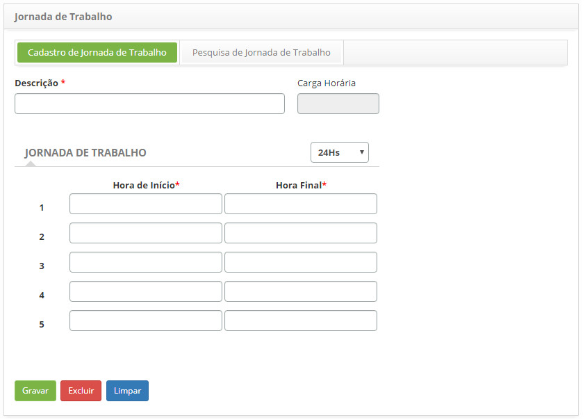

title: Cadastro e pesquisa de jornadas de trabalho
Description: Disponibiliza ações diversas, tais como, incluir, alterar e excluir a jornada de trabalho da organização.
# Cadastro e pesquisa de jornadas de trabalho

Esta funcionalidade tem por objetivo registrar a jornada de trabalho da organização.

Como acessar
--------------

1. Acesse a funcionalidade de Jornada de Trabalho através da navegação no menu principal 
**Cadastros Gerais > Gerência de Pessoal > Jornada de Trabalho**.

Pré-condições
--------------

1. Não se aplica.

Filtros
---------

1. O seguinte filtro possibilita ao usuário restringir a participação de itens na listagem padrão da funcionalidade, facilitando a 
localização dos itens desejados:

    - Descrição.
    
2. Clique na aba **Pesquisa de Jornada de Trabalho**, será apresentada a tela de **Pesquisa de Jornada de Trabalho**, conforme
ilustrado na figura abaixo:

    
    
    **Figura 1 - Tela de pesquisa de jornada de trabalho**
    
3. Realize a pesquisa de jornada de trabalho:

    - Informe a descrição da jornada de trabalho que deseja pesquisar e clique no botão "Pesquisar". Após isso, será exibido o 
    registro da jornada de trabalho conforme a descrição informada;
    
    - Caso deseje listar todos os registros de jornada de trabalho, basta clicar diretamente no botão "Pesquisar".
    
Listagem de itens
-------------------

1. O seguinte campo cadastral está disponível ao usuário para facilitar a identificação dos itens desejados na listagem padrão da
funcionalidade: **Descrição**.

    
    
    **Figura 2 - Tela de listagem de jornada**
    
2. Após a pesquisa, selecione o registro desejado. Feito isso, será direcionado para a tela de cadastro exibindo o conteúdo 
referente ao registro selecionado;

3. Para alterar os dados do registro de jornada de trabalho, basta modificar as informações dos campos desejados e clicar no botão
"Gravar" para que seja gravada a alteração realizada no registro, onde a data, hora e usuário serão gravados automaticamente
para uma futura auditoria.

Preenchimento dos campos cadastrais
-------------------------------------

1. Clique na aba **Cadastro de Jornada de Trabalho**, será apresentada a tela de **Cadastro de Jornada de Trabalho**, conforme
ilustrada na figura abaixo:

    
    
    **Figura 3 - Tela de cadastro de jornada de trabalho**
    
2. Preencha os campos conforme orientações abaixo:

    - **Descrição**: informe a descrição da nova jornada de trabalho;
    - **Carga Horária**: esse campo é para simples conferência, o mesmo será preenchido pelo sistema com a carga horária de 
    trabalho, após gravar o registro. O montante das horas a serem trabalhadas será calculado em função dos horários informados;
    - **Jornada de Trabalho**: defina o formato de hora. O formato de horas a serem definidos são:
        - **24 Hs**: representação das horas de forma contínua, ou seja, 24 horas por dia;
        - **AM/PM: representação das horas num ciclo de 0 a 12 horas, diferenciando- as por AM e PM.
    - **Hora Início**: informe a hora de início da jornada de trabalho;
    - **Hora Final**: informe a hora final da jornada de trabalho.
    
3. Após os dados informados, clique no botão "Gravar para efetuar o registro, onde a data, hora e usuário serão gravados 
automaticamente para uma futura auditoria.

!!! tip "About"

    <b>Product/Version:</b> CITSmart | 7.00 &nbsp;&nbsp;
    <b>Updated:</b>07/24/2019 - Larissa Lourenço
