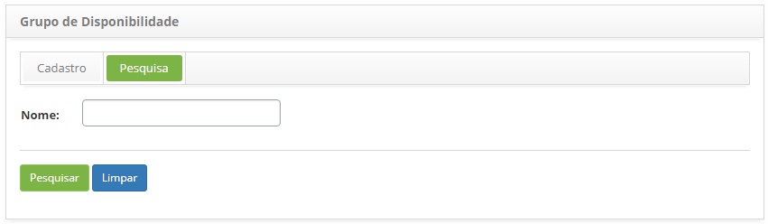
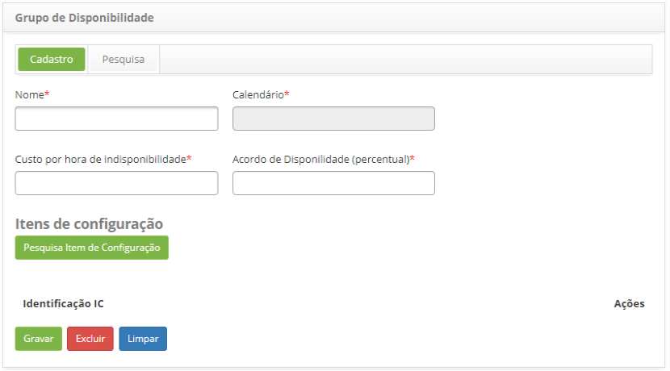
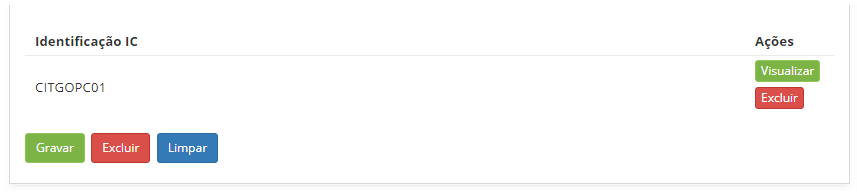
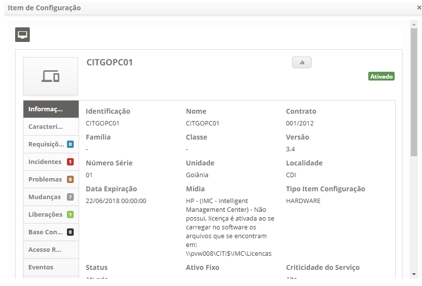

title: Cadastro e pesquisa de grupo de disponibilidade
Description: Esta funcionalidade tem por objetivo agrupar itens de configuração para gerar índice de disponibilidades.
# Cadastro e pesquisa de grupo de disponibilidade

Esta funcionalidade tem por objetivo agrupar itens
de configuração para gerar índice de disponibilidades.

Como acessar
---------------

1. Acesse a funcionalidade de grupo de disponibilidade através da navegação no menu principal 
**Processos ITIL > Gerência de Disponibilidade > Grupo de Disponibilidade**.

Pré-condições
--------------

1. Cadastrar calendário (ver conhecimento Cadastro e pesquisa de calendário).

Filtros
----------

1. O seguinte filtro possibilita ao usuário restringir a participação 
de itens na listagem padrão da funcionalidade, facilitando a 
localização dos itens desejados:

 - Nome.
 
 2. Na tela de **Grupo de Disponibilidade**, clique na aba **Pesquisa**.
 Será apresentada a tela de pesquisa conforme ilustrada na figura abaixo:
 
 
 
 3. Realize a pesquisa de grupo de disponibilidade;
 
     - Informe o nome do grupo de disponibilidade que deseja pesquisar
     e clique no botão "Pesquisar". Após isso, será exibido o registro do
     grupo de disponibilidade conforme o nome informado;
     
     - Caso deseje listar todos os registros de grupo de disponibilidade, 
     basta clicar diretamente no botão Pesquisar.
     
Listagem de itens
-------------------

1. Os seguintes campos cadastrais estão disponíveis ao usuário para facilitar
a identificação dos itens desejados na listagem padrão da funcionalidade:
**Nome** e **Acordo de disponibilidade (percentual)**.

    
2. Após a pesquisa, selecione o registro desejado. Feito isso, será 
direcionado para a tela de cadastro exibindo o conteúdo referente
ao registro selecionado;

3. Para alterar os dados do registro de grupo de disponibilidade, basta modificar
as informações dos campos desejados e clicar no botão "Gravar" para que seja gravada
a alteração realizada no registro, onde a data, hora e usuário serão gravados
automaticamente para uma futura auditoria.

Preenchimento dos campos cadastrais
-------------------------------------

1. Será apresentada a tela de Cadastro de **Grupo de Disponibilidade**, 
conforme ilustrada na figura abaixo:

    
2. Preencha os campos conforme orientações abaixo:

    - **Nome**: informe o nome do grupo de disponibilidade;
    - **Calendário**: informe o calendário do grupo de disponibilidade;
    - **Custo por hora de indisponibilidade**: informe o custo da hora de 
    indisponibilidade do grupo;
    - **Acordo de Disponibilidade (percentual)**: informe o percentual de
    disponibilidade acordado;
    - **Itens de Configuração**: adicione os itens de configuração para
    o grupo de disponibilidade.
    
3. Clique no botão "Pesquisar Item de Configuração", será apresentada a tela de pesquisa
de IC, realize a pesquisa e selecione o IC. Feito isso, o IC será adicionado
ao grupo, conforme exemplo ilustrado na figura abaixo:

    
    
4. Para verificar as informações do IC, basta clicar no botão "Visualizar" do mesmo;

    
    
5. Clique no botão "Gravar" para efetuar o registro, onde a data, hora e usuário 
serão gravados automaticamente para uma futura auditoria.

!!! tip "About"

    <b>Product/Version:</b> CITSmart | 7.00 &nbsp;&nbsp;
    <b>Updated:</b>07/10/2019 – Larissa Lourenço
