title: Gerenciamento de disponibilidade
Description: Esta funcionalidade tem por objetivo verificar a disponibilidade de ICs.
# Gerenciamento de disponibilidade

Esta funcionalidade tem por objetivo verificar a disponibilidade de ICs, 
disponibilidade do Grupo de ICs, disponibilidade do Grupo de Disponibilidade 
e disponibilidade do Serviço de Negócio.

Como acessar
--------------

1. Acesse a funcionalidade de Gerenciamento de Disponibilidade através 
da navegação no menu principal **Processos ITIL > Gerência de
Disponibilidade > Gerenciamento de Disponibilidade**.

Pré-condições
---------------

Para verificar os gráficos de disponibilidade é necessário, primeiramente,
realizar os seguintes procedimentos:

1. Cadastrar o grupo de disponibilidade (ver conhecimento 
[Cadastro e pesquisa de grupo de disponibilidade](/pt-br/citsmart-platform-7/processes/availability/availability-group.html));

2. Vincular o calendário, acordo de nível de serviço do tipo "disponibilidade" 
e custo por hora de indisponibilidade ao Item de Configuração
(ver conhecimento [Gerenciamento de itens de configuração](/pt-br/citsmart-platform-7/processes/configuration/IC-management.html));

3. Vincular o calendário, acordo de nível de serviço do tipo "disponibilidade" 
e custo por hora de indisponibilidade ao Grupo de ICs;

4. Vincular o calendário, acordo de nível de serviço do tipo "disponibilidade" e 
custo por hora de indisponibilidade ao Contrato do Serviço.

Gerenciamento de disponibilidade
-----------------------------------

1. Será apresentada a tela de **Gerenciamento de Disponibilidade**, 
conforme ilustrada na figura abaixo:

    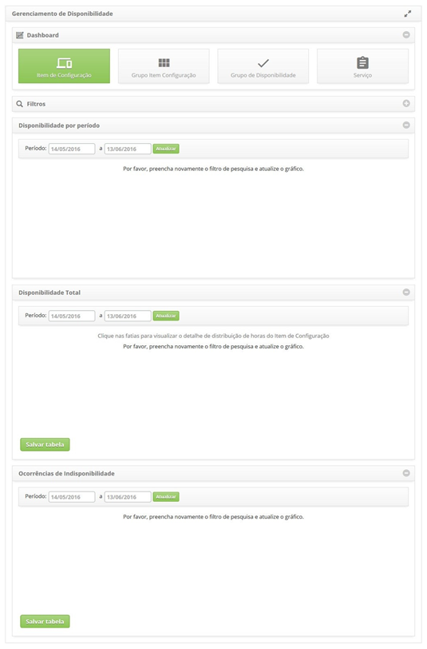

    **Figura 1 - Tela de gerenciamento de disponibilidade**

2. Nesta tela de Gerenciamento de Disponibilidade, é possível verificar a 
disponibilidade de ICs, disponibilidade do Grupo de ICs, disponibilidade do
Grupo de Disponibilidade e disponibilidade do Serviço de Negócio. 
Nos próximos tópicos será abordado sobre como executar essas ações.

Verificando a disponibilidade de item de configuração
-------------------------------------------------------

1. a tela de **Gerenciamento de Disponibilidade**, clique em **Item de Configuração**. 
Feito isso, será apresentado o filtro de IC, conforme ilustrado na figura abaixo:

    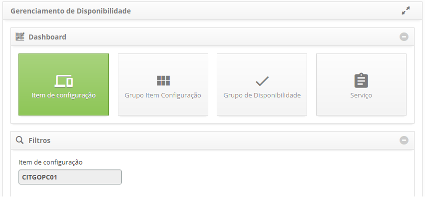

    **Figura 2 - Gerenciamento de disponibilidade - Item de configuração**

2. Clique no campo **Item de Configuração**, será apresenta a tela de pesquisa de ICs.
Realize a pesquisa e selecione o IC desejado. Após isso, o IC será adicionado na tela,
conforme exemplo ilustrado na figura abaixo:

    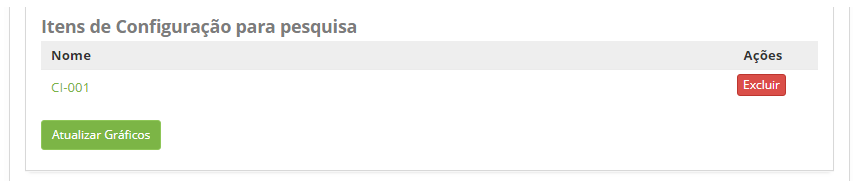

    **Figura 3 - Filtros de IC**

    !!! warning "ATENÇÃO"
    
        Pode ser adicionado vários itens, quantos desejar, para verificação.
        
3. Após o filtro definido, clique no botão "Atualizar Gráficos". Feito isso, 
serão exibidas as informações do(s) IC(s) em gráficos, conforme exemplo 
ilustrado na figura abaixo:

    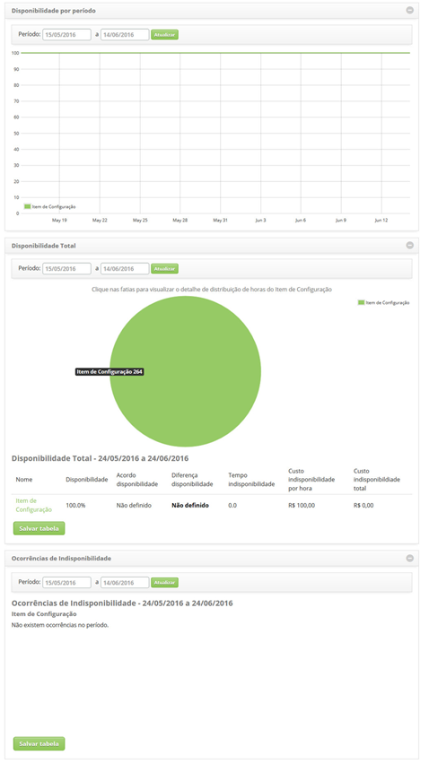

    **Figura 4 - Gráficos de disponibilidade por item de configuração**

    - **Disponibilidade por Período**: apresenta a disponibilidade por dia de cada IC,
    dentro do período informado;
    - **Disponibilidade Total**: apresenta a disponibilidade total de cada IC, 
    dentro do período informado;
    - **Ocorrências de Indisponibilidade**: apresenta as ocorrências de indisponibilidade
    de cada IC, dentro do período informado;
    - Para download da tabela de disponibilidade total e/ou ocorrências
    de indisponibilidade, basta clicar no botão "Salvar tabela" referente;
    - Para download da imagem ou PDF dos gráficos, basta clicar no 
    ícone  do gráfico referente.
    
Verificando a disponibilidade de grupo de item de configuração
----------------------------------------------------------------

1. Na tela de **Gerenciamento de Disponibilidade**, clique em 
**Grupo de Item de Configuração**. Feito isso, será apresentado o filtro de
grupo de ICs, conforme ilustrado na figura abaixo:

    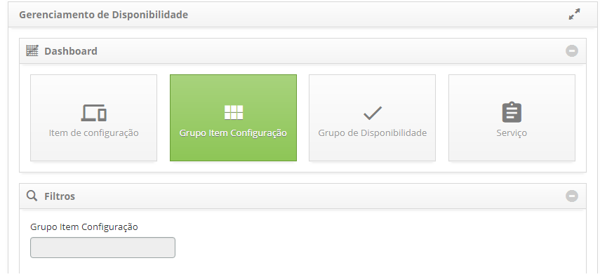

    **Figura 5 - Gerenciamento de disponibilidade - Item de configuração**

2. Clique no campo **Grupo Item de Configuração**, será apresenta a tela
de pesquisa de grupo de ICs. Realize a pesquisa e selecione o grupo de ICs
desejado. Após isso, o Grupo de ICs será adicionado na tela conforme 
exemplo ilustrado na figura abaixo:

    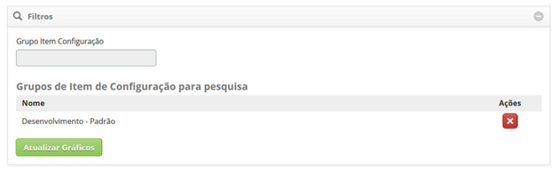

    **Figura 6 - Filtros de grupo de IC**

    !!! warning "ATENÇÃO"
    
        Pode ser adicionado vários grupos, quantos desejar, para verificação.
        
3. Após o filtro definido, clique no botão "Atualizar Gráficos". Feito isso,
serão exibidas as informações do(s) grupo(s) de ICs em gráficos, conforme 
exemplo ilustrado na figura abaixo:

    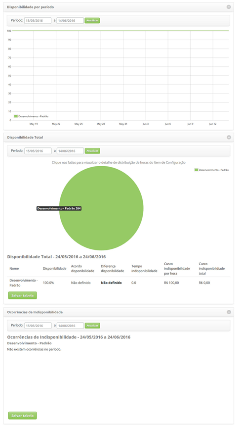

    **Figura 7 - Gráficos de disponibilidade por grupo de IC**

    - **Disponibilidade por Período**: apresenta a disponibilidade por dia de 
    cada grupo de ICs, dentro do período informado;
    - **Disponibilidade Total**: apresenta a disponibilidade total de cada 
    grupo de ICs, dentro do período informado;
    - **Ocorrências de Indisponibilidade**: apresenta as ocorrências de 
    indisponibilidade de cada grupo de ICs, dentro do período informado;
    - Para download da tabela de disponibilidade total e/ou ocorrências de
    indisponibilidade, basta clicar no botão "Salvar tabela" referente;
    - Para download da imagem ou PDF dos gráficos, basta clicar no 
    ícone  do gráfico referente.

Verificando a disponibilidade de grupo de disponibilidade
-----------------------------------------------------------

1. Na tela de **Gerenciamento de Disponibilidade**, clique em **Grupo de 
Disponibilidade**. Feito isso, será apresentado o filtro de grupo de 
disponibilidade, conforme ilustrado na figura abaixo:

    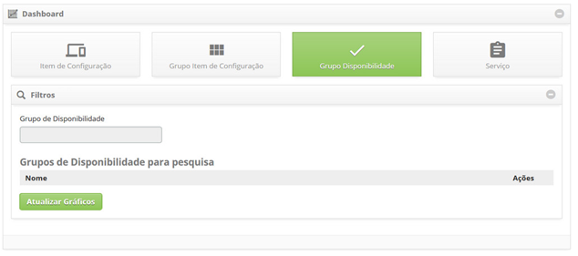

    **Figura 8 - Gerenciamento de disponibilidade - Grupo de disponibilidade**

2. Clique no campo **Grupo de Disponibilidade**, será apresenta a tela 
de pesquisa de grupo de disponibilidade. Realize a pesquisa e selecione
o grupo de disponibilidade desejado. Após isso, o grupo de disponibilidade
será adicionado na tela conforme exemplo ilustrado na figura abaixo:

    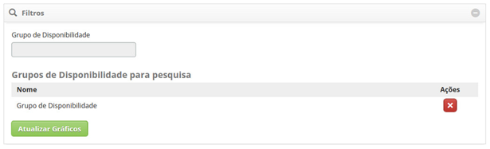

    **Figura 9 - Filtros de grupo de disponibilidade**

    !!! warning "ATENÇÃO"
    
        Pode ser adicionado vários grupos, quantos desejar, para verificação.
       
3. Após o filtro definido, clique no botão "Atualizar Gráficos". Feito isso, 
serão exibidas as informações do(s) grupo(s) de disponibilidade em gráficos,
conforme exemplo ilustrado na figura abaixo:

    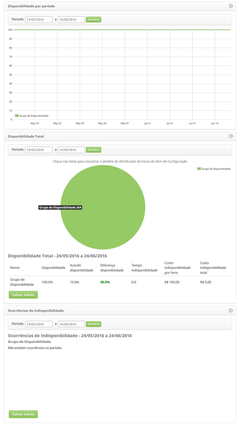

    **Figura 10 - Gráficos de disponibilidade por grupo de disponibilidade**

    - **Disponibilidade por Período**: apresenta a disponibilidade por dia 
    de cada grupo de disponibilidade, dentro do período informado;
    - **Disponibilidade Total** : apresenta a disponibilidade total de cada
    grupo de disponibilidade, dentro do período informado; 
    - **Ocorrências de Indisponibilidade**: apresenta as ocorrências de 
    indisponibilidade de cada grupo de disponibilidade, dentro do período
    informado;
    - Para download da tabela de disponibilidade total e/ou ocorrências de 
    indisponibilidade, basta clicar no botão "Salvar tabela" referente;
    - Para download da imagem ou PDF dos gráficos, basta clicar no 
    ícone   do gráfico referente.

Verificando a disponibilidade de serviço
-------------------------------------------

1. Na tela de **Gerenciamento de Disponibilidade**, clique em **Serviço**. 
Feito isso, será apresentado o filtro de serviço, conforme ilustrado
na figura abaixo:

    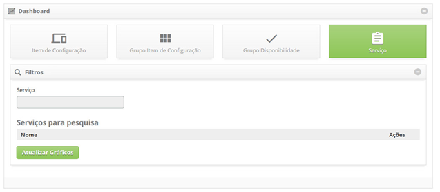

    **Figura 11 - Gerenciamento de disponibilidade - Serviço**

2. Clique no campo **Serviço**, será apresenta a tela de pesquisa de serviços.
Realize a pesquisa e selecione o serviço desejado. Após isso, o serviço 
será adicionado na tela conforme exemplo ilustrado na figura abaixo:

    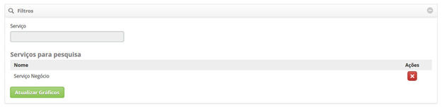
    
    **Figura 12 - Filtros de serviço**

    !!! warning "ATENÇÃO"
    
        Pode ser adicionado vários serviços, quantos desejar, para verificação.
       
3. Após o filtro definido, clique no botão "Atualizar Gráficos". 
Feito isso, serão exibidas as informações do(s) Serviço(s) em gráficos,
conforme exemplo ilustrado na figura abaixo:

    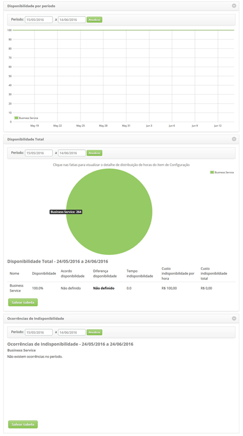

    **Figura 13 - Gráficos de disponibilidade por serviço**

    - **Disponibilidade por Período**: apresenta a disponibilidade por 
    dia de cada serviço, dentro do período informado;
    - **Disponibilidade Total**: apresenta a disponibilidade total de cada 
    serviço, dentro do período informado;
    - **Ocorrências de Indisponibilidade**: apresenta as ocorrências de 
    indisponibilidade de cada serviço, dentro do período informado;
    - Para download da tabela de disponibilidade total e/ou ocorrências de 
    indisponibilidade, basta clicar no botão "Salvar tabela" referente;
    - Para download da imagem ou PDF dos gráficos, basta clicar no
    ícone  do gráfico referente.

!!! tip "About"

    <b>Product/Version:</b> CITSmart | 7.00 &nbsp;&nbsp;
    <b>Updated:</b>07/10/2019 – Larissa Lourenço
