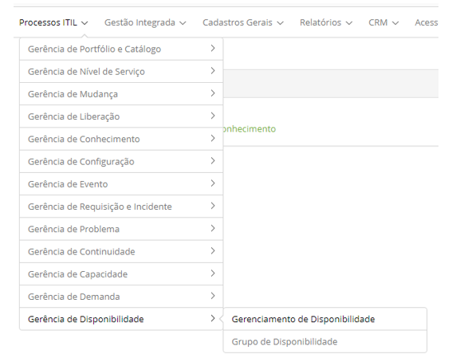

title: Módulo Gerenciamento de Disponibilidade
Description: O Gerenciamento de Disponibilidade é o processo responsável por garantir que os serviços de TI 
# Módulo Gerenciamento de Disponibilidade

Objetivo do módulo
---------------------

O Gerenciamento de Disponibilidade é o processo responsável por garantir que os serviços de TI 
atendam às necessidades atuais e futuras de disponibilidade do negócio de uma maneira mais 
efetiva com custo adequado. O mesmo garante que todos os processos, infraestruturas, ferramentas,
papéis, etc. de TI sejam adequados para as metas de nível de serviço acordadas para disponibilidade.

O principal objetivo do Gerenciamento da Disponibilidade é o fornecimento de um determinado nível de
disponibilidade dos serviços de TI, proporcionando ao cliente atingir seus objetivos
com eficiência de custo.

Esta funcionalidade tem por objetivo verificar a disponibilidade de ICs, disponibilidade do 
Grupo de ICs,disponibilidade do Grupo de Disponibilidade e disponibilidade do 
Serviço de Negócio.

Onde estão suas funcionalidades
---------------------------------

Acesse o menu principal **Processos ITIL > Gerência de Disponibilidade**.

**Figura 1 - Menu do módulo gerência de disponibilidade**

Principal funcionalidade (em destaque)
----------------------------------------

Na seção "Veja também" é possível acessar a(s) funcionalidade(s)
principal(is) deste módulo, desta forma se pode obter um conhecimento mais detalhado.

Veja também
-------------

- [Gerenciamento de disponibilidade](/pt-br/citsmart-platform-7/processes/availability/availability-management.html)

!!! tip "About"

    <b>Product/Version:</b> CITSmart | 7.00 &nbsp;&nbsp;
    <b>Updated:</b>07/10/2019 – Larissa Lourenço
