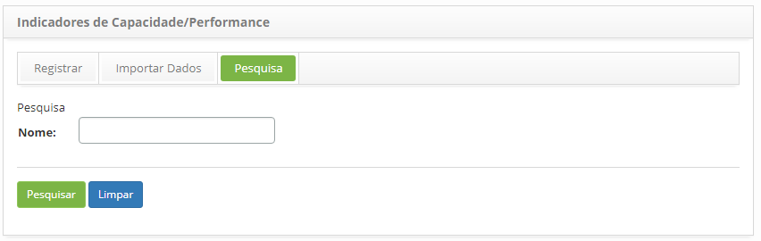
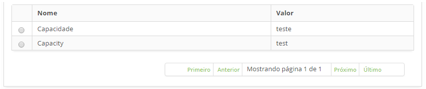
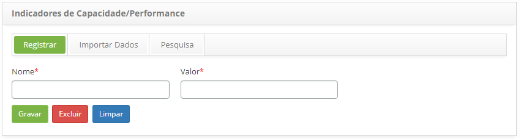

title: Cadastro e pesquisa de indicadores de capacidade
Description: Esta funcionalidade tem o objetivo de cadastrar os indicadores de capacidade/performance
# Cadastro e pesquisa de indicadores de capacidade

Esta funcionalidade tem o objetivo de cadastrar os indicadores de capacidade/performance que serão vinculados aos
Serviços e aos Itens de Configuração (IC).

Como acessar
--------------

1. Acesse a funcionalidade de Indicadores de Capacidade/Performance através da navegação
no menu principal **Processos ITIL > Gerência de Capacidade > Indicadores de 
Capacidade/Performance**.

Pré-condições
----------------

1. Não se aplica.

Filtros
----------

1. O seguinte filtro possibilita ao usuário restringir a participação de itens na listagem padrão da 
funcionalidade, facilitando a localização dos itens desejados:

    - Nome

    

    **Figura 1 - Tela de pesquisa de indicadores de capacidade/performance**

2. Realize a pesquisa do indicador de capacidade/performance;

    - Informe o nome do indicador de capacidade/performance que deseja pesquisar e clique no 
    botão "Pesquisar". Após isso, será exibido o registro do indicador conforme o nome informado.

    - Caso deseje listar todos os registros de indicador de capacidade/performance,
    basta clicar diretamente no botão "Pesquisar".

Listagem de Itens
------------------

1. Os seguintes campos cadastrais estão disponíveis ao usuário para facilitar a identificação
dos itens desejados na listagem padrão da funcionalidade: **Nome** e **Valor**.

    

    **Figura 2 - Tela de listagem de indicadores de capacidade/performance**

2. Após a pesquisa, selecione o registro desejado. Feito isso, será direcionado para a tela 
de cadastro exibindo o conteúdo referente ao registro selecionado;

3. Para alterar os dados do registro de indicador de capacidade/performance, basta modificar as 
informações desejadas e clicar no botão "Gravar".

Preenchimento dos campos cadastrais
-------------------------------------

1. Será apresentada a tela de **Cadastro de Indicadores de Capacidade/Performance**, conforme ilustrada na figura abaixo:

    

     **Figura 3 - Tela de cadastro de indicadores de capacidade/performance**

2. Preencha os campos conforme orientações abaixo:

    - **Nome**: informe o nome do indicador de capacidade/performance;
    - **Valor**: informe o valor do indicador de capacidade/performance.

3. Após os dados informados, clique no botão "Gravar" para efetuar o registro, onde a data,
hora e usuário serão gravados automaticamente para uma futura auditoria;

!!! tip "About"

    <b>Product/Version:</b> CITSmart | 7.00 &nbsp;&nbsp;
    <b>Updated:</b>07/11/2019 – Larissa Lourenço

