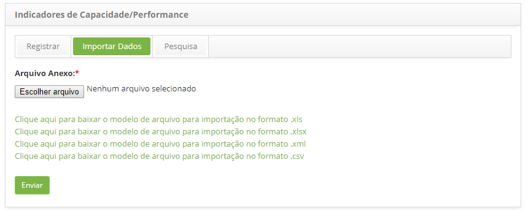

title: Importação de dados de indicadores de capacidade
Description: 
# Importação de dados de indicadores de capacidade

Como acessar
----------------

1. Acesse a funcionalidade de Indicadores de Capacidade/Performance através da navegação 
no menu principal **Processos ITIL > Gerência de Capacidade > Indicadores de Capacidade/Performance**.

Realizando importação de dados de indicadores de capacidade/performance
--------------------------------------------------------------------------

1. Será apresentada a tela de Indicadores de Capacidade/Performance.

2. Clique na guia **Importar Dados**, será apresentada a tela de importação de dados, conforme 
ilustrada na figura abaixo:

**Figura 1 - Tela de importação de dados**

3. Anexe o arquivo para importação dos dados;

4. Note que na tela são apresentados os modelos de arquivos para orientar na forma e ordem que os
dados devem estar no arquivo;

5. Portanto, antes de selecionar o arquivo, verifique se o mesmo está de acordo com o modelo, levando 
em consideração o formato (.xls, .xlsx, .xml ou .csv);

6. Após a verificação, clique no botão "Escolher arquivo", selecione o arquivo e clique no botão
"Enviar" para efetuar a importação;

7. Feito isso, os dados serão importados com sucesso.

!!! tip "About"

    <b>Product/Version:</b> CITSmart | 7.00 &nbsp;&nbsp;
    <b>Updated:</b>07/11/2019 – Larissa Lourenço

