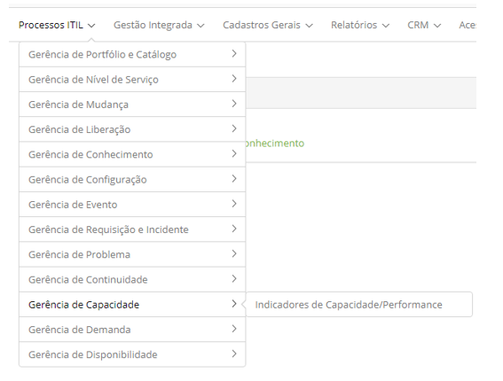

title: Módulo Gerenciamento de Capacidade
Description: O Gerenciamento de Capacidade é o processo responsável por tornar possível o atendimento dos 
requisitos relacionados à capacidade 
# Módulo Gerenciamento de Capacidade

Objetivo do módulo
--------------------

O Gerenciamento de Capacidade é o processo responsável por tornar possível o atendimento dos requisitos relacionados
à capacidade e desempenho do ambiente de TI dentro de um acordo de serviço. O mesmo considera todos os recursos 
necessários para entregar os serviços de TI, planos e requisitos de negócio a curto, médio e longo prazo.

O propósito do Gerenciamento de Capacidade é garantir que a capacidade dos serviços de TI e a infraestrutura de TI sejam
capazes de atender aos requisitos relacionados à capacidade e ao desempenho acordados de maneira oportuna e eficaz em custo.

O Gerenciamento de Capacidade possui três sub processos, nos quais se pode considerar a capacidade:

- **Gestão da capacidade do negócio**: garante que as necessidades futuras do negócio sejam consideradas, planejadas e atendidas em
tempo apropriado. Isso pode ser feito através de análise de tendências, previsões e modelagens. O foco está nas necessidades
atuais e futuras do negócio;

- **Gestão da capacidade de serviços**: gerencia o desempenho dos serviços de TI em operação. São suas responsabilidades garantir, 
monitorar e reportar os níveis de desempenho definidos nos acordos de nível de serviço (SLA) e nos requisitos de nível de serviço (SLR).
Seu foco está nos serviços atuais suportados pelo negócio;

- **Gestão da capacidade de recursos**: monitora e reporta os níveis de desempenho,
individuais, dos recursos (componentes) de infraestrutura de TI. Seu foco está na
tecnologia responsável por sustentar toda a provisão de serviços.

Neste módulo serão definidos os indicadores de capacidade (performance/desempenho)
que serão vinculados aos Serviços e Itens de Configuração.

Onde estão suas funcionalidades
---------------------------------

Acesse o menu principal **Processos ITIL > Gerência de Capacidade**.

