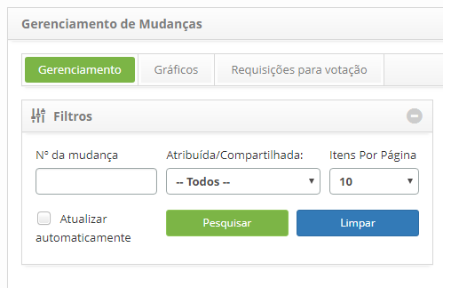
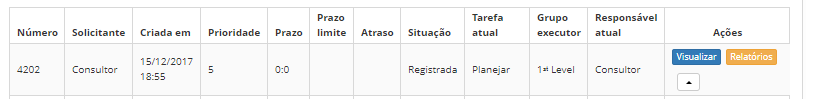
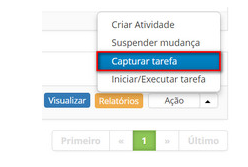

title: Captura de requisição de mudança
Description: Esta funcionalidade refere-se ao ato de atribuir a determinada tarefa para o próprio usuário, tornando-se o 
responsável atual pela requisição de mudança.
# Captura de requisição de mudança

Esta funcionalidade refere-se ao ato de atribuir a determinada tarefa para o próprio usuário, tornando-se o responsável 
atual pela requisição de mudança.

Como acessar
-------------

1. Acesse a funcionalidade de captura de requisição de mudança através da navegação no menu principal
**Processos ITIL > Gerência de Mudança > Gerenciamento de Mudança**.

Pré-condições
----------------

1. Não se aplica.

Filtros
----------

1. Os seguintes filtros possibilitam ao usuário restringir a participação de itens na listagem padrão da funcionalidade, 
facilitando a localização dos itens desejados:

    - Número da mudança;
    - Atribuída/Compartilhada;
    - Itens por página.
    
    
    
    **Figura 1 - Tela de filtros**
    
Listagem de itens
------------------

1. Os seguintes campos cadastrais estão disponíveis ao usuário para facilitar a identificação dos itens desejados na 
listagem padrão da funcionalidade: **Número, Solicitante, Criada em, Prioridade, Prazo, Prazo limite, Atraso, Situação, 
Tarefa atual, Grupo Executor** e **Responsável atual**.

2. Existem botões de ação disponíveis ao usuário em relação a cada item da listagem, são eles: "Visualizar", "Relatórios"
e "Ação".

**Figura 2 - Tela de listagem de tarefas**

Preenchimento dos campos cadastrais
-------------------------------------

1. Não se aplica.

Capturando tarefa
------------------

1. Na guia **Gerenciamento**, localize a requisição de mudança que deseja capturar, clique no botão Ação e selecione a opção 
"Capturar tarefa", conforme indicado na imagem abaixo:

    
    
    **Figura 3 - Capturar tarefa**
    
2. Será exibida uma mensagem de confirmação da captura da tarefa. Clique em "OK" para efetuar a operação;

3. Será apresentado o responsável atual pelo atendimento da requisição de mudança na lista de requisições.

!!! tip "About"

    <b>Product/Version:</b> CITSmart | 7.00 &nbsp;&nbsp;
    <b>Updated:</b>07/12/2019 – Larissa Lourenço
