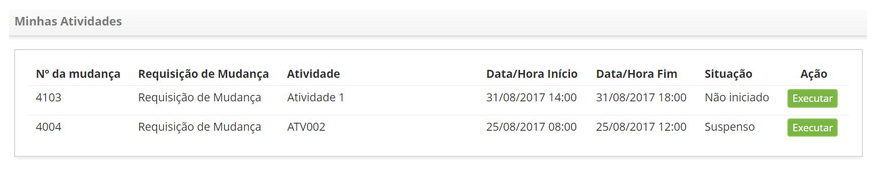
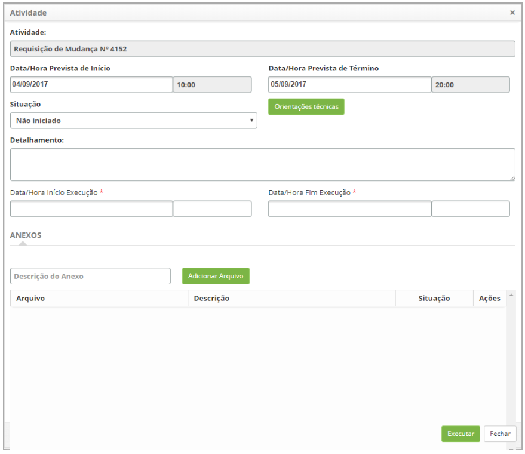

title: Gerenciamento de atividades de mudança
Description: Esta funcionalidade tem o objetivo de gerenciar suas atividades relacionadas às requisições de mudança.
# Gerenciamento de atividades de mudança

Esta funcionalidade tem o objetivo de gerenciar suas atividades relacionadas às requisições de mudança.

Como acessar
---------------

1. Acesse a funcionalidade de minhas atividades através da navegação no menu principal 
**Processos ITIL > Gerência de Mudança > Minhas Atividades**.

Pré-condições
---------------

1. Ter atividades atribuídas ao seu usuário.

Filtros
--------

1. Não se aplica.

Listagem de itens
------------------

1. Os seguintes campos cadastrais estão disponíveis ao usuário para facilitar a identificação dos itens desejados na 
listagem padrão da funcionalidade: **Nº da Mudança, Requisição de Mudança, Atividade, Data/Hora Fim** e **Situação**.

2. Existe um botão de ação disponível ao usuário em relação a cada item da listagem, é ele: "Executar".

3. Será apresentada a tela **Minhas Atividades**, conforme ilustrada na figura abaixo:

**Figura 1 - Minhas atividades**

Preenchimento dos campos cadastrais
------------------------------------

1. Para registrar informações da execução da atividade, basta clicar no botão "Executar" e será apresentada a tela,
conforme ilustrado abaixo:

    
    
    **Figura 2 - Registro de execução de atividade**
    
    - **Situação**: selecione a situação da atividade, para facilitar o gerenciamento da mudança;
    
2. Clique no botão "Orientações técnicas" para visualizar o que foi informado da descrição da requisição de mudança;

    - **Detalhamento**: informe os detalhes sobre a execução da atividade;
    - **Data/Hora Início Execução**: informe a data e o horário de início da execução da atividade;
    
3. Para anexar um arquivo à atividade, informe a descrição do anexo, clique no botão "Adicionar Arquivo", e 
selecione o arquivo que desejar;

4. Clique no botão "Executar" para salvar as informações preenchidas referente a atividade.

!!! tip "About"

    <b>Product/Version:</b> CITSmart | 7.00 &nbsp;&nbsp;
    <b>Updated:</b>07/12/2019 – Larissa Lourenço
