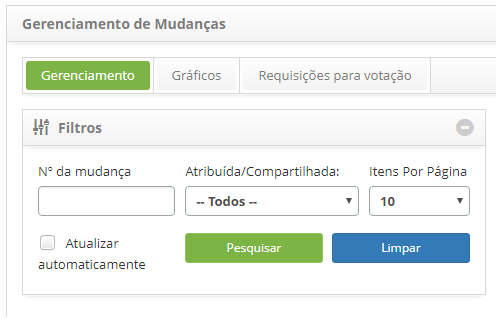
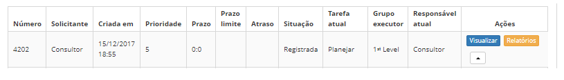
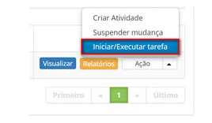

title: Cancelamento de requisição de mudança
Description: Esta funcionalidade permite realizar o cancelamento da requisição de mudança.
# Cancelamento de requisição de mudança

Esta funcionalidade permite realizar o cancelamento da requisição de mudança.

Como acessar
--------------

1. Acesse a funcionalidade de cancelamento de requisição de mudança através da navegação no menu principal
**Processos ITIL > Gerência de Mudança > Gerência de Mudança**.

Pré-condições
---------------

1. Não se aplica.

Filtros
---------

1. Os seguintes filtros possibilitam ao usuário restringir a participação de itens na listagem padrão da funcionalidade,
facilitando a localização dos itens desejados:

    - Número da mudança;
    - Atribuída/Compartilhada
    - Itens por página.
    
    
    
    **Figura 1 - Tela de filtros**
    
Listagem de itens
--------------------

1. Os seguintes campos cadastrais estão disponíveis ao usuário para facilitar a identificação dos itens desejados na listagem padrão da 
funcionalidade: Número, Solicitante, Criada em, Prioridade, Prazo, Prazo limite, Atraso, Situação, Tarefa atual, Grupo Executor e Responsável atual.

2. Existem botões de ação disponíveis ao usuário em relação a cada item da listagem, são eles: "Visualizar", "Relatórios" e "Ação".

**Figura 2 - Tela de listagem de mudanças**

Preenchimento dos campos cadastrais
-------------------------------------

1. Não se aplica.

Cancelando requisição de mudança
----------------------------------

1. Na guia **Gerenciamento**, localize a requisição de mudança que deseja cancelar, clique no botão "Ação" e selecione a opção 
"Iniciar/Executar tarefa" da mesma, conforme indicado na imagem abaixo:

    
    
    **Figura 3 - Cancelar requisição de mudanças**
    
2. Será exibida a tela de **Registro da Requisição de Mudança** com os campos preenchidos, com o conteúdo referente a 
requisição selecionada;

    - Na área de fechamento, no campo **Status**, marque a opção **Cancelada**;
    - No campo **Fechamento**, descreva os detalhes do cancelamento da requisição de mudança;
    - Após registro das informações do cancelamento da requisição de mudança, clique no botão "Gravar e avançar o fluxo"
    para efetuar a operação, onde a requisição de mudança será cancelada com sucesso;
    - Caso queira gravar somente as informações registradas sobre o cancelamento de requisição de mudança e manter a tarefa 
    atual, clique no botão "Gravar e manter a tarefa atual".
    - Em ambos os casos anteriores, ao clicar no botão "Gravar" a data, hora e usuário serão gravados automaticamente
    para uma futura auditoria.
    
!!! tip "About"

    <b>Product/Version:</b> CITSmart | 7.00 &nbsp;&nbsp;
    <b>Updated:</b>07/12/2019 – Larissa Lourenço
