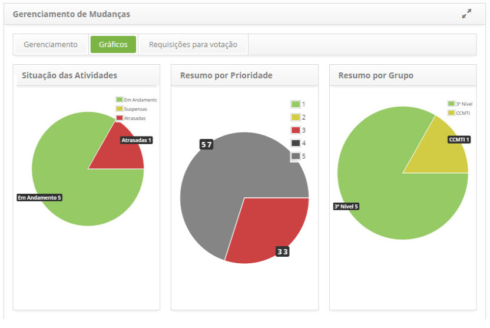

title: Gráficos de requisição de mudança
Description: Esta funcionalidade permite visualizar os gráficos de requisição de mudança.
# Gráficos de requisição de mudança

Como acessar
-------------

1. Acesse a funcionalidade de gráficos de requisição de mudança através da navegação no menu principal
**Processos ITIL > Gerência de Mudança > Gerenciamento de Mudança**.

Visualizando gráficos
----------------------

1. Clique na guia **Gráficos** e será apresentado as informações das requisições por situação (em andamento, suspensas e atrasadas),
por prioridade e por grupo executor, sendo essas demonstradas em gráficos conforme ilustrado na figura abaixo:

**Figura 1 - Tela de gráficos de mudanças**

!!! tip "About"

    <b>Product/Version:</b> CITSmart | 7.00 &nbsp;&nbsp;
    <b>Updated:</b>07/12/2019 – Larissa Lourenço
