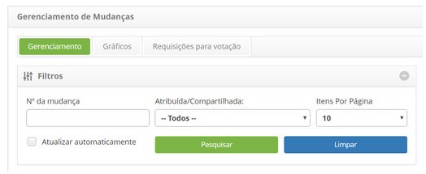
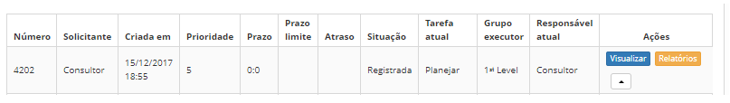

title: Visualização de requisição de mudança
Description: Esta funcionalidade permite visualizar as informações da requisição de mudança.
# Visualização de requisição de mudança

Esta funcionalidade permite visualizar as informações da requisição de mudança.

Como acessar
--------------

1. Acesse a funcionalidade através da navegação no menu principal 
**Processos ITIL > Gerência de Mudança > Gerenciamento de Mudança**.

Pré-condições
---------------

1. Não se aplica.

Filtros
---------

1. Os seguintes filtros possibilitam ao usuário restringir a participação de itens na listagem padrão da funcionalidade, 
facilitando a localização dos itens desejados:

    - Nº da mudança;

    - Atribuída/Compartilhada;

    - Itens Por Página.

**Figura 1 - Tela de filtros**

Listagem de itens
------------------

1. Os seguintes campos cadastrais estão disponíveis ao usuário para facilitar a identificação dos itens desejados na listagem 
padrão da funcionalidade: **Número, Solicitante, Criada em, Prioridade, Prazo, Prazo limite, Situação,Tarefa atual, 
Grupo executor** e **Responsável atual**.

2. Existem botões de ação disponíveis ao usuário em relação a cada item da listagem, são eles: "Visualizar", "Relatórios" 
e "Ação".

3. Na guia **Gerenciamento**, localize a requisição de mudança que deseja visualizar e clique no botão "Visualizar" da mesma:

    
    
    **Figura 2 - Botão visualizar**
    
4. Será aberta a tela de Registro da Requisição de Mudança para visualização;

    - Se desejar gerar PDF das informações da requisição de mudança, clique no botão "Gerar PDF"

    - Se desejar gerar um relatório das informações da requisição de mudança, clique no botão "Relatório Registro de Execução".

Preenchimento dos campos cadastrais
------------------------------------

1. Não se aplica.

!!! tip "About"

    <b>Product/Version:</b> CITSmart | 7.00 &nbsp;&nbsp;
    <b>Updated:</b>01/12/2019 – Larissa Lourenço

