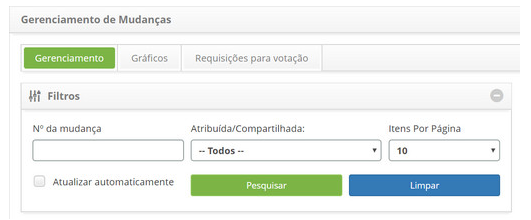
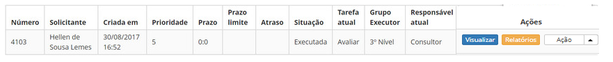
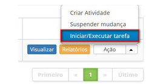

title: Avaliação e finalização de requisição de mudança
Description: Essa funcionalidade permite realizar a avaliação da requisição de mudança e finalizar a mesma.
# Avaliação e finalização de requisição de mudança

Essa funcionalidade permite realizar a avaliação da requisição de mudança e finalizar a mesma.

Como acessar
--------------

1. Acesse a funcionalidade de avaliação e finalização de requisição de mudança através da navegação no menu principal
**Processos ITIL > Gerência de Mudança > Gerência de Mudança**.

Pré-condições
--------------

1. Não se aplica.

Filtros
---------

1. Os seguintes filtros possibilitam ao usuário restringir a participação de itens na listagem padrão da funcionalidade, 
facilitando a localização dos itens desejados:

 - Número de mudança;
 - Atribuída/Compartilhada;
 - Itens por página

**Figura 1 - Tela de pesquisa de mudança**

Listagem de itens
------------------

1. Os seguintes campos cadastrais estão disponíveis ao usuário para facilitar a identificação dos itens desejados na listagem 
padrão da funcionalidade: **Número, Solicitante, Criada em, Prioridade, Prazo, Prazo limite, Atraso, Situação, Tarefa atual,
Grupo Executor** e **Responsável atual**.

2. Existem botões de ação disponíveis ao usuário em relação a cada item da listagem, são eles: "Visualizar", "Relatórios" e "Ação" 
(Criar Atividade, Suspender mudança e Iniciar/Executar tarefa)

**Figura 2 - Tela de listagem de mudança**

Preenchimento dos campos cadastrais
------------------------------------

1. Não se aplica

Avaliando e finalizando requisição de mudança
-----------------------------------------------

1. Na guia Gerenciamento, localize a requisição de mudança que será avaliada e finalizada, clique no botão "Ação" e selecione a 
opção Iniciar/Executar tarefa da mesma, conforme indicado na imagem abaixo:

**Figura 3 - Realizar avaliação da requisição de mudança**

2. Será exibida a tela de Requisição de Mudança com os campos preenchidos, com o conteúdo referente à requisição selecionada;

 - Verifique se a requisição de mudança foi atendida conforme solicitado;
 - Registre as informações necessárias sobre a avaliação da requisição de mudança:
    - Clique no botão "Adicionar registro de execução";
    - Descreva as informações sobre a execução de sua atividade.
 - No campo **Fechamento**, informe o fechamento da requisição de mudança, ou seja, os detalhes da finalização da execução da 
requisição de mudança;
 -  Após registro das informações sobre a avaliação e finalização da requisição de mudança, clique no botão "Gravar e avançar o fluxo"
paraefetuar a operação, onde a requisição de mudança e os problemas, incidentes e itens de configuração relacionados serão finalizados
com sucesso;
 - Caso queira gravar somente as informações registradas sobre a avaliação e finalização da requisição de mudança e manter a tarefa atual, clique 
no botão "Gravar e manter a tarefa atual";
 - Em ambos os casos anteriores, ao clicar no botão Gravar a data, hora e usuário serão armazenados automaticamente para uma futura auditoria.

!!! note "REGRA"

    todos "Erros conhecidos" relacionados à um problema ao qual foi relacionado à mudança que está sendo encerrada, serão arquivados,
    caso o Parâmetro 232 (ERRO CONHECIDO - Arquivar Erro Conhecido ao concluir Mudança? (S ou N - Default: 'N')) esteja definido 
    com o valor "S".
    
!!! tip "About"

    <b>Product/Version:</b> CITSmart | 7.00 &nbsp;&nbsp;
    <b>Updated:</b>07/11/2019 – Larissa Lourenço
