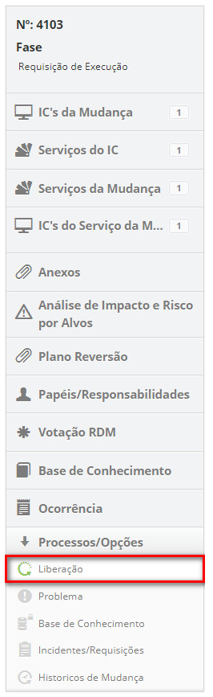

title: Execução de requisição de mudança
Description: Essa funcionalidade permite realizar a execução da requisição de mudança.
# Execução de requisição de mudança

Essa funcionalidade permite realizar a execução da requisição de mudança.

Como acessar
--------------

1. Acesse a funcionalidade de execução de requisição de mudança através da navegação no menu principal 
**Processos ITIL > Gerência de Mudança > Gerenciamento de Mudança**.

Pré-condições
---------------

1. Ter cadastrado ao menos uma requisição de mudança (ver conhecimento Cadastro de requisição de mudança).

Filtros
--------

1.Os seguintes filtros possibilitam ao usuário restringir a participação de itens na listagem padrão da
funcionalidade, facilitando a localização dos itens desejados:

    - Número da mudança;
    - Atribuída/Compartilhada;
    - Itens por página.
    

    
**Figura 1 - Tela de filtros**
    
Listagem de itens
-------------------

1. Os seguintes campos cadastrais estão disponíveis ao usuário para facilitar a identificação dos itens desejados na
listagem padrão da funcionalidade: **Número, Solicitante, Criada em, Prioridade, Prazo, Prazo limite, Atraso, Situação,
Tarefa atual, Executor** e **Responsável atual**.

2. Existem botões de ação disponíveis ao usuário em relação a cada item da listagem, são eles: "Visualizar", "Relatórios" 
e "Ação'.

Preenchimento dos campos cadastrais
------------------------------------

1. Não se aplica.

Executando requisição de mudança
---------------------------------

1. Na guia **Gerenciamento**, localize a requisição de mudança que deseja registrar as informações de sua execução, 
clique no botão "Ação" e selecione a opção "Iniciar/Executar" tarefa da mesma, conforme indicado na imagem abaixo:

    
    
    **Figura 3 - Registrar execução da requisição de mudança**
    
2. Será exibida a tela de **Requisição de Mudança** com os campos preenchidos com o conteúdo referente à requisição selecionada;

    - Registre as informações necessárias sobre a execução da requisição de mudança:
    
        - Clique no botão "Adicionar registro de execução";
        - Descreva as informações sobre a execução de sua atividade.
        
Vinculando problema à mudança
------------------------------

1. Informe o(s) problema(s) referente à mudança:

    - Ao lado direito da tela de requisição de mudança, clique na opção **Problema**;
    
    
    
    **Figura 4 - Seleção de problema**
    
    - Clique no ícone  para vincular um problema;
    - Será exibida uma janela para pesquisa de problemas. Realize a pesquisa e selecione o 
    problema. Feito isso, será relacionado o problema à mudança;
    
    
    
    **Figura 5 - Relacionamento de problema à mudança**
    
    - Caso queira visualizar o registro de problema que foi relacionado à mudança, basta clicar no
    ícone  do mesmo;
    - Caso queira remover um problema que foi relacionado à mudança, basta clicar no 
    ícone  do mesmo.
    
Vinculando os incidentes/requisições à mudança
-----------------------------------------------

1. Informe os incidentes/requisições de serviço referente à mudança:

    - Ao lado direito da tela de requisição de mudança, clique na opção **Incidentes/Requisições**;
    
    
    
    **Figura 6 - Seleção de incidentes/requisições**
    
    - Clique no ícone  para vincular o Incidente/Requisição de Serviço;
    - Será exibida uma janela para pesquisa de Incidente/requisição de serviços, realize a pesquisa e selecione o
    incidente/requisição;
    - Será relacionado o incidente/requisição à mudança;
    
    
    
    **Figura 7 - Relacionamento de incidente/requisição à mudança**
    
    - Caso queira criar registrar um novo incidente referente à mudança, basta clicar 
    no ícone  ;
    - Caso queira remover um incidente/requisição que foi relacionado, basta clicar no
    ícone  .
    
Vinculando liberação à mudança
-------------------------------

1. Informe a liberação referente à mudança:

    - Ao lado direito da tela de requisição de mudança, clique na opção **Liberação**;
    
    
    
    **Figura 8 - Seleção de liberação**
    
    - Clique no ícone  para vincular a liberação;
    - Será exibida uma janela para pesquisa de liberação. Realize a pesquisa e selecione a liberação. 
    Feito isso, será relacionada a liberação à mudança;
    
    
    
    **Figura 9 - Relacionamento de liberação à mudança**
    
    - Caso queira remover uma liberação que foi relacionada, basta clicar
    no ícone  . 
    
Vinculando conhecimento à mudança
----------------------------------

1. Informe o conhecimento referente à mudança:

    - Ao lado direito da tela de requisição de mudança, clique na opção **Base de Conhecimento**;
    
    
    
    **Figura 10 - Seleção de base de conhecimento**
    
    - Clique no botão "Adicionar Conhecimento" para adicionar o conhecimento;
    - Será exibida uma janela para pesquisa de conhecimento. Realize a pesquisa e selecione o 
    conhecimento. Feito isso, será relacionado o conhecimento à mudança;
    - Caso queira criar registrar um novo conhecimento referente à mudança, basta clicar no botão "Cadastro de Conhecimento";
    
    
    
    **Figura 11 - Relacionamento de conhecimento à mudança**
    
    - Caso queira remover um conhecimento que foi relacionado, basta clicar 
    no ícone  .
    
Vinculando papéis/responsabilidades à mudança
-----------------------------------------------

1. Informe os papéis/responsabilidades, ou seja, as pessoas envolvidas na execução da requisição de mudança:

    - Ao lado direito da tela de requisição de mudança, clique na opção **Papéis/Responsabilidades**;
    
    
    
    **Figura 12 - Seleção de papéis/responsabilidades**
    
    - Será exibida uma janela para realizar a pesquisa das pessoas envolvidas na execução da requisição de mudança;
    
    !!! note "NOTA"
    
        Os responsáveis pelo IC vinculado a requisição de mudança já serão apresentados automaticamente.
        
    - Realize a pesquisa e selecione o empregado envolvido na execução da requisição de mudança;
    - Informe o papel do empregado na execução de mudança;
    - Selecione a responsabilidade e clique em Adicionar para efetuar a operação;
    
    
    
    **Figura 13 - Relacionamento de papéis/responsabilidades à mudança**
    
    - Caso queira excluir a informação sobre a pessoa envolvida na execução da requisição de mudança que foi 
    adicionada, basta clicar no ícone  da mesma. Com exceção dos responsáveis que
    foram trazidos automaticamente do vínculo com o IC.
    
Vinculando ocorrência à mudança
---------------------------------

1. Caso queira inserir uma ocorrência à requisição de mudança, proceda da seguinte maneira:

    - Ao lado direito da tela de requisição de mudança, clique na opção **Ocorrência**;
    
    
    
    **Figura 14 - Seleção de ocorrência**
    
    - Será apresentada a tela de **Ocorrências** contendo duas abas, uma para visualização da
    relação das ocorrências registradas e outra para cadastro de ocorrência;
    - Clique na aba **Cadastro de Ocorrência**, será apresentada tela de cadastro conforme ilustrada na figura abaixo:
    
    
    
    **Figura 15 - Registro de ocorrência**
    
    - Preencha os campos de acordo a orientação abaixo:
        - **Categoria**: selecione a categoria da ocorrência. Caso não seja encontrada a categoria, é possível realizar
        um cadastro rápido clicando no ícone  ;
        - **Origem**: selecione a origem da ocorrência. Caso não seja encontrada a origem, é possível realizar um cadastro 
        rápido clicando no ícone;
        - **Tempo Gasto (min)**: informe o tempo gasto (em minutos);
        - **Registrado por**: informe por quem está sendo registrada a ocorrência;
        - **Descrição**: informe a descrição da ocorrência;
        - **Ocorrências**: descreva os detalhes da ocorrência;
        - **Informações de Contato**: descreva as informações para contato;
        - Após informar todos os dados da ocorrência, clique no botão "Gravar" para efetuar a operação, onde a data, hora
        e usuário serão armazenados automaticamente para uma futura auditoria.
    - Após o registro das informações sobre a execução da requisição de mudança, clique no botão "Gravar e avançar o fluxo"
    para efetuar a operação, onde a liberação será encaminhada para fase de avaliação;
    - Caso queira gravar somente as informações registradas da execução da requisição de mudança e manter a tarefa atual,
    clique no botão "Gravar e manter a tarefa atual";
    - Em ambos os casos anteriores, ao clicar no botão "Gravar" a data, hora e usuário serão armazenados automaticamente
    para uma futura auditoria.
    
!!! tip "About"

    <b>Product/Version:</b> CITSmart | 7.00 &nbsp;&nbsp;
    <b>Updated:</b>07/12/2019 – Larissa Lourenço
