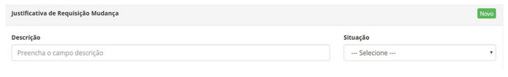
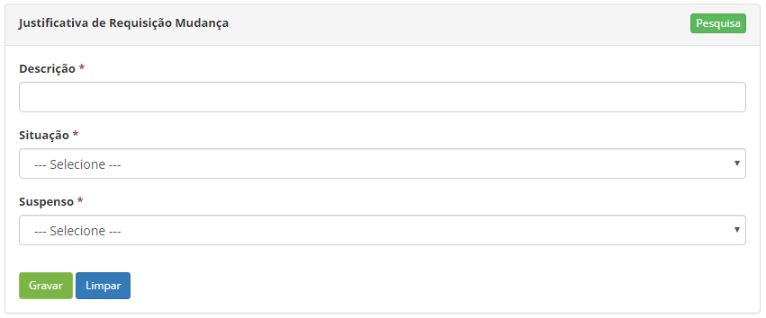

title: Cadastro e pesquisa de justificativa de requisição de mudança
Description: Esta funcionalidade tem por objetivo registrar a justificativa de requisição de mudança que será utilizado em outras rotinas do sistema.
# Cadastro e pesquisa de justificativa de requisição de mudança

Esta funcionalidade tem por objetivo registrar a justificativa de requisição de mudança que será utilizado em outras rotinas do sistema.

Como acessar
---------------

1. Acesse a funcionalidade de Pesquisa de Liberação através da navegação no menu principal 
**Processos ITIL > Gerência de Mudança > Justificativa Requisição Mudança**.

Pré-condições
---------------

1. Não se aplica.

Filtros
---------

1. Os seguintes filtros possibilitam ao usuário restringir a participação de itens na listagem padrão da funcionalidade, 
facilitando a localização dos itens desejados, conforme ilustrado na figura abaixo:

    - Descrição;
    - Situação.
    
    
    
    **Figura 1 - Tela de pesquisa de justificativa de requisição de mudança**
    
2. Na tela de cadastro de justificativa de requisição de mudança, clique no botão "Pesquisa". Será apresentada a tela de
justificativa de requisição mudança, conforme ilustrada na figura a seguir. Nesta tela, são exibidas as justificativas 
de requisição mudança registradas para visualização.

Listagem de itens
-------------------

1. Os seguintes campos cadastrais estão disponíveis ao usuário para facilitar a identificação dos itens desejados na listagem 
padrão da funcionalidade: **Descrição** e **Situação**.

2. Existem botões de ação disponíveis ao usuário em relação a cada item da listagem, são eles: "Editar" e "Excluir".

    
    
    **Figura 2 - Tela de itens**
    
3. Para realizar a pesquisa de uma justificativa de requisição de mudança, informe a descrição e/ou situação da mesma. Após
isso, será exibido o registro conforme os dados informados;

4. Para alterar os dados do registro de justificativa de requisição de mudança, clique no botão Editar. Feito isso, será 
direcionado para a tela de cadastro exibindo o conteúdo referente ao registro selecionado.

Preenchimento dos campos cadastrais
-------------------------------------

1. Clique no botão "Novo". Feito isso, será apresentada a tela de cadastro de justificativa de requisição de mudança,
conforme ilustrada na figura a seguir:

    
    
    **Figura 3 - Tela de cadastro de justificativa de requisição de mudança**
    
2. Preencha os campos conforme orientações abaixo:

    - **Descrição**: informe a descrição da justificativa de requisição de mudança;
    - **Situação**: selecione a situação da justificativa de requisição de mudança.
    - **Suspenso**: informe se a justificativa será para suspensão da requisição de mudança, 
    selecionando uma das opções (Não ou Sim);
    
3. Clique no botão "Gravar" para efetuar o registro, onde a data, hora e usuário serão
gravados automaticamente para uma futura auditoria.

!!! tip "About"

    <b>Product/Version:</b> CITSmart | 7.00 &nbsp;&nbsp;
    <b>Updated:</b>07/11/2019 – Larissa Lourenço

